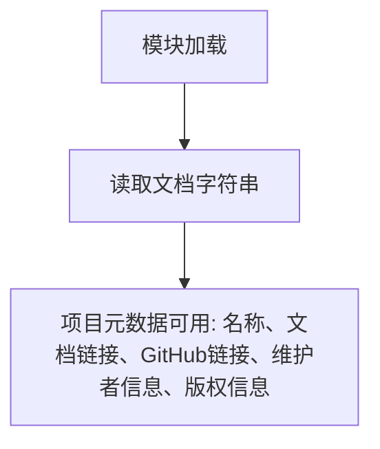

# `markdown\tests\test_syntax\inline\__init__.py` 详细设计文档

该文件仅包含Python Markdown项目的文档字符串，说明这是一个John Gruber's Markdown的Python实现，提供了项目文档链接、维护者信息和版权声明。

## 整体流程



## 类结构

```
无类结构 (该文件仅包含模块级文档字符串)
无继承层次
```

## 全局变量及字段


### `__doc__`
    
模块级文档字符串，包含Python Markdown项目的名称、功能、文档链接、维护者信息和版权声明

类型：`str`
    


    

## 全局函数及方法


## 关键组件


### Markdown

Python Markdown 是一个纯 Python 实现的 Markdown 标记语言解析器，用于将 Markdown 格式文本转换为 HTML。本代码片段仅包含项目文档头部，未包含具体实现代码。

### 项目元数据

项目元数据信息，包含项目名称、文档地址、GitHub 仓库地址、PyPI 包地址、维护者信息、版权信息和许可证信息。该模块无实际类或函数实现。

### 核心功能描述

将 Markdown 格式的文本转换为 HTML，支持标准 Markdown 语法扩展。

### 维护者信息

项目由 Waylan Limberg、Dmitry Shachnev 和 Isaac Muse 共同维护，继承自 Yuri Takhteyev 和 Manfred Stienstra 的早期版本。

### 版本与版权

项目采用 BSD 许可证，版权覆盖 2004-2023 年。

### 潜在技术债务

由于仅提供文档头部，无法进行完整代码分析。建议提供完整实现代码以进行详细设计。

### 外部依赖与接口

根据文档可知，该项目为独立 PyPI 包，依赖 Python 标准库，无额外外部依赖声明。


## 问题及建议


### 已知问题

- 版本信息可能过时：版权声明中的年份范围为2007-2023，当前年份为2024年，需要更新
- 项目维护者信息不够完整：仅提供了GitHub用户名，缺少实际姓名和联系方式
- 缺乏实质性模块文档：docstring仅包含项目元信息，缺少模块功能描述、使用方法、API概览等核心内容
- 依赖外部LICENSE文件：文档中提及LICENSE.md但未在当前文件中提供许可证全文
- 无代码示例：缺少快速入门示例或基本用法演示
- 缺少版本号：文档中提到v. 1.7 and later但未明确标注当前版本号

### 优化建议

- 更新版权年份至2024年，并明确标注当前版本号
- 在docstring中添加模块功能描述，说明该模块的用途、主要类和API
- 添加简短的使用示例，展示基本的Markdown转换用法
- 考虑将LICENSE文本的一部分直接包含在docstring中或添加更明确的许可证引用说明
- 补充项目状态信息，如是否活跃维护、最后的发布版本等
- 考虑添加与其他流行Python库的对比或集成方式说明


## 其它


### 设计目标与约束

将Markdown文本转换为HTML，实现一个轻量级标记语言的解析器，遵循Gruber的Markdown规范，支持标准Markdown语法及多个扩展，提供灵活的API和插件系统。

### 错误处理与异常设计

使用自定义异常类处理解析错误，如`MarkdownException`基类及其子类`BlockParserError`、`InlineParserError`等；解析过程中采用温和的错误处理策略，尽可能容忍语法错误并继续解析。

### 数据流与状态机

解析流程分为块级解析（标题、列表、代码块等）和内联解析（链接、强调、代码等）两个阶段；使用状态机跟踪解析上下文，通过`HtmlStash`、`Preprocessors`、`Treeprocessors`等组件管理中间状态。

### 外部依赖与接口契约

核心库无硬性外部依赖（标准库除外），通过可选依赖支持YAML配置解析；提供`markdown.Markdown`主类作为公开API入口，支持链式调用扩展和方法。

### 性能考量

支持增量解析和缓存机制，通过`memory_cache`配置启用；预编译正则表达式，对常用语法进行优化，避免重复解析。

### 安全性考虑

默认不启用原始HTML传递，需要通过`safe_mode`或`html_replacement_text`配置防止XSS攻击；提供`strip_top_level_tags`选项控制输出。

### 版本兼容性

支持Python 3.8+；保持API向后兼容，通过版本号语义化管理；迁移指南文档记录版本间变更。

### 测试策略

使用`pytest`框架，包含单元测试、集成测试和性能基准测试；测试覆盖核心解析器、扩展和API交互。

### 插件系统

提供`Extension`基类用于创建扩展；通过`registerExtension`注册扩展，支持配置参数传递；扩展执行顺序可控。

### 配置管理

通过`Markdown`类构造函数或`reset()`方法传递配置字典；支持全局默认配置和实例级配置覆盖。

### 编码规范

遵循PEP 8，使用type hints增强可读性；docstring格式符合Google风格或Sphinx风格。

### 维护和扩展性

模块化设计便于功能扩展，核心解析逻辑与扩展解耦；通过`__init__.py`导出公开API；持续维护更新。


    