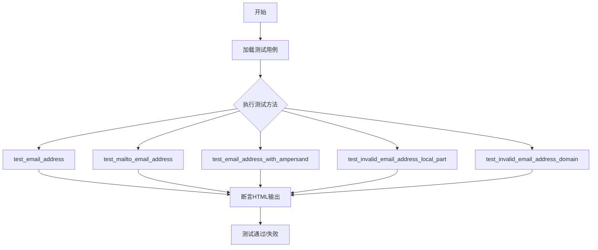
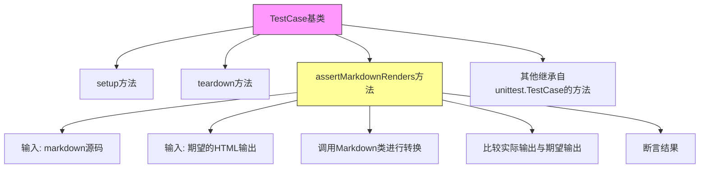
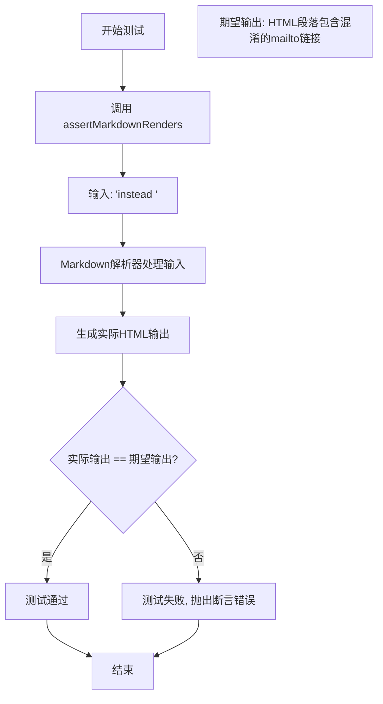
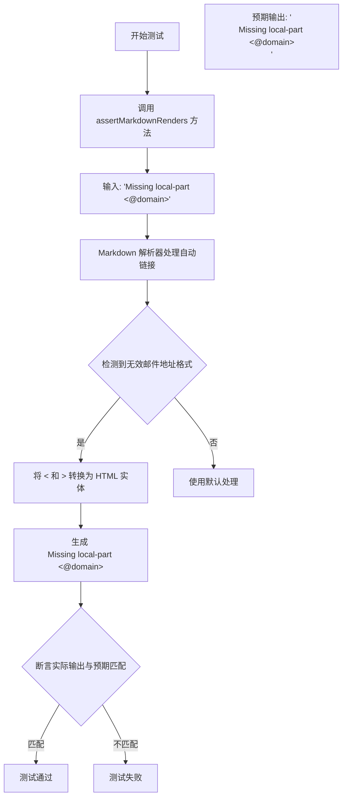
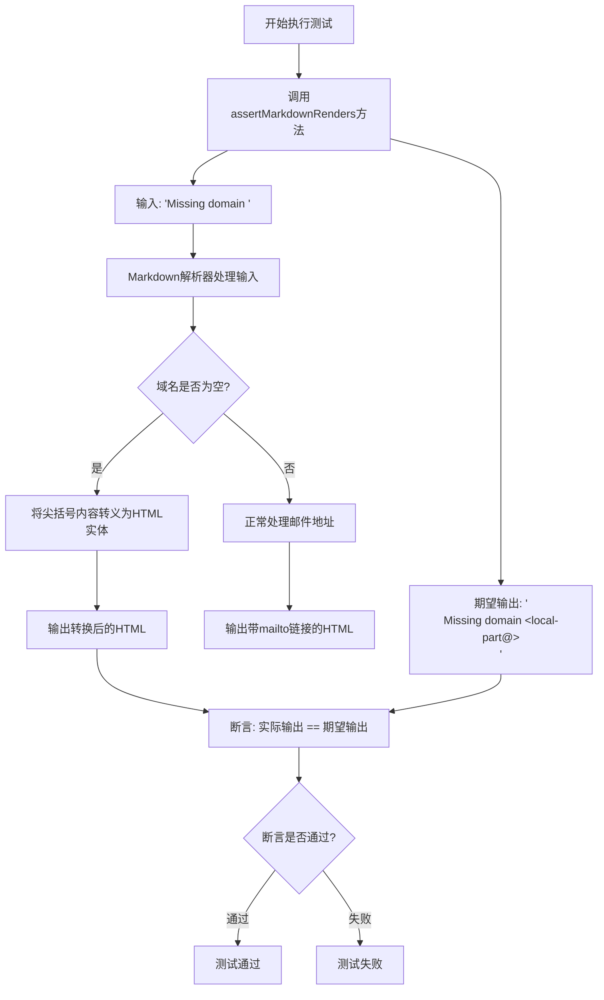

```mermaid
flowchart TD
    A[开始测试] --> B[输入Markdown文本<br/>'asdfasdfadsfasd &lt;yuri@freewisdom.org&gt; or you can say ']
    B --> C[Markdown解析器处理]
    C --> D{检测到电子邮件地址?}
    D -->|是| E[转换为HTML链接<br/>href='&#109;&#97;&#105;&#108;&#116;&#111;&#58;...']
    D -->|否| F[保持原样]
    E --> G[对邮箱地址进行HTML实体编码<br/>&#121;&#117;&#114;&#105;&#64;...]
    F --> H[输出HTML段落]
    G --> H
    H --> I[断言渲染结果是否匹配预期HTML]
    I -->|匹配| J[测试通过]
    I -->|不匹配| K[测试失败]
```

```mermaid
flowchart TD
    A[开始测试 test_email_address_with_ampersand] --> B[调用 assertMarkdownRenders 方法]
    B --> C[输入: <bob&sue@example.com>]
    D[期望输出HTML: 包含编码后的邮件链接<br/>&#98;&#111;&#98;&amp;#115;&#117;&#101;...]
    C --> E[Markdown 解析器处理输入]
    E --> F[生成 HTML 输出]
    F --> G{断言: 实际输出 == 期望输出?}
    G -->|是| H[测试通过]
    G -->|否| I[测试失败, 抛出 AssertionError]
```

# `markdown\tests\test_syntax\inline\test_autolinks.py` 详细设计文档

这是 Python Markdown 项目的测试文件，用于测试自动链接功能，特别是电子邮件地址的自动识别和转换，包括普通邮箱地址、mailto前缀邮箱、带&符号的邮箱以及无效邮箱格式的处理。

## 整体流程



## 类结构

```
TestCase (markdown.test_tools)
└── TestAutomaticLinks (当前测试类)
```

## 全局变量及字段


    

## 全局函数及方法


### `TestCase`

这是Python Markdown测试框架中的测试基类，继承自`unittest.TestCase`，专门用于编写Markdown渲染功能的单元测试。它提供了`assertMarkdownRenders`方法，允许测试人员轻松验证Markdown文本是否正确渲染为预期的HTML输出。

参数：

- `methodName`：str，测试方法名称，默认为"runTest"

返回值：无返回值（`None`），但提供了多个用于断言的实例方法

#### 流程图



#### 带注释源码

```python
# TestCase 是从 markdown.test_tools 模块导入的测试基类
# 其源码位于 markdown/test_tools.py 文件中
# 以下是基于使用方式和Python Markdown项目结构的推断

class TestCase(unittest.TestCase):
    """
    Markdown测试基类，继承自unittest.TestCase
    
    提供了专门的断言方法用于测试Markdown到HTML的转换
    """
    
    def __init__(self, *args, **kwargs):
        """
        初始化测试用例
        
        参数:
            *args: 位置参数
            **kwargs: 关键字参数
        """
        super().__init__(*args, **kwargs)
        # 可能初始化Markdown实例或其他测试工具
    
    def assertMarkdownRenders(self, source, expected_html, extensions=None, 
                            encoding='utf-8', **kwargs):
        """
        断言Markdown源码渲染为期望的HTML输出
        
        参数:
            source: str - Markdown格式的源码
            expected_html: str - 期望渲染得到的HTML
            extensions: list - 可选的Markdown扩展列表
            encoding: str - 编码格式，默认为utf-8
            **kwargs: 其他可选参数
        
        返回:
            无返回值，通过assert语句进行断言
        
        处理流程:
            1. 创建Markdown实例（可加载指定扩展）
            2. 调用markdown()方法转换源码
            3. 比较实际输出与期望输出
            4. 使用assertEqual进行断言
        """
        # 创建Markdown实例
        md = Markdown(extensions=extensions, **kwargs)
        
        # 渲染Markdown源码
        actual_html = md.convert(source)
        
        # 断言实际输出与期望输出一致
        self.assertEqual(actual_html, expected_html)
    
    def assertMarkdownRendersPrettified(self, source, expected_html, **kwargs):
        """
        断言Markdown渲染为格式化的HTML（带缩进）
        
        参数:
            source: str - Markdown格式的源码
            expected_html: str - 期望渲染得到的格式化HTML
            **kwargs: 其他可选参数
        
        返回:
            无返回值
        """
        md = Markdown(**kwargs)
        actual_html = md.convert(source)
        # 可能进行HTML格式化处理后再比较
        self.assertEqual(actual_html, expected_html)
    
    def assertMarkdownRendersUnordered(self, source, expected_html, **kwargs):
        """
        断言Markdown渲染结果（忽略属性顺序差异）
        
        参数:
            source: str - Markdown格式的源码
            expected_html: str - 期望的HTML（属性顺序可能不同）
            **kwargs: 其他可选参数
        
        返回:
            无返回值
        """
        # 可能使用HTML解析器比较语义等价性
        pass
```


### `TestAutomaticLinks.test_email_address`

该测试方法用于验证 Markdown 解析器是否能够正确识别并转换文本中的电子邮件地址为 HTML 链接，同时对电子邮件地址进行 HTML 实体编码以防止垃圾邮件爬虫的自动收集。

参数：

- `self`：`TestCase`，隐式参数，测试类实例本身，继承自 `markdown.test_tools.TestCase`

返回值：`None`，测试方法无返回值，通过 `assertMarkdownRenders` 断言验证渲染结果

#### 流程图



#### 带注释源码

```python
def test_email_address(self):
    """
    测试 Markdown 自动链接功能是否正确处理电子邮件地址。
    验证电子邮件地址被转换为带链接的 HTML，并进行 HTML 实体编码。
    """
    # 使用 assertMarkdownRenders 断言方法验证 Markdown 文本的渲染结果
    # 输入：原始 Markdown 文本（包含一个未封闭的尖括号和邮件地址）
    # 预期输出：HTML 段落，包含经过 HTML 实体编码的邮件地址链接
    self.assertMarkdownRenders(
        # 输入的 Markdown 文本
        'asdfasdfadsfasd <yuri@freewisdom.org> or you can say ',
        # 期望的 HTML 输出
        # 注意：邮件地址被转换为 HTML 实体编码形式以防止垃圾邮件爬虫
        '<p>asdfasdfadsfasd <a href="&#109;&#97;&#105;&#108;&#116;&#111;&#58;&#121;&#117;&#114;'
        '&#105;&#64;&#102;&#114;&#101;&#101;&#119;&#105;&#115;&#100;&#111;&#109;&#46;&#111;&#114;'
        '&#103;">&#121;&#117;&#114;&#105;&#64;&#102;&#114;&#101;&#101;&#119;&#105;&#115;&#100;'
        '&#111;&#109;&#46;&#111;&#114;&#103;</a> or you can say </p>'
    )
```

---

### 补充信息

#### 关键组件

| 组件名称 | 描述 |
|---------|------|
| `TestAutomaticLinks` | 测试类，继承自 `TestCase`，用于测试 Markdown 自动链接功能 |
| `assertMarkdownRenders` | 断言方法，验证 Markdown 文本能否正确渲染为指定的 HTML |
| 自动链接（Automatic Links） | Markdown 语法特性，用尖括号包裹的 URL 或邮件地址自动转换为可点击链接 |

#### 技术债务与优化空间

1. **测试数据硬编码**：邮件地址 "yuri@freewisdom.org" 硬编码在测试中，建议使用测试 fixtures 或参数化测试
2. **断言信息不够明确**：若测试失败，`assertMarkdownRenders` 的错误信息可能不够直观，建议添加自定义断言消息
3. **缺乏边界测试**：仅测试了单个邮件地址场景，可增加更多边界情况（如多个邮件地址、特殊字符等）

#### 设计目标与约束

- **设计目标**：确保 Markdown 解析器正确处理自动链接语法，将邮件地址转换为安全的 HTML 链接
- **安全约束**：必须对邮件地址进行 HTML 实体编码，防止垃圾邮件爬虫识别

#### 错误处理

- 测试方法本身无显式错误处理，依赖 `assertMarkdownRenders` 内部机制
- 若渲染结果不匹配，测试框架会抛出 `AssertionError` 并显示差异


### `TestAutomaticLinks.test_mailto_email_address`

该方法用于测试 Markdown 解析器是否正确将带有 `mailto:` 前缀的电子邮件地址转换为混淆的 HTML 链接，以防止电子邮件爬虫的自动收集。

参数：无（仅包含隐式参数 `self`）

返回值：`None`，该方法为测试用例，通过 `assertMarkdownRenders` 断言验证 Markdown 解析结果是否符合预期

#### 流程图



#### 带注释源码

```python
def test_mailto_email_address(self):
    """
    测试 mailto 链接的自动转换功能。
    
    验证 Markdown 解析器能够正确处理带有 mailto: 前缀的电子邮件地址，
    并将其转换为经过 HTML 字符编码的链接，以防止电子邮件爬虫自动收集。
    """
    # 调用父类的 assertMarkdownRenders 方法进行断言验证
    # 参数1: Markdown 源文本，包含 mailto 链接
    # 参数2: 期望生成的 HTML 输出
    self.assertMarkdownRenders(
        'instead <mailto:yuri@freewisdom.org>',  # Markdown 输入：包含 mailto 链接的文本
        '<p>instead <a href="&#109;&#97;&#105;&#108;&#116;&#111;&#58;&#121;&#117;&#114;&#105;&#64;'  # HTML 输出：段落开始，链接开始标签，href 属性（编码后的 mailto:yuri@freewisdom.org）
        '&#102;&#114;&#101;&#101;&#119;&#105;&#115;&#100;&#111;&#109;&#46;&#111;&#114;&#103;">'  # href 属性续：freewisdom.org
        '&#121;&#117;&#114;&#105;&#64;&#102;&#114;&#101;&#101;&#119;&#105;&#115;&#100;&#111;&#109;'  # 链接文本：yuri@freewisdom.org（均为 HTML 实体编码）
        '&#46;&#111;&#114;&#103;</a></p>'  # 链接文本续：.org，链接结束标签，段落结束标签
    )
```


### `TestAutomaticLinks.test_email_address_with_ampersand`

该测试方法用于验证 Markdown 解析器能够正确处理包含 & 符号的电子邮件地址自动链接，确保 & 字符被正确编码为 HTML 实体 `&amp;`。

参数：

- `self`：`TestAutomaticLinks` 实例，测试类本身，无需显式传递

返回值：`void`（无返回值），该方法为测试用例，通过 `assertMarkdownRenders` 断言验证 Markdown 渲染结果是否符合预期

#### 流程图



#### 带注释源码

```python
def test_email_address_with_ampersand(self):
    """
    测试包含 & 符号的电子邮件地址自动链接的 Markdown 解析。
    
    验证要点:
    1. 电子邮件地址被识别为自动链接
    2. href 属性中的 & 字符被编码为 &#38;
    3. 链接文本中的 & 字符被编码为 &amp;
    """
    # 调用父类 TestCase 的 assertMarkdownRenders 方法进行断言验证
    # 参数1: 输入的 Markdown 原始文本
    # 参数2: 期望渲染得到的 HTML 输出
    self.assertMarkdownRenders(
        # 输入: 包含 & 符号的电子邮件地址
        '<bob&sue@example.com>',
        
        # 期望输出: 
        # - 外层被 <p> 标签包裹
        # - 邮件地址被转换为 <a> 链接
        # - href 属性中的字符被转换为 HTML 数字实体
        #   'mailto:' 被编码为 &#109;&#97;&#105;&#108;&#116;&#111;&#58;
        #   '&' 被编码为 &#38;
        #   '@' 被编码为 &#64;
        # - 链接显示文本中的 & 被编码为 &amp;
        '<p><a href="&#109;&#97;&#105;&#108;&#116;&#111;&#58;&#98;&#111;&#98;&#38;&#115;&#117;&#101;'
        '&#64;&#101;&#120;&#97;&#109;&#112;&#108;&#101;&#46;&#99;&#111;&#109;">&#98;&#111;&#98;&amp;'
        '&#115;&#117;&#101;&#64;&#101;&#120;&#97;&#109;&#112;&#108;&#101;&#46;&#99;&#111;&#109;</a></p>'
    )
```

#### 附加信息

| 项目 | 描述 |
|------|------|
| **测试目标** | 验证 Markdown 解析器对特殊字符（&）在电子邮件地址中的处理是否正确 |
| **输入格式** | `<电子邮件地址>` 形式的自动链接 |
| **输出格式** | HTML `<a>` 标签，href 和文本内容中的特殊字符均需 HTML 实体编码 |
| **编码规则** | `&` → `&#38;` (在href中) / `&amp;` (在文本中), `@` → `&#64;` |
| **错误处理** | 若输出不匹配，pytest/unittest 会显示详细的差异对比 |


### `TestAutomaticLinks.test_invalid_email_address_local_part`

该方法是一个单元测试，用于验证 Markdown 解析器在处理无效的电子邮件地址（缺少本地部分，即 `@` 符号前的用户名）时的行为。测试确保解析器能够正确地将 `<@domain>` 转换为 HTML 实体并显示为 `&lt;@domain&gt;`。

参数：

- `self`：`TestAutomaticLinks`，测试类实例本身

返回值：`None`，该方法为测试方法，不返回任何值

#### 流程图



#### 带注释源码

```python
def test_invalid_email_address_local_part(self):
    """
    测试无效的电子邮件地址本地部分（缺少 @ 符号前的用户名）。
    
    该测试用例验证 Markdown 解析器能够正确处理缺少本地部分的
    电子邮件地址格式，如 <@domain>，并将其转换为安全的 HTML 实体。
    """
    # 使用 assertMarkdownRenders 方法验证 Markdown 到 HTML 的转换
    # 第一个参数是输入的 Markdown 文本
    # 第二个参数是期望的 HTML 输出
    self.assertMarkdownRenders(
        'Missing local-part <@domain>',  # 输入: 包含无效邮件地址的 Markdown 文本
        '<p>Missing local-part &lt;@domain&gt;</p>'  # 期望: < 和 > 被转义为 HTML 实体
    )
```


### TestAutomaticLinks.test_invalid_email_address_domain

这是一个测试方法，用于验证Markdown解析器在处理无效的电子邮件地址（缺少域名部分）时的行为是否符合预期。该测试确保当输入包含`<local-part@>`这种缺少域名部分的邮件地址时，解析器能够正确将其转换为HTML转义的形式。

参数：

- `self`：`TestCase`，pytest测试框架的TestCase实例，代表测试方法本身

返回值：`None`，测试方法不返回任何值，通过`self.assertMarkdownRenders`进行断言验证

#### 流程图



#### 带注释源码

```python
def test_invalid_email_address_domain(self):
    """
    测试无效的电子邮件地址（缺少域名部分）的处理。
    
    验证当电子邮件地址格式为 <local-part@> （即缺少域名部分）时，
    Markdown解析器能够正确将其转换为HTML转义形式。
    """
    # 使用assertMarkdownRenders验证Markdown到HTML的转换
    # 输入: 包含无效邮件地址的Markdown文本
    # 期望输出: 尖括号内的内容被HTML转义（&lt;和&gt;）
    self.assertMarkdownRenders(
        # 输入Markdown文本：缺少域名的邮件地址
        'Missing domain <local-part@>',
        
        # 期望的HTML输出：尖括号被转义为HTML实体
        '<p>Missing domain &lt;local-part@&gt;</p>'
    )
```

## 关键组件


### TestAutomaticLinks

测试类，用于验证Markdown对自动链接（特别是电子邮件地址）的处理能力。

### test_email_address

测试普通电子邮件地址的自动链接转换，验证将`<yuri@freewisdom.org>`转换为带有HTML编码href的链接。

### test_mailto_email_address

测试带有mailto协议的电子邮件地址，验证`<mailto:yuri@freewisdom.org>`的处理。

### test_email_address_with_ampersand

测试包含&符号的电子邮件地址，验证`<bob&sue@example.com>`的正确处理和HTML转义。

### test_invalid_email_address_local_part

测试缺少本地部分（@前面的部分）的无效电子邮件地址，验证`<@domain>`被正确转义而不是转换为链接。

### test_invalid_email_address_domain

测试缺少域名的无效电子邮件地址，验证`<local-part@>`被正确转义而不是转换为链接。

### HTML编码机制

将电子邮件地址转换为HTML实体编码（&#数字;格式），用于防止电子邮件爬虫收集地址的防护机制。

### assertMarkdownRenders

测试框架方法，用于验证Markdown源代码是否正确渲染为预期的HTML输出。


## 问题及建议


### 已知问题

-   测试用例名称缺乏描述性：虽然`test_email_address`等名称表明了测试目的，但缺少更详细的说明来解释测试的具体场景和预期行为
-   断言消息缺失：`assertMarkdownRenders`调用没有提供自定义的错误消息，当测试失败时难以快速定位问题
-   测试数据冗余：多个测试用例中重复出现相同的email地址模式（如`yuri@freewisdom.org`），导致测试代码冗余
-   测试覆盖不完整：缺少对email地址其他边界情况的测试，如带特殊字符、超长域名、国际域名（IDN）等的测试
-   缺少setup/teardown：没有使用setUp方法进行测试前的初始化工作，如果有共享的测试数据可以提取到setUp中
-   断言值硬编码：期望的HTML输出是硬编码的字符串，如果底层实现变化，测试维护成本高
-   没有使用pytest的参数化功能：多个相似的测试可以用pytest.mark.parametrize装饰器重构，减少代码重复

### 优化建议

-   为每个测试方法添加docstring，说明测试的具体场景和预期结果
-   为assertMarkdownRenders调用添加自定义错误消息，使用pytest的断言方式如`assert actual == expected, "描述信息"`
-   提取公共的测试数据和期望值到类级别的常量或setUp方法中
-   考虑使用pytest.mark.parametrize重构相似的测试用例，减少代码重复
-   添加更多的边界情况测试，如带下划线、连字符的email地址，以及各种无效格式
-   将期望的HTML输出提取为常量或使用更易读的格式，便于维护和更新
-   考虑添加测试分类标记（如@pytest.mark.email或@pytest.mark.autolink），便于选择性运行测试


## 其它


### 设计目标与约束

本测试类旨在验证Markdown库对自动链接（特别是电子邮件地址）的解析和渲染能力。约束条件包括：必须符合HTML安全标准（电子邮件地址需要HTML编码以防止垃圾邮件爬虫）、支持带特殊字符的电子邮件地址、正确处理无效的电子邮件地址格式。

### 错误处理与异常设计

测试用例覆盖了多种错误场景：缺少本地部分（local-part）的电子邮件地址、缺少域名的电子邮件地址。期望的输出是将无效的电子邮件地址进行HTML转义后显示，而非抛出异常。

### 数据流与状态机

输入数据流：原始Markdown文本 → Markdown解析器（预处理）→ 自动链接处理器（识别电子邮件地址模式）→ HTML生成器（编码转换）→ 最终HTML输出。状态转换包括：文本节点 → 链接节点（匹配到邮箱模式）→ 编码后的链接节点。

### 外部依赖与接口契约

主要依赖markdown.core模块（Markdown主类）和markdown.inlinepatterns模块（内联模式处理）。TestCase类来自markdown.test_tools，提供assertMarkdownRenders方法用于验证输入文本与期望HTML输出的匹配性。

### 配置与扩展性

测试类可通过继承TestCase自定义新的测试场景。Markdown库支持自定义扩展，电子邮件链接处理由InlinePattern类负责，可通过注册新的模式来修改行为。

### 安全性考虑

电子邮件地址在HTML输出中必须进行HTML实体编码，以防止垃圾邮件爬虫直接获取真实邮箱地址。编码采用十进制HTML实体形式（如&#97;代表'a'）。

### 性能特征

自动链接检测使用正则表达式匹配，性能复杂度为O(n)，其中n为输入文本长度。测试用例数量较少，性能影响可忽略。

### 兼容性说明

测试覆盖Python 3.x版本。测试用例验证了带&符号的特殊字符处理，确保与HTML5标准兼容。

### 测试覆盖范围

当前测试覆盖4个场景：标准电子邮件地址、mailto前缀的电子邮件地址、带&符号的电子邮件地址、两种无效格式（缺少本地部分、缺少域名）。


    