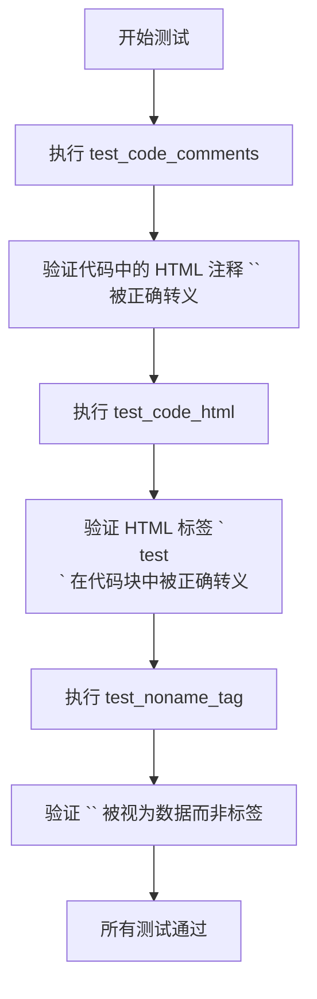
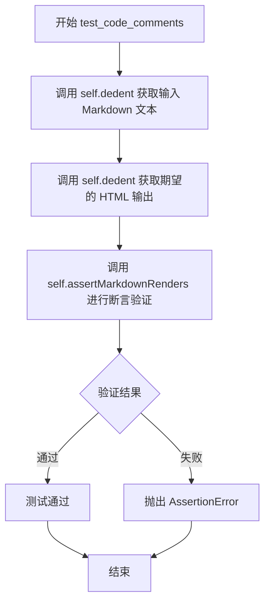
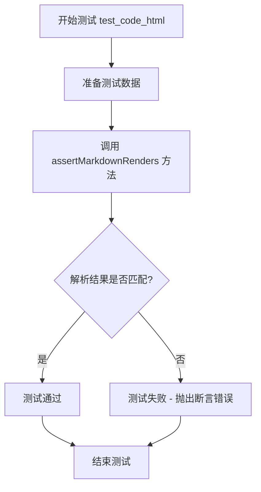
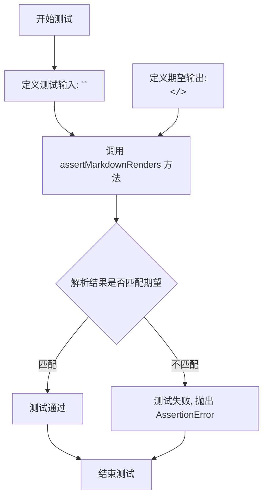

# `markdown\tests\test_syntax\inline\test_code.py` 详细设计文档

这是Python Markdown项目的测试文件，用于测试Markdown解析器对代码片段的处理能力，包括HTML注释、HTML标签以及无名称标签的正确渲染，确保这些特殊字符序列被正确转义而非被解析为HTML标签。

## 整体流程



## 类结构

```
TestCase (markdown.test_tools.TestCase)
└── TestCode (测试类)
```

## 全局变量及字段


### `TestCase`
    
测试框架基类，提供Markdown测试用例的断言方法

类型：`class`
    


    

## 全局函数及方法


### `TestCode.test_code_comments`

该方法用于测试 Markdown 解析器正确处理代码片段中的 HTML 注释标记（`<!--` 和 `-->`），确保它们被转义为普通文本而非实际注释。

参数：

- `self`：`TestCase`，测试类实例本身

返回值：`None`，无返回值（测试方法）

#### 流程图



#### 带注释源码

```python
def test_code_comments(self):
    """
    测试代码注释的处理：
    验证 Markdown 解析器将代码片段中的 HTML 注释标记
    <!-- 和 --> 正确转义为 &lt;!-- 和 --&gt;
    """
    # 调用 assertMarkdownRenders 验证 Markdown 到 HTML 的转换
    self.assertMarkdownRenders(
        # 第一个参数：输入的 Markdown 文本（去除缩进）
        # 包含两段文本，每段都有代码片段中的 HTML 注释标记
        self.dedent(
            """
            Some code `<!--` that is not HTML `-->` in a paragraph.

            Some code `<!--`
            that is not HTML `-->`
            in a paragraph.
            """
        ),
        # 第二个参数：期望输出的 HTML（去除缩进）
        # 代码片段中的 < 和 > 应当被转义为 &lt; 和 &gt;
        self.dedent(
            """
            <p>Some code <code>&lt;!--</code> that is not HTML <code>--&gt;</code> in a paragraph.</p>
            <p>Some code <code>&lt;!--</code>
            that is not HTML <code>--&gt;</code>
            in a paragraph.</p>
            """
        )
    )
```


### `TestCode.test_code_html`

该方法是一个单元测试，用于验证 Markdown 解析器在处理包含 HTML 标签的内联代码时，能正确地将 HTML 标签转义为 HTML 实体（如 `<p>` 转换为 `&lt;p&gt;`），同时保留已存在的 HTML 块元素不被修改。

参数：

- `self`：`TestCode`，测试类实例本身，隐含参数

返回值：`None`，该方法为测试用例，通过 `assertMarkdownRenders` 断言验证 Markdown 解析结果，不返回任何值

#### 流程图



#### 带注释源码

```python
def test_code_html(self):
    """
    测试 Markdown 解析器处理内联代码中的 HTML 标签的转义行为
    
    验证点：
    1. HTML 块元素（如 <p>html</p>）应保持原样不被转义
    2. 内联代码中的 HTML 标签（如 `<p>test</p>`）应被转义为实体
    """
    # 调用父类方法验证 Markdown 到 HTML 的转换
    self.assertMarkdownRenders(
        # 输入：原始 Markdown 文本
        # 包含一个 HTML 块和一个包含 HTML 标签的内联代码
        self.dedent(
            """
            <p>html</p>

            Paragraph with code: `<p>test</p>`.
            """
        ),
        # 期望输出：HTML 文档
        # HTML 块保持不变，内联代码中的标签被转义
        self.dedent(
            """
            <p>html</p>

            <p>Paragraph with code: <code>&lt;p&gt;test&lt;/p&gt;</code>.</p>
            """
        )
    )
```


### `TestCode.test_noname_tag`

该方法是一个单元测试，用于验证 Markdown 解析器正确处理 `</>` 这样的"无名"HTML 标签。测试确保解析器将其视为普通文本数据而非 HTML 标签，并将其包装在 `<code>` 标签中进行 HTML 转义输出。

参数：

- `self`：测试类实例，无需显式传递

返回值：`None`，该方法为测试用例，执行断言验证 Markdown 解析结果，不返回任何值

#### 流程图



#### 带注释源码

```python
def test_noname_tag(self):
    # Browsers ignore `</>`, but a Markdown parser should not, and should treat it as data
    # but not a tag.
    # 注释说明：浏览器会忽略 `</>` 这样的"无名"结束标签，但 Markdown 解析器不应该忽略它
    # 而应该将其当作普通数据处理，而不是当作 HTML 标签

    self.assertMarkdownRenders(
        # 调用继承自 TestCase 的断言方法，验证 Markdown 渲染结果
        self.dedent(
            """
            `</>`
            """
            # 测试输入：带有 `</>` 的 Markdown 文本，期望解析为代码片段
        ),
        self.dedent(
            """
            <p><code>&lt;/&gt;</code></p>
            """
            # 期望输出：HTML 段落，包含代码标签，内容中的 < 和 > 已被转义为 &lt; 和 &gt;
            # 这证明解析器正确识别了 `</>` 为代码而非 HTML 标签
        )
    )
```

## 关键组件


### TestCode 类

测试类，继承自 TestCase，用于验证 Markdown 解析器对内联代码中特殊字符（HTML 标签、注释）的处理是否正确。

### test_code_comments 方法

测试代码中的 HTML 注释符号（`<!--` 和 `-->`）应被转义为实体，而不是被解析为 HTML 注释。验证 Markdown 解析器正确区分代码内容与实际 HTML 注释。

### test_code_html 方法

测试段落中的 HTML 标签在代码格式（反引号）内应被转义。验证 `<p>test</p>` 被转换为 `&lt;p&gt;test&lt;/p&gt;`，确保内联代码中的 HTML 标签不会被浏览器渲染。

### test_noname_tag 方法

测试无效的 HTML 标签（如 `</>`）应被转义为实体，而不是被浏览器忽略。验证 Markdown 解析器将其转换为 `&lt;/&gt;`，保持数据的完整性。

### assertMarkdownRenders 方法（继承自 TestCase）

继承自父类的测试方法，用于验证 Markdown 源代码能否正确渲染为预期的 HTML 输出。接收两个参数：输入的 Markdown 文本和期望的 HTML 输出。

### dedent 方法（继承自 TestCase）

继承自父类的工具方法，用于移除多行字符串的公共前导空白，使测试代码更易读。


## 问题及建议


### 已知问题

- **测试覆盖不足**：仅覆盖行内代码场景，缺少代码块（```）的测试、多行代码块中的HTML处理、嵌套场景（如代码中的代码）
- **断言信息缺失**：所有测试使用默认断言消息，失败时无法快速定位问题
- **测试数据硬编码**：期望输出的HTML字符串硬编码在测试方法中，不利于维护和扩展
- **缺少测试文档**：测试方法没有docstring，无法快速理解每个测试的意图
- **重复代码**：多次调用`self.dedent()`格式化测试数据，可提取为测试数据辅助方法
- **未测试边界情况**：缺少空代码、特殊字符（如`<!>`、`<>`）、混合场景的测试
- **未验证HTML转义完整性**：未测试所有HTML特殊字符（`&`、`"`、`'`等）在代码中的转义
- **测试隔离性不明**：未显式设置和清理测试环境状态，可能存在隐藏依赖

### 优化建议

- 为每个测试方法添加详细的docstring，说明测试目的和预期行为
- 提取公共测试数据为类级别或模块级别的测试fixture，使用pytest fixture或unittest的setUp方法
- 为断言添加自定义错误消息，如`self.assertMarkdownRenders(..., msg="行内HTML注释转义失败")`
- 扩展测试覆盖：添加代码块测试、多行代码测试、HTML特殊字符完整测试（`&amp;`、`&quot;`等）、边界情况测试
- 考虑将期望输出抽取为常量或从配置文件加载，提高可维护性
- 添加参数化测试，使用`@pytest.mark.parametrize`覆盖多种输入场景
- 确保测试之间相互独立，避免共享状态

## 其它


### 一段话描述

该代码是Python Markdown项目的测试文件，用于测试Markdown解析器在处理行内代码中的HTML注释和特殊标签时的正确性，确保解析器能够正确区分Markdown代码片段与HTML标签，避免将代码中的HTML语法误解析为实际HTML元素。

### 文件的整体运行流程

该测试文件通过unittest框架执行，流程如下：
1. 测试类`TestCode`继承自`TestCase`，在测试套件初始化时加载
2. 每个测试方法（`test_code_comments`、`test_code_html`、`test_noname_tag`）独立运行
3. 测试使用`assertMarkdownRenders`方法验证Markdown源码经过解析后是否生成预期的HTML输出
4. `dedent`方法用于移除字符串的公共前导空白，使多行字符串格式化更清晰
5. 测试验证行内代码语法（反引号）内的HTML特殊字符被正确转义为HTML实体

### 类的详细信息

### 类名：TestCode

**类字段：**

- **父类**：TestCase（来自markdown.test_tools模块）
  - 类型：class
  - 描述：unittest测试用例基类，提供测试断言方法

**类方法：**

- **test_code_comments**
  - 参数：无
  - 参数类型：无
  - 参数描述：测试方法无需参数
  - 返回值类型：None
  - 返回值描述：测试方法不返回值，通过断言验证Markdown解析结果
  - 流程图：
    ```mermaid
    flowchart TD
    A[开始测试] --> B[准备Markdown源码]
    B --> C[准备期望HTML输出]
    C --> D[调用assertMarkdownRenders验证]
    D --> E{验证结果}
    E -->|通过| F[测试通过]
    E -->|失败| G[抛出AssertionError]
    ```
  - 源码：
    ```python
    def test_code_comments(self):
        self.assertMarkdownRenders(
            self.dedent(
                """
                Some code `<!--` that is not HTML `-->` in a paragraph.

                Some code `<!--`
                that is not HTML `-->`
                in a paragraph.
                """
            ),
            self.dedent(
                """
                <p>Some code <code>&lt;!--</code> that is not HTML <code>--&gt;</code> in a paragraph.</p>
                <p>Some code <code>&lt;!--</code>
                that is not HTML <code>--&gt;</code>
                in a paragraph.</p>
                """
            )
        )
    ```

- **test_code_html**
  - 参数：无
  - 参数类型：无
  - 参数描述：测试方法无需参数
  - 返回值类型：None
  - 返回值描述：测试方法不返回值，通过断言验证Markdown解析结果
  - 流程图：
    ```mermaid
    flowchart TD
    A[开始测试] --> B[准备包含HTML标签的Markdown源码]
    B --> C[准备期望HTML输出]
    C --> D[调用assertMarkdownRenders验证]
    D --> E{验证结果}
    E -->|通过| F[测试通过]
    E -->|失败| G[抛出AssertionError]
    ```
  - 源码：
    ```python
    def test_code_html(self):
        self.assertMarkdownRenders(
            self.dedent(
                """
                <p>html</p>

                Paragraph with code: `<p>test</p>`.
                """
            ),
            self.dedent(
                """
                <p>html</p>

                <p>Paragraph with code: <code>&lt;p&gt;test&lt;/p&gt;</code>.</p>
                """
            )
        )
    ```

- **test_noname_tag**
  - 参数：无
  - 参数类型：无
  - 参数描述：测试方法无需参数
  - 返回值类型：None
  - 返回值描述：测试方法不返回值，通过断言验证Markdown解析结果
  - 流程图：
    ```mermaid
    flowchart TD
    A[开始测试] --> B[准备包含非标准标签的Markdown源码]
    B --> C[准备期望HTML输出]
    C --> D[调用assertMarkdownRenders验证]
    D --> E{验证结果}
    E -->|通过| F[测试通过]
    E -->|失败| G[抛出AssertionError]
    ```
  - 源码：
    ```python
    def test_noname_tag(self):
        # Browsers ignore `</>`, but a Markdown parser should not, and should treat it as data
        # but not a tag.

        self.assertMarkdownRenders(
            self.dedent(
                """
                `</>`
                """
            ),
            self.dedent(
                """
                <p><code>&lt;/&gt;</code></p>
                """
            )
        )
    ```

### 关键组件信息

- **TestCase**（来自markdown.test_tools）
  - 描述：提供Markdown测试支持的基类，包含`assertMarkdownRenders`和`dedent`方法

- **assertMarkdownRenders**
  - 描述：核心验证方法，接收Markdown源码和期望的HTML输出，验证解析结果是否匹配

- **dedent**
  - 描述：字符串格式化工具，用于移除多行字符串的公共前导空白，提高测试代码可读性

### 设计目标与约束

- **设计目标**：确保Markdown解析器正确处理行内代码块中的HTML特殊字符，将其转义为HTML实体，防止代码中的HTML语法被浏览器误解析
- **设计约束**：测试覆盖了三种场景——HTML注释、多行HTML标签、非标准标签，均需正确转义

### 错误处理与异常设计

- **AssertionError**：当Markdown解析结果与期望输出不符时抛出，由unittest框架捕获并标记测试失败
- **测试隔离**：每个测试方法独立运行，互不影响，使用`dedent`确保字符串格式化一致性

### 数据流与状态机

- **数据流**：Markdown源码 → Markdown解析器 → HTML输出 → 断言验证
- **状态机**：测试方法执行时经历"准备→验证→结果"三个状态，任何阶段失败都会导致测试失败

### 外部依赖与接口契约

- **外部依赖**：
  - `markdown.test_tools.TestCase`：提供测试基础设施
  - `unittest`：Python标准测试框架
- **接口契约**：
  - `assertMarkdownRenders(markdown源码, 期望HTML输出)`：返回布尔值或抛出异常
  - `dedent(字符串)`：返回格式化后的字符串

### 潜在的技术债务或优化空间

- **测试覆盖不足**：仅覆盖三种基本场景，未测试嵌套标签、混合内容、边界情况（如连续反引号）
- **缺少参数化测试**：相同逻辑的测试方法可以合并为参数化测试，减少代码重复
- **注释可增强**：代码中的注释仅说明测试目的，未解释Markdown解析的具体行为和转义规则

### 其它项目

**测试维护性建议：**
- 考虑添加更多边界情况测试，如空的行内代码、包含多个HTML实体的代码
- 可以将测试数据外部化，便于非开发人员理解和维护测试用例
- 建议添加性能测试，确保大量Markdown文档解析时的效率

**文档完善建议：**
- 补充Markdown解析器对HTML实体转义规则的官方文档链接
- 添加测试用例与Markdown规范中具体条款的对应关系说明

    