# `markdown\tests\test_syntax\inline\test_emphasis.py` 详细设计文档

这是一个Markdown库的测试文件，专门用于测试文本强调（emphasis）功能的各种边界情况，特别是验证哪些字符序列不应被错误地识别为强调标记（如独立星号、下划线、连续星号/下划线等）。

## 整体流程

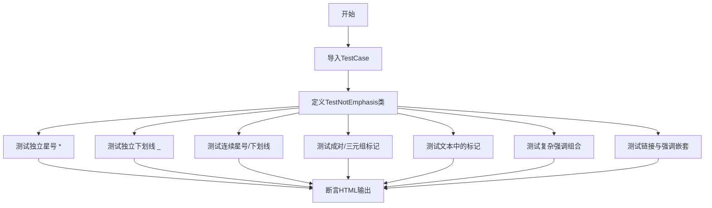

## 类结构

```
TestCase (基类)
└── TestNotEmphasis (测试类)
```

## 全局变量及字段


### `TestNotEmphasis.test_standalone_asterisk`
    
测试单独的星号不应被解析为强调标记

类型：`method`
    


### `TestNotEmphasis.test_standalone_understore`
    
测试单独的下划线不应被解析为强调标记

类型：`method`
    


### `TestNotEmphasis.test_standalone_asterisks_consecutive`
    
测试连续的多个星号不应被解析为强调标记

类型：`method`
    


### `TestNotEmphasis.test_standalone_understore_consecutive`
    
测试连续的多个下划线不应被解析为强调标记

类型：`method`
    


### `TestNotEmphasis.test_standalone_asterisks_pairs`
    
测试成对的星号组合不应被解析为强调标记

类型：`method`
    


### `TestNotEmphasis.test_standalone_understore_pairs`
    
测试成对的下划线组合不应被解析为强调标记

类型：`method`
    


### `TestNotEmphasis.test_standalone_asterisks_triples`
    
测试三个星号的组合不应被解析为强调标记

类型：`method`
    


### `TestNotEmphasis.test_standalone_understore_triples`
    
测试三个下划线的组合不应被解析为强调标记

类型：`method`
    


### `TestNotEmphasis.test_standalone_asterisk_in_text`
    
测试文本中的单独星号不应被解析为强调标记

类型：`method`
    


### `TestNotEmphasis.test_standalone_understore_in_text`
    
测试文本中的单独下划线不应被解析为强调标记

类型：`method`
    


### `TestNotEmphasis.test_standalone_asterisks_in_text`
    
测试文本中多个星号不应被解析为强调标记

类型：`method`
    


### `TestNotEmphasis.test_standalone_understores_in_text`
    
测试文本中多个下划线不应被解析为强调标记

类型：`method`
    


### `TestNotEmphasis.test_standalone_asterisks_with_newlines`
    
测试跨行的星号组合不应被解析为强调标记

类型：`method`
    


### `TestNotEmphasis.test_standalone_understores_with_newlines`
    
测试跨行的下划线组合不应被解析为强调标记

类型：`method`
    


### `TestNotEmphasis.test_standalone_underscore_at_begin`
    
测试开头位置的下划线不应被解析为强调标记

类型：`method`
    


### `TestNotEmphasis.test_standalone_asterisk_at_end`
    
测试结尾位置的星号不应被解析为强调标记

类型：`method`
    


### `TestNotEmphasis.test_standalone_understores_at_begin_end`
    
测试开头和结尾的下划线不应被解析为强调标记

类型：`method`
    


### `TestNotEmphasis.test_complex_emphasis_asterisk`
    
测试复杂的星号强调组合的正确解析

类型：`method`
    


### `TestNotEmphasis.test_complex_emphasis_asterisk_mid_word`
    
测试单词中间的星号不应被解析为强调标记

类型：`method`
    


### `TestNotEmphasis.test_complex_emphasis_smart_underscore`
    
测试智能下划线的复杂强调组合

类型：`method`
    


### `TestNotEmphasis.test_complex_emphasis_smart_underscore_mid_word`
    
测试单词中间的智能下划线不应被解析为强调

类型：`method`
    


### `TestNotEmphasis.test_nested_emphasis`
    
测试嵌套的强调标记的正确解析

类型：`method`
    


### `TestNotEmphasis.test_complex_multple_emphasis_type`
    
测试多种强调类型混合的正确解析

类型：`method`
    


### `TestNotEmphasis.test_complex_multple_emphasis_type_variant2`
    
测试多种强调类型的另一种变体

类型：`method`
    


### `TestNotEmphasis.test_link_emphasis_outer`
    
测试链接外部的强调标记正确解析

类型：`method`
    


### `TestNotEmphasis.test_link_emphasis_inner`
    
测试链接内部的强调标记正确解析

类型：`method`
    


### `TestNotEmphasis.test_link_emphasis_inner_outer`
    
测试链接内外都有强调标记的正确解析

类型：`method`
    
    

## 全局函数及方法


### `TestNotEmphasis.test_standalone_asterisk`

该测试方法用于验证 Markdown 解析器正确处理独立的星号字符，确保单个星号不被解释为强调标记，而是作为普通文本原样输出。

参数：

- `self`：`TestCase`，Python 类方法的第一个参数，表示测试类的实例本身

返回值：`None`，测试方法无返回值，通过 `assertMarkdownRenders` 断言验证渲染结果

#### 流程图

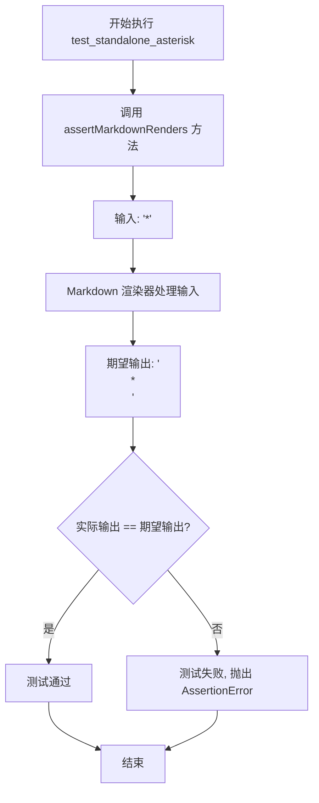

#### 带注释源码

```python
def test_standalone_asterisk(self):
    """
    测试独立的星号字符不被解释为强调标记。
    
    验证 Markdown 解析器正确处理以下场景：
    - 单个星号字符作为普通文本输出，不进行强调处理
    """
    # 调用父类 TestCase 提供的断言方法，验证 Markdown 渲染结果
    # 参数1: '*' - 输入的 Markdown 源文本
    # 参数2: '<p>*</p>' - 期望的 HTML 输出结果
    self.assertMarkdownRenders(
        '*',          # 输入: 独立的星号字符
        '<p>*</p>'    # 期望输出: 被 <p> 标签包裹的星号字符
    )
    # 如果渲染结果与期望不符，assertMarkdownRenders 会抛出 AssertionError
    # 测试通过表示 Markdown 正确地将独立星号视为普通文本而非强调标记
```


### `TestNotEmphasis.test_standalone_understore`

该方法用于测试 Markdown 渲染器对单独的下划线字符 `_` 的处理能力，验证在standalone（独立出现，非组合）情况下下划线不会被错误解析为强调语法，而是作为普通文本原样输出。

参数：

- `self`：`TestNotEmphasis`，继承自 TestCase 的实例对象，表示当前测试用例的上下文

返回值：`None`，Python 测试方法通常不返回值，通过断言表达测试结果

#### 流程图

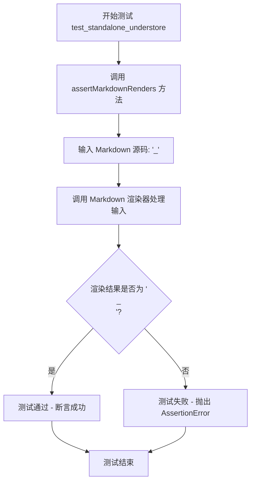

#### 带注释源码

```python
def test_standalone_understore(self):
    """
    测试独立下划线字符的渲染行为。
    
    验证单独的 '_' 字符不会被 Markdown 解析器识别为强调标记，
    而是作为普通文本输出。这是 Markdown 规范中重要的边界情况测试。
    """
    # 使用 TestCase 提供的断言方法验证 Markdown 渲染结果
    # 参数1: 输入的 Markdown 源码
    # 参数2: 期望的 HTML 输出
    self.assertMarkdownRenders(
        '_',        # 输入: 单独的底线字符
        '<p>_</p>'  # 期望输出: 包裹在段落标签中的底线字符
    )
```

---

**设计说明**：该测试用例属于 Markdown Python 项目中的边界条件测试，专注于验证下划线（`_`）在非强调场景下的正确处理逻辑。根据 Markdown 规范，单独的下划线不应触发强调/斜体效果，测试确保了渲染器的核心解析逻辑符合规范要求。


### `TestNotEmphasis.test_standalone_asterisks_consecutive`

该测试方法用于验证 Markdown 解析器正确处理连续的非强调型星号。当文本中出现多个独立的星号（前后均有空格或其他字符隔开）时，这些星号应被视为普通字符而非强调标记。该测试特别关注"Foo * * * *"这类连续出现但未形成有效强调语法的星号序列，确保它们被原样保留在输出的 HTML 中而不被转换为 emphasis 标签。

参数：

- `self`：TestCase 类的实例本身，无需显式传递，由 Python 自动处理

返回值：`None`，测试方法不返回任何值，仅通过断言验证结果

#### 流程图

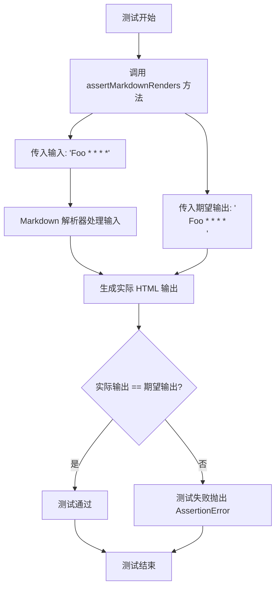

#### 带注释源码

```python
def test_standalone_asterisks_consecutive(self):
    """
    测试连续的非强调型星号序列是否被正确渲染。
    
    当 Markdown 中出现 'Foo * * * *' 时（即星号之间有空格分隔），
    这些星号不应被解释为强调语法，而应作为普通字符输出。
    """
    # 调用父类提供的断言方法验证 Markdown 渲染结果
    self.assertMarkdownRenders(
        'Foo * * * *',      # 输入：包含连续独立星号的 Markdown 文本
        '<p>Foo * * * *</p>'  # 期望输出：星号应作为普通文本保留在段落中
    )
```


### `TestNotEmphasis.test_standalone_understore_consecutive`

该方法用于测试 Markdown 解析器对连续下划线字符的处理能力，验证在文本中间出现的连续独立下划线（如 `_ _ _ _`）不会被错误地解析为强调标签，而是作为普通文本原样输出。

参数：

- `self`：`TestNotEmphasis` 类实例，表示测试用例的上下文对象

返回值：`None`，该方法通过 `assertMarkdownRenders` 进行断言验证，测试失败时抛出异常

#### 流程图

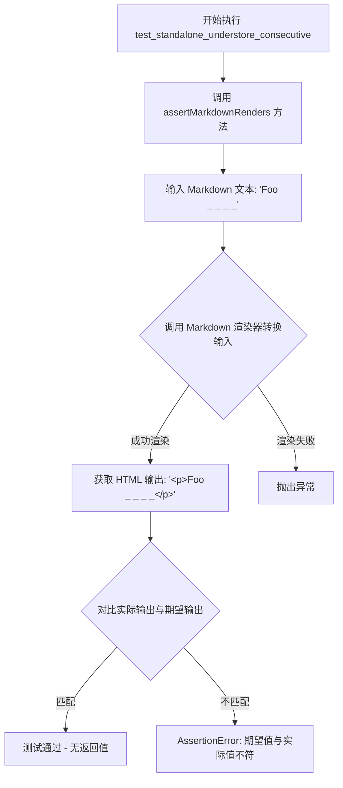

#### 带注释源码

```python
def test_standalone_understore_consecutive(self):
    """
    测试连续下划线字符在文本中的渲染行为。
    
    验证规则：连续的下划线字符作为普通文本输出，不应触发强调语法。
    测试场景：'Foo _ _ _ _' 应渲染为 '<p>Foo _ _ _ _</p>'
    """
    # 调用父类 TestCase 提供的断言方法验证 Markdown 渲染结果
    # 参数1: 输入的 Markdown 原始文本
    # 参数2: 期望输出的 HTML 文本
    self.assertMarkdownRenders(
        'Foo _ _ _ _',      # 输入: 包含连续下划线的文本
        '<p>Foo _ _ _ _</p>' # 期望: 下划线不被解释为强调标签
    )
```


### `TestNotEmphasis.test_standalone_asterisks_pairs`

该测试方法用于验证 Markdown 解析器在处理连续的独立双星号对（`** `）时不将其错误地解析为强调标签，而是正确地将其作为普通文本原样输出。

参数：无（继承自 `TestCase` 基类，通过 `self` 调用方法）

返回值：`None`（无返回值），该方法为测试用例，通过 `assertMarkdownRenders` 断言验证 Markdown 渲染结果

#### 流程图

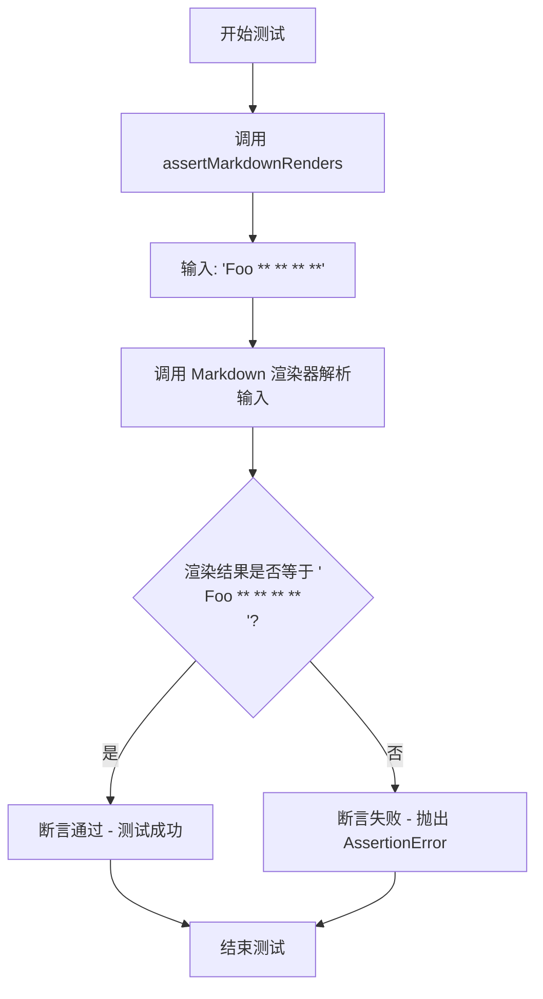

#### 带注释源码

```python
def test_standalone_asterisks_pairs(self):
    """
    测试方法：验证独立的连续双星号对不被解析为强调标签
    
    测试场景：当 Markdown 文本中包含连续的独立双星号对时
    （例如 'Foo ** ** ** **'），这些双星号不应被解析为
    <strong> 或 <em> 标签，而应作为普通文本原样输出。
    
    预期行为：输入 'Foo ** ** ** **' 
            → 输出 '<p>Foo ** ** ** **</p>'
    """
    # 调用父类 TestCase 的 assertMarkdownRenders 方法进行断言验证
    # 参数1: 输入的 Markdown 原始文本
    # 参数2: 期望输出的 HTML 片段
    self.assertMarkdownRenders(
        'Foo ** ** ** **',  # 输入: 包含连续独立双星号对的文本
        '<p>Foo ** ** ** **</p>'  # 期望: 双星号对作为普通文本输出，不被解析为强调
    )
```


### `TestNotEmphasis.test_standalone_understore_pairs`

该测试方法用于验证 Markdown 解析器在处理包含连续独立下划线对（`__`）的文本时，能够正确将其渲染为普通文本而非强调语法，确保输出与预期一致。

参数：

- `self`：`TestNotEmphasis`，测试类的实例方法隐含参数，代表当前测试对象

返回值：`None`，该方法为测试用例，无返回值，通过 `assertMarkdownRenders` 内部断言验证结果

#### 流程图

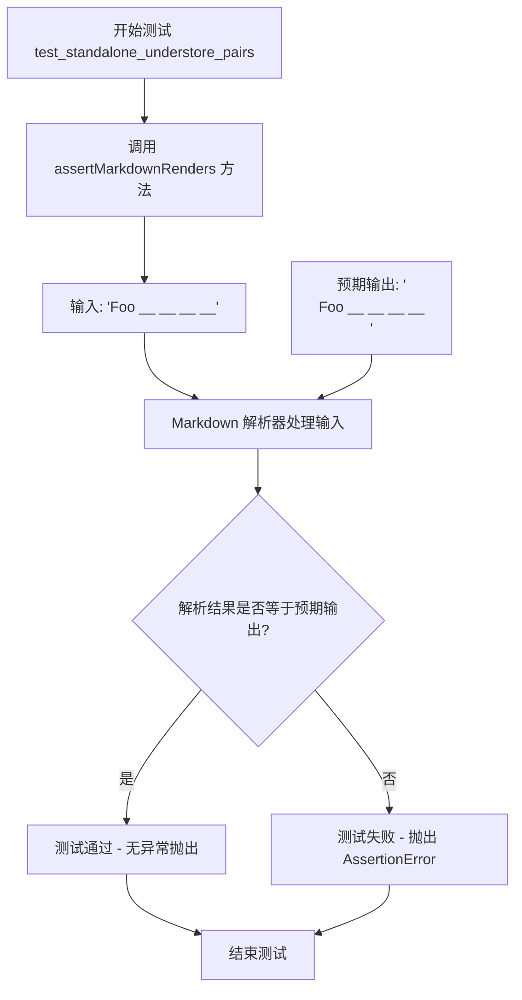

#### 带注释源码

```python
def test_standalone_understore_pairs(self):
    """
    测试独立的下划线对（__）在文本中的渲染行为。
    验证连续的下划线对不应被解析为强调语法，而应作为普通文本输出。
    """
    # 调用父类 TestCase 提供的测试辅助方法
    # 参数1: Markdown 源文本，包含连续的下划线对
    # 参数2: 预期的 HTML 输出
    self.assertMarkdownRenders(
        'Foo __ __ __ __',      # 输入: 包含4个独立下划线对的文本
        '<p>Foo __ __ __ __</p>' # 预期输出: 下划线对应保持为普通文本
    )
```


### `TestNotEmphasis.test_standalone_asterisks_triples`

该测试方法用于验证 Markdown 解析器能正确处理独立的连续三星号序列（`***`），确保这些特殊字符组合不会被错误地解析为强调或分隔符，而是按原样输出为普通文本。

参数：
- `self`：`TestCase`（隐式参数），Python 类方法的默认参数，表示测试类实例本身

返回值：`None`，测试方法无返回值，通过 `assertMarkdownRenders` 断言验证结果

#### 流程图

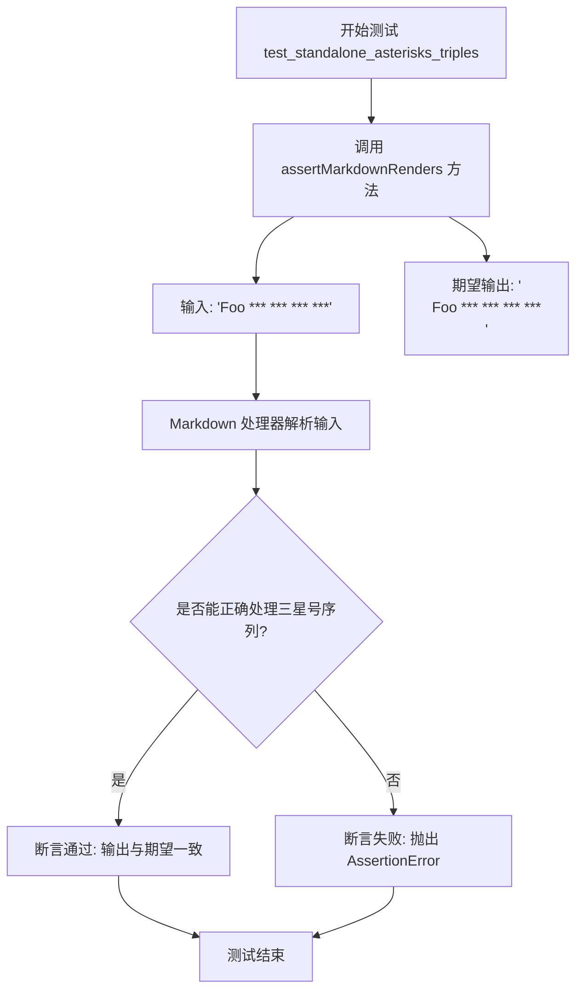

#### 带注释源码

```python
def test_standalone_asterisks_triples(self):
    """
    测试独立的连续三星号序列的处理
    
    验证 Markdown 解析器能够正确识别并保留：
    - 'Foo *** *** *** ***' 格式的连续三星号组合
    - 保持原有文本结构，不进行强调或分隔符解析
    
    期望输出应为普通段落文本，不包含任何 HTML 强调标签
    """
    self.assertMarkdownRenders(
        'Foo *** *** *** ***',  # 输入：包含连续三星号的 Markdown 文本
        '<p>Foo *** *** *** ***</p>'  # 期望输出：保持原样的 HTML 段落
    )
```


### `TestNotEmphasis.test_standalone_understore_triples`

该方法是 Python Markdown 测试套件中的一个单元测试方法，用于验证 Markdown 解析器对连续三个下划线字符（`___`）的正确处理，确保这些独立的连续下划线不被解释为强调（emphasis）语法，而是作为普通文本原样输出。

参数：

- `self`：`TestCase`（隐式参数），测试用例实例本身，用于调用父类的 `assertMarkdownRenders` 方法进行断言验证

返回值：`None`（无返回值），该方法为测试方法，通过 `assertMarkdownRenders` 内部进行断言验证，若测试失败则抛出异常

#### 流程图

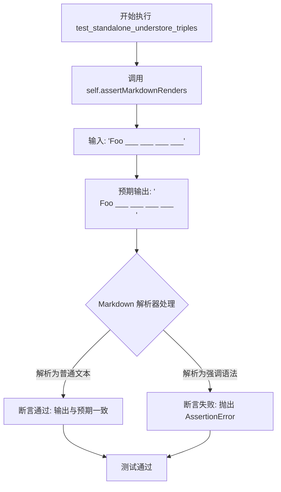

#### 带注释源码

```python
def test_standalone_understore_triples(self):
    """
    测试独立的连续三个下划线字符（triple underscore）不被解析为强调语法。
    
    该测试验证以下场景：
    - 输入: 'Foo ___ ___ ___ ___'（包含多个连续的三个下划线）
    - 预期输出: '<p>Foo ___ ___ ___ ___</p>'
    
    验证逻辑：
    三个连续的下划线（___）在 Markdown 中通常用于表示 <hr> 水平线或强调，
    但在特定上下文中（如非行首、非单词边界）应作为普通文本处理。
    """
    self.assertMarkdownRenders(
        'Foo ___ ___ ___ ___',  # 输入 Markdown 文本：包含多个独立的 triple underscore
        '<p>Foo ___ ___ ___ ___</p>'  # 预期渲染的 HTML 输出：保持原样
    )
```


### `TestNotEmphasis.test_standalone_asterisk_in_text`

该方法是Python-Markdown项目中的一个单元测试用例，用于验证在文本中间出现的独立星号（*）不应被解析为Markdown强调语法，而应作为普通字符原样输出。

参数：

- `self`：`TestCase`，测试类实例本身，包含测试所需的断言方法

返回值：`None`，该方法为测试用例，通过`assertMarkdownRenders`执行断言，不返回任何值

#### 流程图

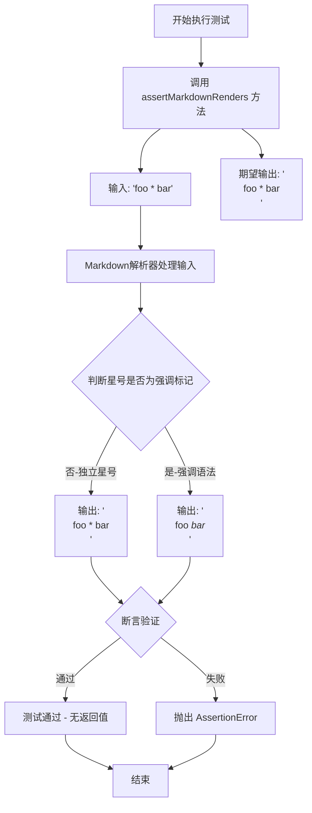

#### 带注释源码

```python
def test_standalone_asterisk_in_text(self):
    """
    测试文本中独立的星号不应被解析为强调语法
    
    验证场景: 当星号出现在两个单词之间（foo * bar）时，
    由于既不是成对出现，也不满足Markdown强调语法的位置要求，
    因此应作为普通字符处理，不进行强调渲染。
    """
    # 调用测试基类提供的断言方法
    # 参数1: Markdown源码输入
    # 参数2: 期望的HTML渲染结果
    self.assertMarkdownRenders(
        'foo * bar',          # 输入: 包含独立星号的文本
        '<p>foo * bar</p>'    # 期望输出: 星号作为普通字符保留
    )
```


### `TestNotEmphasis.test_standalone_understore_in_text`

该测试方法用于验证 Markdown 解析器在处理文本中单独出现的下划线字符时，能够正确识别其为普通文本而非强调（emphasis）标记。具体来说，当输入为 `'foo _ bar'` 时，解析输出应保持为 `<p>foo _ bar</p>`，即下划线不被转换为 HTML 强调标签。

#### 参数

- `self`：`TestNotEmphasis`，测试类实例本身，用于调用继承自 `TestCase` 的断言方法

#### 返回值

- `None`（无返回值），该方法为测试用例，通过 `self.assertMarkdownRenders` 执行断言验证

#### 流程图

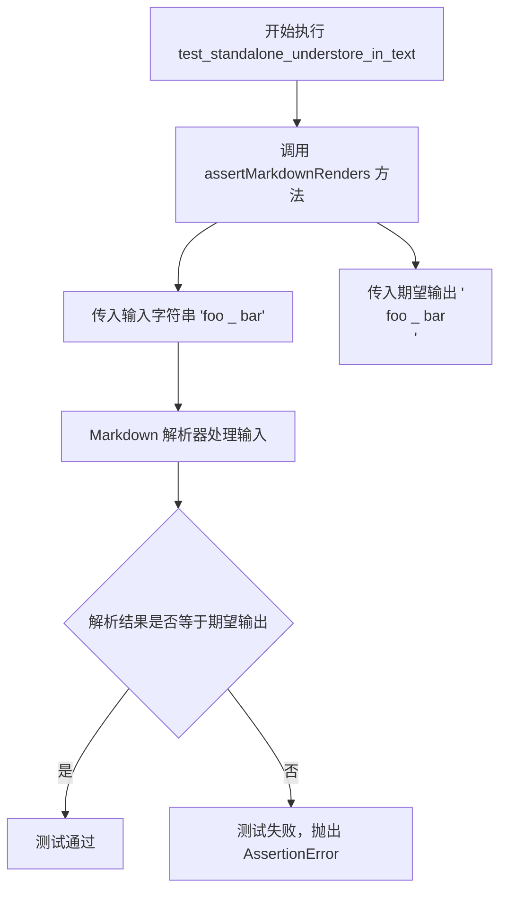

#### 带注释源码

```python
def test_standalone_understore_in_text(self):
    """
    测试文本中独立的下划线字符不会被解析为强调标记。
    
    验证场景：
    - 输入: 'foo _ bar'（下划线位于两个单词之间）
    - 期望输出: '<p>foo _ bar</p>'（下划线作为普通字符保留）
    
    测试目的：
    确保 Markdown 解析器能够区分：
    1. 独立的下划线（应作为普通字符）
    2. 成对的下划线（用于强调，如 _text_）
    3. 成双的下划线（用于加粗，如 __text__）
    """
    self.assertMarkdownRenders(
        'foo _ bar',      # 输入：包含独立下划线的文本
        '<p>foo _ bar</p>' # 期望输出：下划线保持为普通字符
    )
```


### `TestNotEmphasis.test_standalone_asterisks_in_text`

该测试方法用于验证 Markdown 解析器能够正确处理文本中非连续的独立星号字符，确保它们不会被错误地解析为强调语法，而是作为普通文本原样输出。

参数：

- `self`：`TestNotEmphasis`，隐式参数，表示测试类实例本身

返回值：`void`（无返回值），该方法为测试用例，通过断言验证功能，不返回具体值

#### 流程图

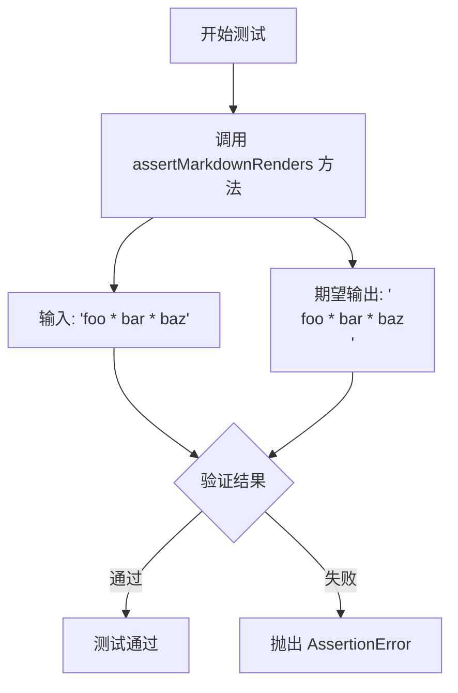

#### 带注释源码

```python
def test_standalone_asterisks_in_text(self):
    """
    测试方法：验证文本中独立的星号不会被解析为强调标记
    
    该测试确保 Markdown 解析器正确处理以下场景：
    - 星号出现在文本中间而非单独一行
    - 多个星号分散在文本中（foo * bar * baz）
    - 星号两侧有空格，但不构成有效的强调语法
    
    预期行为：星号应作为普通文本输出，不进行强调处理
    """
    self.assertMarkdownRenders(
        'foo * bar * baz',      # 输入：包含多个独立星号的文本
        '<p>foo * bar * baz</p>'  # 期望输出：星号作为普通文本保留
    )
```

#### 补充说明

| 项目 | 说明 |
|------|------|
| **测试目标** | 验证 Markdown 解析器对非强调语法的星号处理 |
| **输入格式** | 普通文本中夹杂星号字符 |
| **输出格式** | HTML 段落标签包裹的文本，星号保持原样 |
| **边界场景** | 星号不在行首、不连续、不构成有效强调语法 |
| **依赖方法** | `assertMarkdownRenders` 来自父类 `TestCase`，用于对比实际输出与期望输出 |


### `TestNotEmphasis.test_standalone_understores_in_text`

该测试方法用于验证 Markdown 解析器能够正确处理文本中非连续出现的独立下划线字符（`_`），确保这些下划线不被误解为强调标记，而是作为普通文本原样保留。

参数：

- `self`：`TestNotEmphasis`（隐式参数），测试类的实例本身

返回值：`None`，该方法为测试用例，通过 `assertMarkdownRenders` 进行断言验证，不返回任何值

#### 流程图

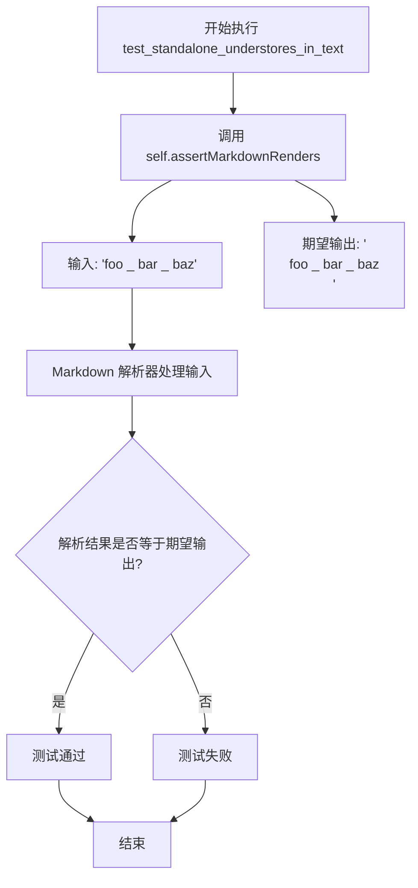

#### 带注释源码

```python
def test_standalone_understores_in_text(self):
    """
    测试独立下划线在文本中的处理。
    
    验证在文本中间出现的单个下划线（不连续）不会被
    Markdown 解析器解释为强调标记，而是作为普通字符保留。
    
    例如：'foo _ bar _ baz' 应该渲染为 '<p>foo _ bar _ baz</p>'
    而不是被转换为强调语法。
    """
    self.assertMarkdownRenders(
        'foo _ bar _ baz',      # 输入 Markdown 文本，包含非连续的下划线
        '<p>foo _ bar _ baz</p>'  # 期望的 HTML 输出，下划线作为普通文本保留
    )
```


### `TestNotEmphasis.test_standalone_asterisks_with_newlines`

该测试方法用于验证 Markdown 解析器在处理包含换行符的文本时，能够正确识别独立的星号（*）并避免错误地将它们转换为强调标签。

参数：
- `self`：隐式参数，`TestCase` 实例本身

返回值：`None`，测试方法无显式返回值，通过 `assertMarkdownRenders` 断言验证 Markdown 渲染结果

#### 流程图

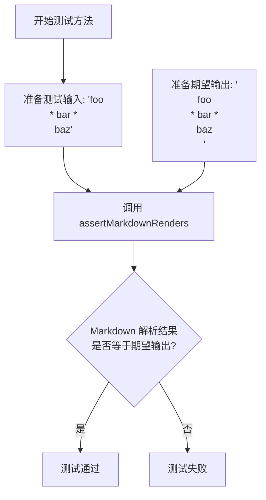

#### 带注释源码

```python
def test_standalone_asterisks_with_newlines(self):
    """
    测试带有换行符的独立星号组合。
    
    验证 Markdown 解析器在多行文本中遇到 '* bar *' 这种模式时，
    不会错误地将中间的空格和字符转换为强调（斜体/加粗）标签。
    
    关键点：
    - 输入包含换行符：'foo\n* bar *\nbaz'
    - 星号周围有空格，不是连续的星号对
    - 期望保持原样输出，不进行强调转换
    """
    self.assertMarkdownRenders(
        'foo\n* bar *\nbaz',  # 源码输入：包含换行符和多行星号模式的Markdown文本
        '<p>foo\n* bar *\nbaz</p>'  # 期望输出：HTML段落标签包裹，保持星号原样
    )
```


### `TestNotEmphasis.test_standalone_understores_with_newlines`

该方法用于测试 Markdown 解析器在处理包含换行符的文本中独立下划线（underscore）时的行为，验证独立的下划线字符不被解析为强调语法，而是作为普通字符原样输出。

参数：

- `self`：`TestCase`，测试类实例，继承自 `markdown.test_tools.TestCase`，提供 `assertMarkdownRenders` 方法用于验证 Markdown 渲染结果

返回值：`None`，测试方法无返回值，通过 `assertMarkdownRenders` 方法进行断言验证

#### 流程图

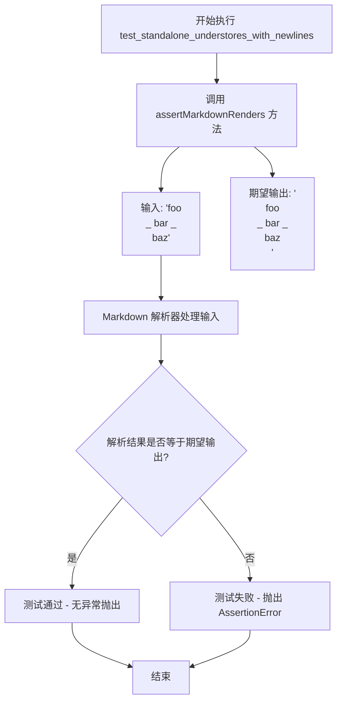

#### 带注释源码

```python
def test_standalone_understores_with_newlines(self):
    """
    测试独立下划线在包含换行符的文本中的处理行为。
    
    验证场景：
    - 输入文本包含换行符（\n）
    - 下划线（_）前后有空格，但不构成有效的强调语法
    - 期望结果：下划线作为普通字符原样保留，不被解析为 <em> 或 <strong>
    """
    # 调用父类提供的测试工具方法，验证 Markdown 渲染结果
    self.assertMarkdownRenders(
        'foo\n_ bar _\nbaz',    # 输入：包含换行符和独立下划线的文本
        '<p>foo\n_ bar _\nbaz</p>'  # 期望输出：下划线保持为普通字符
    )
```


### `TestNotEmphasis.test_standalone_underscore_at_begin`

该测试方法用于验证 Markdown 解析器对以下划线开头的文本的处理能力。具体来说，它测试当文本以独立的下划线开头（前面有空格），且文本中间也包含下划线时，解析器应正确识别这些下划线不是强调（emphasis）标记，从而原样输出而不进行转换。

参数：

- `self`：实例方法隐式参数，表示测试类 `TestNotEmphasis` 的实例对象

返回值：`None`，测试方法无返回值，通过 `assertMarkdownRenders` 断言验证渲染结果

#### 流程图

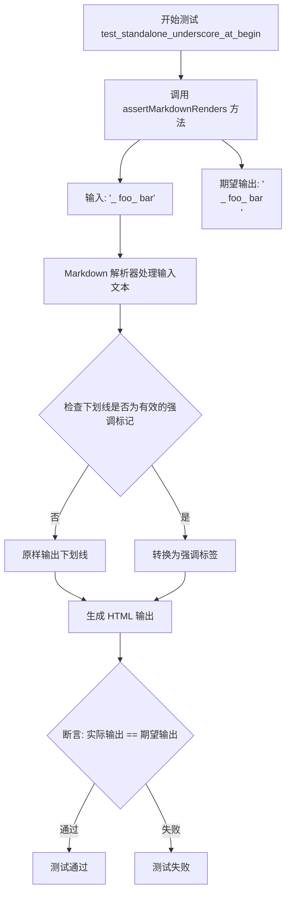

#### 带注释源码

```python
def test_standalone_underscore_at_begin(self):
    """
    测试 standalone underscore at begin - 测试以下划线开头的文本渲染
    
    验证 Markdown 解析器正确处理以下情况：
    - 文本以独立下划线开头（下划线前有空格）
    - 文本中间包含下划线但不成对
    
    预期行为：下划线不被解析为强调标记，原样保留在输出中
    """
    self.assertMarkdownRenders(
        '_ foo_ bar',           # 输入 Markdown 文本：包含开头和中间的下划线
        '<p>_ foo_ bar</p>'    # 期望的 HTML 输出：下划线未被转换为强调标签
    )
```


### `TestNotEmphasis.test_standalone_asterisk_at_end`

该测试方法用于验证 Markdown 解析器在处理文本末尾包含星号时的边界情况。具体测试用例为输入 `'foo *bar *'`（星号位于文本末尾），期望输出为 `<p>foo *bar *</p>`，确保末尾的星号不会被错误地解析为强调标记的开始。

参数： 无（仅隐式参数 `self`）

返回值： 无（通过 `assertMarkdownRenders` 断言进行验证，无显式返回值）

#### 流程图

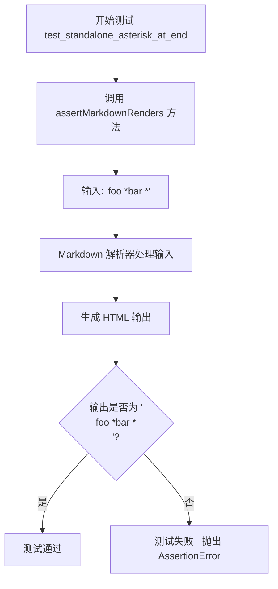

#### 带注释源码

```python
def test_standalone_asterisk_at_end(self):
    """
    测试 Markdown 解析器处理末尾星号的边界情况。
    
    验证当星号出现在文本末尾时（例如 'foo *bar *'），
    解析器不会将其识别为强调标记的开始，而是将其作为普通字符输出。
    """
    self.assertMarkdownRenders(
        'foo *bar *',      # 输入：包含末尾星号的 Markdown 文本
        '<p>foo *bar *</p>'  # 期望输出：星号保持为普通字符，不进行强调处理
    )
```


### `TestNotEmphasis.test_standalone_understores_at_begin_end`

该测试方法用于验证 Markdown 解析器在处理文本开头和结尾均带有独立下划线字符时的正确性，确保下划线不被误解析为强调语法，而是作为普通字符原样输出。

参数：

- `self`：`TestNotEmphasis`（隐式），测试类的实例本身，用于调用继承的 `assertMarkdownRenders` 方法

返回值：`None`，测试方法无返回值，通过 `assertMarkdownRenders` 断言验证解析结果

#### 流程图

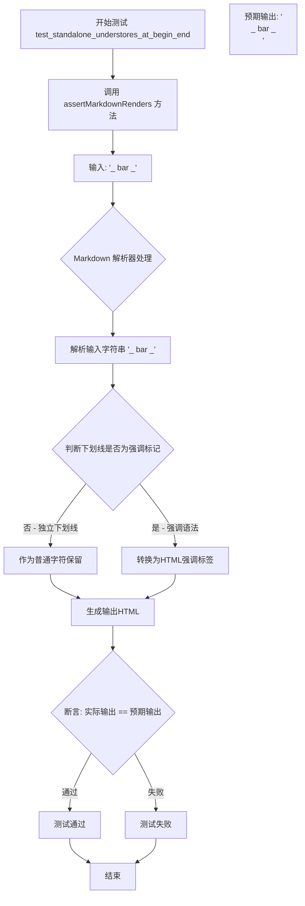

#### 带注释源码

```python
def test_standalone_understores_at_begin_end(self):
    """
    测试独立下划线在文本开头和结尾的情况。
    
    验证 Markdown 解析器正确处理形如 '_ bar _' 的输入，
    其中下划线位于文本开头和结尾，应作为普通字符而非强调标记处理。
    """
    # 调用父类 TestCase 提供的断言方法验证 Markdown 渲染结果
    self.assertMarkdownRenders(
        '_ bar _',           # 输入: Markdown 源文本，开头和结尾各有独立下划线
        '<p>_ bar _</p>'     # 期望输出: HTML 段落，下划线作为普通字符保留
    )
```


### TestNotEmphasis.test_complex_emphasis_asterisk

该方法是一个单元测试用例，用于验证Markdown解析器能够正确处理复杂的嵌套强调语法（星号形式）。具体测试的是在同时存在粗体（`**`）和斜体（`*`）标记时，解析器能否正确识别嵌套关系并生成对应的HTML标签。

参数：

- `self`：`TestCase`，测试类的实例本身，无需显式传递

返回值：`None`，测试方法无返回值，通过断言验证渲染结果

#### 流程图

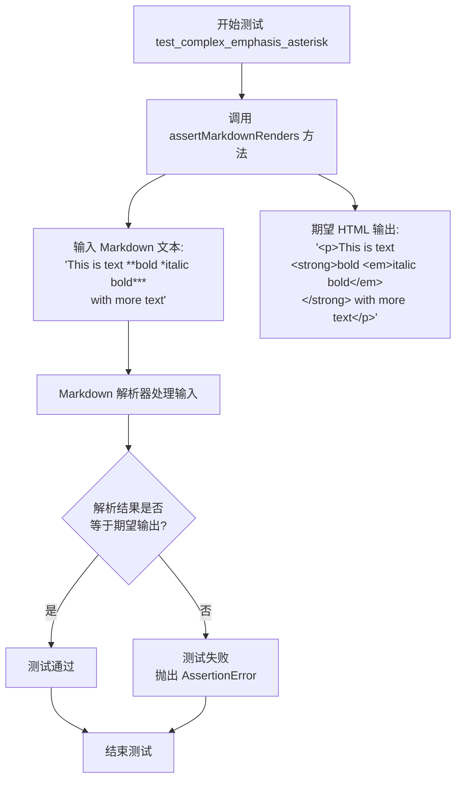

#### 带注释源码

```python
def test_complex_emphasis_asterisk(self):
    """
    测试复杂的星号强调语法（嵌套粗体和斜体）。
    
    验证 Markdown 解析器能够正确处理如下情况：
    - 外层使用 ** 包裹表示粗体
    - 内层使用 * 包裹表示斜体
    - 嵌套结构：<strong>bold <em>italic bold</em></strong>
    """
    # 调用父类提供的测试辅助方法，验证 Markdown 渲染结果
    # 参数1: 输入的 Markdown 原始文本
    # 参数2: 期望渲染输出的 HTML 文本
    self.assertMarkdownRenders(
        'This is text **bold *italic bold*** with more text',  # 输入: 包含嵌套强调的文本
        '<p>This is text <strong>bold <em>italic bold</em></strong> with more text</p>'  # 期望: 正确嵌套的HTML
    )
```


### `TestNotEmphasis.test_complex_emphasis_asterisk_mid_word`

该方法是 Python Markdown 项目中的一个测试用例，用于验证 Markdown 解析器能够正确处理在单词中间的星号（*）字符的复杂强调语法。具体测试的是当粗体标记（`**`）内部包含斜体标记（`*`）且该斜体标记出现在单词中间时的渲染结果。

参数：

- `self`：TestCase，测试类实例本身，隐式参数无需显式传递

返回值：`None`，无返回值（测试方法使用断言验证结果，不返回任何值）

#### 流程图

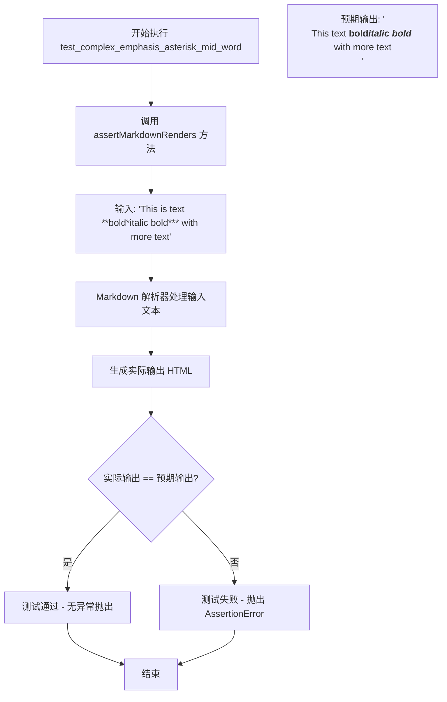

#### 带注释源码

```python
def test_complex_emphasis_asterisk_mid_word(self):
    """
    测试复杂强调语法：星号在单词中间的混合强调
    
    验证 Markdown 解析器能正确处理以下场景：
    - 外层使用双星号(**)表示粗体
    - 内层使用单星号(*)表示斜体
    - 斜体标记出现在单词中间（如 bold*italic）
    
    测试输入: 'This is text **bold*italic bold*** with more text'
    预期输出: '<p>This is text <strong>bold<em>italic bold</em></strong> with more text</p>'
    
    注意：在这个测试用例中，'bold*italic bold' 表示：
    - 'bold' 是普通文本（紧邻内层星号）
    - '*italic bold*' 是一个斜体强调（在外层粗体内部）
    """
    self.assertMarkdownRenders(
        'This is text **bold*italic bold*** with more text',
        '<p>This is text <strong>bold<em>italic bold</em></strong> with more text</p>'
    )
```

---

**补充说明**

| 项目 | 详情 |
|------|------|
| **所属类** | `TestNotEmphasis` |
| **父类** | `TestCase` (来自 `markdown.test_tools`) |
| **测试目的** | 验证 Markdown 解析器对混合强调语法的处理能力，特别是星号出现在单词中间的情况 |
| **测试场景** | 输入文本包含 `**bold*italic bold***`，其中内层 `*` 出现在 `bold` 和 `italic` 之间 |
| **关键验证点** | 解析器应正确识别：外层 `**...***` 为粗体，内部 `*...*` 为斜体，且内层斜体标记在单词中间时不影响外层粗体的闭合判断 |
| **设计约束** | 测试确保解析器遵循 Markdown 规范中关于强调标记嵌套和边界判断的规则 |


### `TestNotEmphasis.test_complex_emphasis_smart_underscore`

该测试方法用于验证 Markdown 解析器在下划线（underscore）智能强调模式下的正确性，测试复杂的嵌套强调标签（如 `__bold _italic bold___`）是否能正确解析为对应的 HTML 标签（`<strong>` 和 `<em>`）。

参数：

- `self`：`TestNotEmphasis` 实例，代表测试类本身，无需显式传递

返回值：`None`（无返回值），该方法通过 `assertMarkdownRenders` 断言验证 Markdown 渲染结果是否符合预期

#### 流程图

```mermaid
flowchart TD
    A[开始执行 test_complex_emphasis_smart_underscore] --> B[调用 assertMarkdownRenders 方法]
    B --> C[输入: 'This is text __bold _italic bold___ with more text']
    D[期望输出: '<p>This text <strong>bold <em>italic bold</em></strong> with more text</p>']
    C --> E[Markdown 解析器处理输入文本]
    E --> F[识别 __ 开头作为强调开始]
    F --> G[嵌套处理内部 _italic bold_]
    G --> H[生成 HTML 结构]
    H --> I{断言: 实际输出 == 期望输出?}
    I -->|是| J[测试通过]
    I -->|否| K[测试失败, 抛出 AssertionError]
    J --> L[结束]
    K --> L
```

#### 带注释源码

```python
def test_complex_emphasis_smart_underscore(self):
    """
    测试 Markdown 解析器的智能下划线强调功能。
    
    验证当使用双下划线 __ 包围文本，且内部包含单下划线 _ 时，
    解析器能够正确识别嵌套的强调标签（<strong> 和 <em>）。
    """
    # 调用父类 TestCase 的 assertMarkdownRenders 方法进行断言验证
    # 参数1: 输入的 Markdown 原始文本
    # 参数2: 期望输出的 HTML 文本
    self.assertMarkdownRenders(
        'This is text __bold _italic bold___ with more text',  # Markdown 输入: 使用双下划线定义粗体,内部单下划线定义斜体
        '<p>This is text <strong>bold <em>italic bold</em></strong> with more text</p>'  # 期望 HTML: <p>标签包裹,双下划线转为<strong>,单下划线转为<em>
    )
```


### `TestNotEmphasis.test_complex_emphasis_smart_underscore_mid_word`

这是一个测试方法，用于验证 Markdown 解析器在处理 smart underscore（智能下划线）强调语法时的行为。当下划线出现在单词中间（如 `__bold_italic bold___`）时，Markdown 解析器不应将其解析为强调标签，而应保留原始的下划线字符。

参数：

- `self`：`TestNotEmphasis`，继承自 `TestCase` 的测试类实例，表示当前测试对象

返回值：`None`，该方法为测试方法，无返回值，通过 `assertMarkdownRenders` 断言验证 Markdown 渲染结果

#### 流程图

```mermaid
flowchart TD
    A[开始执行 test_complex_emphasis_smart_underscore_mid_word] --> B[调用 assertMarkdownRenders 方法]
    B --> C[输入: 'This is text __bold_italic bold___ with more text']
    B --> D[期望输出: '<p>This is text __bold_italic bold___ with more text</p>']
    C --> E[Markdown 解析器处理输入]
    E --> F{解析结果是否匹配期望?}
    F -->|是| G[测试通过]
    F -->|否| H[测试失败]
    G --> I[结束]
    H --> I
```

#### 带注释源码

```python
def test_complex_emphasis_smart_underscore_mid_word(self):
    """
    测试 smart underscore 在单词中间的强调处理
    
    当下划线出现在单词中间时（如 __bold_italic bold___），
    Markdown 解析器应该将其视为普通字符，不进行强调处理。
    这是因为在许多编程场景中，下划线是合法的标识符字符。
    """
    self.assertMarkdownRenders(
        'This is text __bold_italic bold___ with more text',  # 输入的 Markdown 文本
        '<p>This is text __bold_italic bold___ with more text</p>'  # 期望的 HTML 输出
    )
```


### `TestNotEmphasis.test_nested_emphasis`

该测试方法用于验证 Markdown 解析器对嵌套强调语法的处理能力。具体来说，它检查当文本中同时存在粗体（`**`）和斜体（`*`）标记，且斜体标记嵌套在粗体标记内部（`**bold *italic* *italic* bold**`）时，解析器能否正确生成对应的 HTML 结构（`<strong>` 包裹 `<em>`）。

参数：

- `self`：`TestNotEmphasis`（继承自 `TestCase`），测试类实例本身。

返回值：`None`，该方法为测试用例，执行完毕后无返回值（若断言失败则抛出 `AssertionError`）。

#### 流程图

```mermaid
graph TD
    Start((开始)) --> Input[定义输入 Markdown: 'This text is **bold *italic* *italic* bold**']
    Input --> Expect[定义期望 HTML: '<p>This text is <strong>bold <em>italic</em> <em>italic</em> bold</strong></p>']
    Expect --> Call{调用 self.assertMarkdownRenders}
    
    subgraph 内部处理流程 [assertMarkdownRenders 内部逻辑]
    Call --> Process[调用 Markdown 库解析输入]
    Process --> Output[生成输出 HTML]
    Output --> Compare{比对 输出HTML 与 期望HTML}
    end
    
    Compare -->|匹配| Success((测试通过 / 返回 None))
    Compare -->|不匹配| Fail((测试失败 / 抛出 AssertionError))
```

#### 带注释源码

```python
def test_nested_emphasis(self):
    """
    测试嵌套 emphasis (强调) 的渲染。
    验证多个 italic (斜体) 标记正确嵌套在 bold (粗体) 标记中。
    """
    # 定义输入的 Markdown 文本
    # 包含外层 **bold** 和内层 *italic*
    input_markdown = 'This text is **bold *italic* *italic* bold**'
    
    # 定义期望的 HTML 输出
    # 期望外层标签为 <strong>，内层标签为 <em>
    expected_html = '<p>This text is <strong>bold <em>italic</em> <em>italic</em> bold</strong></p>'
    
    # 调用父类测试工具方法进行验证
    self.assertMarkdownRenders(
        input_markdown,
        expected_html
    )
```


### `TestNotEmphasis.test_complex_multple_emphasis_type`

该方法是一个单元测试，用于验证 Markdown 解析器在处理包含多个不同类型强调标记（星号*和双星号**）的复杂文本时，能否正确地将它们渲染为嵌套的 HTML 强调标签（`<strong>` 和 `<em>`）。

参数：

- `self`：`TestNotEmphasis`（隐式参数），测试类实例本身

返回值：无（`None`），该方法为测试方法，使用 `assertMarkdownRenders` 进行断言验证，不返回任何值

#### 流程图

```mermaid
flowchart TD
    A[开始测试 test_complex_multple_emphasis_type] --> B[调用 assertMarkdownRenders 方法]
    B --> C[输入: 'traced ***along*** bla **blocked** if other ***or***']
    D[预期输出: '<p>traced <strong><em>along</em></strong> bla <strong>blocked</strong> if other <strong><em>or</em></strong></p>']
    C --> E{解析 Markdown}
    E --> F[识别 ***along*** 为 <strong><em>along</em></strong>]
    E --> G[识别 **blocked** 为 <strong>blocked</strong>]
    E --> H[识别 ***or*** 为 <strong><em>or</em></strong>]
    F --> I[生成完整 HTML]
    G --> I
    H --> I
    I --> J{断言: 实际输出 == 预期输出}
    J -->|是| K[测试通过]
    J -->|否| L[测试失败, 抛出 AssertionError]
    K --> M[结束测试]
    L --> M
```

#### 带注释源码

```python
def test_complex_multple_emphasis_type(self):
    """
    测试复杂多重强调类型组合的渲染结果
    
    该测试验证 Markdown 解析器能够正确处理以下场景:
    1. 三星号 ***text*** 表示 <strong><em>text</em></strong> (粗体+斜体)
    2. 双星号 **text** 表示 <strong>text</strong> (粗体)
    3. 多种强调标记在同一文本中混合使用
    """
    
    # 使用 assertMarkdownRenders 验证 Markdown 到 HTML 的转换
    # 参数1: 输入的 Markdown 文本
    # 参数2: 期望输出的 HTML 文本
    self.assertMarkdownRenders(
        'traced ***along*** bla **blocked** if other ***or***',
        '<p>traced <strong><em>along</em></strong> bla <strong>blocked</strong> if other <strong><em>or</em></strong></p>'  # noqa: E501
    )
    # 验证点:
    # - '***along***' 被解析为 <strong><em>along</em></strong> (外层粗体+内层斜体)
    # - '**blocked**' 被解析为 <strong>blocked</strong> (纯粗体)
    # - '***or***' 被解析为 <strong><em>or</em></strong> (外层粗体+内层斜体)
    # - 文本 'traced', 'bla', 'if other' 保持普通文本格式
```


### `TestNotEmphasis.test_complex_multple_emphasis_type_variant2`

该测试方法用于验证Markdown解析器在处理混合强调类型（粗体 `**` 与粗体+斜体 `***` 混合）时的正确性，确保嵌套的强调标记能够正确转换为对应的HTML标签。

参数：
- `self`：TestCase，测试类的实例方法隐含参数

返回值：`None`，测试方法无返回值，通过 `assertMarkdownRenders` 断言验证渲染结果

#### 流程图

```mermaid
flowchart TD
    A[开始执行测试] --> B[调用assertMarkdownRenders方法]
    B --> C[输入Markdown文本]
    C --> D["'on the **1-4 row** of the AP Combat Table ***and*** receive'"]
    D --> E[Markdown解析器处理]
    E --> F1[处理 **1-4 row** 为粗体]
    E --> F2[处理 ***and*** 为粗体+斜体]
    F1 --> G[生成HTML输出]
    F2 --> G
    G --> H["<p>on the <strong>1-4 row</strong> of the AP Combat Table <strong><em>and</em></strong> receive</p>"]
    H --> I{输出与期望匹配?}
    I -->|是| J[测试通过]
    I -->|否| K[测试失败抛出断言错误]
```

#### 带注释源码

```python
def test_complex_multple_emphasis_type_variant2(self):
    """
    测试方法：test_complex_multple_emphasis_type_variant2
    
    测试Markdown解析器对混合强调类型的处理能力：
    1. **text** -> <strong>text</strong> (粗体)
    2. ***text*** -> <strong><em>text</em></strong> (粗体+斜体)
    
    此测试验证两种不同强调标记在同一文本中的正确渲染。
    """
    
    # 调用父类TestCase的assertMarkdownRenders方法进行渲染验证
    # 参数1: 输入的Markdown文本（包含混合强调标记）
    # 参数2: 期望的HTML输出
    self.assertMarkdownRenders(
        # 输入: 包含 **粗体** 和 ***粗体+斜体*** 的文本
        'on the **1-4 row** of the AP Combat Table ***and*** receive',
        
        # 期望输出: 
        # - **1-4 row** 转换为 <strong>1-4 row</strong>
        # - ***and*** 转换为 <strong><em>and</em></strong>
        '<p>on the <strong>1-4 row</strong> of the AP Combat Table <strong><em>and</em></strong> receive</p>'
    )
```


### TestNotEmphasis.test_link_emphasis_outer

该测试方法用于验证 Markdown 解析器正确处理链接外部被强调符号包裹的情况，即 `**[text](url)**` 这样的嵌套语法能够正确转换为 `<strong><a href="url">text</a></strong>`。

参数：

- 无参数（继承自 TestCase 的测试方法，使用 self）

返回值：`None`，无返回值（测试方法）

#### 流程图

```mermaid
flowchart TD
    A[开始测试 test_link_emphasis_outer] --> B[调用 assertMarkdownRenders 方法]
    B --> C[输入: '**[text](url)**']
    B --> D[期望输出: '<p><strong><a href="url">text</a></strong></p>']
    C --> E[Markdown 解析器处理输入]
    E --> F{解析链接和强调}
    F -->|成功| G[生成实际输出]
    F -->|失败| H[抛出 AssertionError]
    G --> I{比较实际输出与期望输出}
    I -->|相等| J[测试通过]
    I -->|不等| H
    J --> K[结束测试]
    H --> K
```

#### 带注释源码

```python
def test_link_emphasis_outer(self):
    """
    测试链接外部有强调符号的情况。
    
    验证 Markdown 语法: **[text](url)**
    期望渲染为: <p><strong><a href="url">text</a></strong></p>
    
    这种情况是强调符号包裹整个链接，包括链接标记。
    强调符号位于链接的外部。
    """
    
    # 使用继承的 assertMarkdownRenders 方法进行测试
    # 参数1: 输入的 Markdown 原文
    # 参数2: 期望的 HTML 输出
    self.assertMarkdownRenders(
        '**[text](url)**',          # 输入: 链接外部有双星号强调
        '<p><strong><a href="url">text</a></strong></p>'  # 期望输出: 强调包裹链接
    )
```


### `TestNotEmphasis.test_link_emphasis_inner`

该测试方法用于验证 Markdown 中链接内部包含粗体文本（`**text**` 包裹在链接 `[text](url)` 内部）时的正确渲染行为。

参数：

- `self`：`TestCase`，测试类实例本身，继承自 `markdown.test_tools.TestCase`

返回值：`None`，测试方法无返回值，通过断言方法验证渲染结果

#### 流程图

```mermaid
flowchart TD
    A[开始测试] --> B[调用 assertMarkdownRenders 方法]
    B --> C[输入: [**text**](url)]
    C --> D[期望输出: <p><a href="url"><strong>text</strong></a></p>]
    D --> E{实际输出 == 期望输出?}
    E -->|是| F[测试通过]
    E -->|否| G[测试失败 - 抛出 AssertionError]
```

#### 带注释源码

```python
def test_link_emphasis_inner(self):
    """
    测试链接内部包含粗体 emphasis 的渲染情况。
    
    测试场景: [**text**](url)
    期望输出: <p><a href="url"><strong>text</strong></a></p>
    
    验证逻辑:
    1. 输入为 Markdown 语法: [**text**](url)
       - 这是一个链接 [text](url)，其中 text 被 ** 包裹表示粗体
    2. 期望输出为 HTML: <p><a href="url"><strong>text</strong></a></p>
       - 链接 <a> 包裹着粗体 <strong> 标签
    """
    
    # 调用父类 TestCase 提供的断言方法验证 Markdown 渲染
    self.assertMarkdownRenders(
        '[**text**](url)',  # 输入: Markdown 格式的链接，内部包含粗体
        '<p><a href="url"><strong>text</strong></a></p>'  # 期望输出: HTML 格式
    )
```

---

**备注**：该方法是 Python-Markdown 项目中的单元测试用例，继承自 `markdown.test_tools.TestCase`，使用 `assertMarkdownRenders` 方法对比输入的 Markdown 文本与期望生成的 HTML 输出是否一致。此测试确保了链接内嵌粗体格式的正确解析和渲染。


### TestNotEmphasis.test_link_emphasis_inner_outer

该测试方法用于验证Markdown解析器在处理链接和强调标记嵌套时的正确性，测试用例为输入`**[**text**](url)**`（外层和内层都包含强调标记的链接），期望输出为`<p><strong><a href="url"><strong>text</strong></a></strong></p>`。

参数：

- `self`：实例方法隐含参数，表示测试类实例本身，无需显式传递

返回值：`None`，该方法为测试用例，通过`assertMarkdownRenders`断言验证Markdown解析结果是否符合预期，若不符合则抛出异常

#### 流程图

```mermaid
flowchart TD
    A[开始测试] --> B[调用assertMarkdownRenders方法]
    B --> C[输入 Markdown: **[**text**](url)**]
    C --> D[Markdown解析器处理输入]
    D --> E{解析流程}
    E -->|外层强调| F[识别外层**开始和结束标记]
    E -->|内层链接| G[识别[text]和(url)组合为链接]
    E -->|内层强调| H[识别链接文本内部的**标记]
    F --> I[生成HTML: &lt;strong&gt;]
    G --> J[生成HTML: &lt;a href='url'&gt;]
    H --> K[生成HTML: &lt;strong&gt;text&lt;/strong&gt;]
    I --> L[组合所有HTML标签]
    J --> L
    K --> L
    L --> M[输出: &lt;p&gt;&lt;strong&gt;&lt;a href='url'&gt;&lt;strong&gt;text&lt;/strong&gt;&lt;/a&gt;&lt;/strong&gt;&lt;/p&gt;]
    M --> N{断言验证}
    N -->|通过| O[测试通过 - 返回None]
    N -->|失败| P[抛出AssertionError异常]
```

#### 带注释源码

```python
def test_link_emphasis_inner_outer(self):
    """
    测试链接和强调标记的嵌套场景：外层和内层都包含强调标记。
    
    测试用例验证以下Markdown语法：
    - 外层使用 **...** 表示强调
    - 内层包含一个完整链接 [**text**](url)
    - 链接文本内部又使用 **text** 表示强调
    
    期望解析为HTML：
    <p><strong><a href="url"><strong>text</strong></a></strong></p>
    
    即：外层强调包含一个链接，链接内部包含内层强调。
    """
    
    # 调用父类测试框架的断言方法，验证Markdown解析结果
    # 参数1: 输入的Markdown文本
    # 参数2: 期望输出的HTML文本
    self.assertMarkdownRenders(
        '**[**text**](url)**',  # 输入: 外层强调包围内层链接，链接文本内又有强调
        '<p><strong><a href="url"><strong>text</strong></a></strong></p>'  # 期望输出: 正确嵌套的HTML
    )
```

## 关键组件


### TestNotEmphasis

测试非强调场景的测试类，继承自markdown.test_tools.TestCase，用于验证Markdown解析器正确处理不应被解析为强调标记的星号(*)和下划线(_)场景。

### 独立符号测试

测试独立星号和下划线不被错误解析为强调标记，包含单字符、连续字符、成对字符、三重字符等场景，验证解析器能正确识别文本中的普通符号。

### 文本内嵌符号测试

测试在普通文本中出现的星号和下划线能正确渲染为普通字符，包括单词中间、句子中间以及跨行等情况。

### 复杂强调组合测试

测试粗体和斜体的复杂嵌套场景，包括**粗体 *斜体 粗体***、__粗体 _斜体 粗体___等组合，验证解析器正确处理标记优先级和嵌套关系。

### 链接与强调嵌套测试

测试链接标记与强调标记的嵌套组合，包括**[**text**](url)**、[**text**](url)等场景，验证解析器正确处理不同位置的标记组合。


## 问题及建议


### 已知问题

- 测试方法命名不规范：`TestNotEmphasis` 类名表明测试"非强调"内容，但包含 `test_complex_emphasis_*` 等测试强调功能的用例，命名混淆
- 代码重复：多个测试方法结构高度相似（输入-输出验证模式），未使用 pytest 参数化装饰器，导致大量冗余代码
- 魔法字符串：期望的 HTML 输出以硬编码字符串形式分散在各处，维护成本高，HTML 格式变更时需修改多处
- 缺乏测试文档：测试方法缺少 docstring，无法快速理解每个用例验证的具体边界条件
- 行长度违规：部分行超过 PEP 8 推荐的 80 字符限制（如 `test_complex_multple_emphasis_type` 中的期望输出），需用 `# noqa: E501` 忽略
- 测试隔离性不明确：未明确测试是否独立运行，类级别的状态修改可能影响测试独立性
- 测试覆盖不均：强调相关的测试（星号、下划线）较全面，但链接与强调嵌套场景覆盖有限

### 优化建议

- 重命名测试类：根据实际测试内容拆分为 `TestNotEmphasis`（测试非强调场景）和 `TestEmphasisRendering`（测试强调渲染），或统一为 `TestEmphasisBehavior`
- 使用 pytest 参数化：利用 `@pytest.mark.parametrize` 装饰器将相似测试用例合并，减少重复代码
- 提取测试数据：将输入/输出对定义为外部数据文件或常量类，提升可维护性
- 添加 docstring：为每个测试方法编写简洁说明，明确验证的 Markdown 语法场景
- 修复长行：将超长字符串拆分为多行或使用隐式字符串连接
- 增强测试独立性：确保每个测试方法不依赖执行顺序，必要时在 `setUp` 中重置状态
- 补充边界用例：增加对 Unicode 字符、混合语言、空格处理等边界情况的测试覆盖


## 其它


### 设计目标与约束

本测试文件旨在验证Python Markdown库对非强调标记（星号*和下划线_）的正确处理能力。设计目标包括：1）确保独立的星号和下划线不被误解析为强调标记；2）验证连续多个星号/下划线在特定上下文中的正确行为；3）测试复杂嵌套场景下强调与非强调的正确区分。约束条件包括：遵循CommonMark规范中关于强调标记的解析规则，兼容旧版Markdown行为，并确保性能开销在可接受范围内。

### 错误处理与异常设计

本测试文件使用Python unittest框架的assertMarkdownRenders方法进行验证。当测试失败时，会抛出AssertionError并显示期望HTML与实际HTML的差异。测试文件本身不包含业务逻辑错误处理，所有错误处理机制依赖于父类TestCase和assertMarkdownRenders方法。若遇到无效的Markdown输入，markdown核心库应返回原始文本或按照规范进行处理。

### 数据流与状态机

测试数据流主要围绕Markdown解析器的状态转换：输入文本→词法分析器→标记识别→语法解析器→HTML输出。关键状态包括：1）非强调状态：检测到独立星号/下划线时保持原样输出；2）强调开始状态：遇到成对星号/下划线时进入强调模式；3）强调结束状态：遇到对应的结束标记时退出强调模式。状态转换由正则表达式和状态机共同控制，确保边界条件（如行首、行尾、单词中间等）的正确处理。

### 外部依赖与接口契约

本测试文件依赖以下外部组件：1）markdown.test_tools.TestCase：提供assertMarkdownRenders方法，接收(input_text, expected_html)参数并验证解析结果；2）markdown核心库：负责实际的Markdown到HTML转换；3）Python unittest框架：提供测试运行基础设施。接口契约方面，assertMarkdownRenders(input_md: str, expected_html: str)方法应返回None并在不匹配时抛出AssertionError，markdown库应接受字符串输入并返回HTML字符串输出。

### 性能考量和边界条件

性能方面，单个测试用例应在毫秒级完成，整体测试套件执行时间应在可接受范围内。边界条件包括：1）空字符串输入；2）仅包含星号/下划线的输入；3）星号/下划线位于行首、行尾、行中间；4）多个星号/下划线连续出现；5）与链接、图像等其它语法元素的组合；6）跨行情况。测试用例已覆盖这些边界条件，但可考虑增加更大规模文本的性能基准测试。

### 测试覆盖度分析

当前测试覆盖了独立星号/下划线、连续星号/下划线、文本中星号/下划线、复杂强调嵌套、多类型强调混合、链接与强调组合等场景。覆盖盲点可能包括：1）Unicode特殊字符与星号/下划线的组合；2）与HTML标签混合的边界情况；3）非常规字符集下的行为；4）大规模文档的性能表现。建议后续补充压力测试和国际化场景测试。

### 代码质量评估

代码质量评估：测试用例命名清晰，每个方法准确描述测试场景；测试之间相互独立，无状态共享；使用assertMarkdownRenders提供语义化的断言接口。改进空间：可增加参数化测试以减少重复代码；可添加文档字符串说明每个测试用例的预期行为和CommonMark规范依据；可考虑将部分测试用例归类到不同的测试类中以提高可维护性。

    