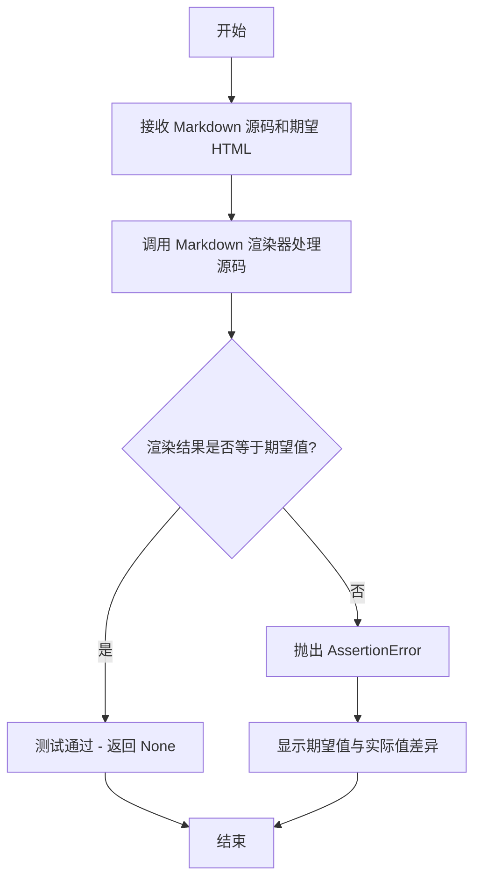
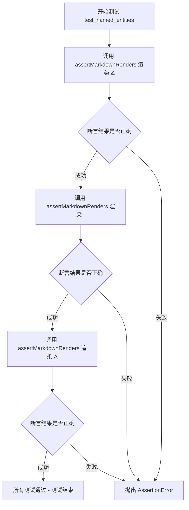

```mermaid
flowchart TD
    A[开始执行 test_decimal_entities] --> B{执行第一个断言}
    B -->|通过| C[验证 &#38; 渲染为 <p>&#38;</p>]
    C --> D{执行第二个断言}
    D -->|通过| E[验证 &#178; 渲染为 <p>&#178;</p>]
    E --> F[测试通过 - 方法结束]
    B -->|失败| G[抛出 AssertionError]
    D -->|失败| G
```

```mermaid
flowchart TD
    A[开始测试 test_hexadecimal_entities] --> B[调用 assertMarkdownRenders 验证 &#x00026;]
    B --> C{验证通过?}
    C -->|是| D[调用 assertMarkdownRenders 验证 &#xB2;]
    C -->|否| E[抛出 AssertionError]
    D --> F{验证通过?}
    F -->|是| G[测试通过]
    F -->|否| E
    
    style E fill:#ffcccc
    style G fill:#ccffcc
```

```mermaid
flowchart TD
    A[开始测试] --> B{测试用例 1}
    B -->|输入: &not an entity;| C[调用 assertMarkdownRenders]
    C --> D[预期输出: <p>&amp;not an entity;</p>]
    D --> E{测试用例 2}
    E -->|输入: &#B2;| F[调用 assertMarkdownRenders]
    F --> G[预期输出: <p>&amp;#B2;</p>]
    G --> H{测试用例 3}
    H -->|输入: &#xnothex;| I[调用 assertMarkdownRenders]
    I --> J[预期输出: <p>&amp;#xnothex;</p>]
    J --> K[测试通过]
    K --> L[结束]
```

# `markdown\tests\test_syntax\inline\test_entities.py` 详细设计文档

这是一个Python Markdown项目的单元测试文件，用于测试HTML实体（命名实体、十进制实体、十六进制实体及虚假实体）的解析和渲染功能。

## 整体流程

```mermaid
graph TD
    A[开始] --> B[导入TestCase]
B --> C[定义TestEntities类]
C --> D[test_named_entities]
C --> E[test_decimal_entities]
C --> F[test_hexadecimal_entities]
C --> G[test_false_entities]
D --> H[assertMarkdownRenders: &amp; -> <p>&amp;</p>]
E --> I[assertMarkdownRenders: &#38; -> <p>&#38;</p>]
F --> J[assertMarkdownRenders: &#x00026; -> <p>&#x00026;</p>]
G --> K[assertMarkdownRenders: &not an entity; -> <p>&amp;not an entity;</p>]
```



## 类结构

```
markdown.test_tools.TestCase (基类)
└── TestEntities (测试类)
```

## 全局变量及字段


    

## 全局函数及方法


### `TestCase.assertMarkdownRenders`

该方法继承自 `unittest.TestCase`（通过 `markdown.test_tools.TestCase`），用于验证 Markdown 源码能否正确渲染为期望的 HTML 输出，是 Markdown 项目测试框架的核心断言方法。

参数：

- `source`：`str`，输入的 Markdown 源码文本
- `expected`：`str`，期望渲染输出的 HTML 文本

返回值：`None`，该方法通过断言验证，若不匹配则抛出 `AssertionError`

#### 流程图



#### 带注释源码

```python
def assertMarkdownRenders(self, source, expected):
    """
    断言 Markdown 源码能够渲染为期望的 HTML 输出。
    
    参数:
        source: 要渲染的 Markdown 源码字符串
        expected: 期望得到的 HTML 输出字符串
    
    返回:
        None - 测试通过时无返回值，失败时抛出 AssertionError
    
    实现逻辑:
        1. 使用 self.markdown 对象（由 TestCase 基类提供）渲染 source
        2. 获取渲染结果（通常已包含 <p> 标签包装）
        3. 使用 assertEqual 或类似断言比较渲染结果与 expected
        4. 不匹配时提供详细的错误信息
    """
    # 内部调用 Markdown 渲染器
    # result = self.markdown(source)
    # self.assertEqual(result, expected)
    
    # 注意：具体实现位于 markdown.test_tools.TestCase 基类中
    # 此处展示典型的使用模式
    pass
```


### `TestEntities.test_named_entities`

验证Markdown能够正确渲染命名HTML实体（如`&amp;`、`&sup2;`、`&Aacute;`）为对应的HTML输出。

参数：

- `self`：无（TestCase实例本身），测试类实例

返回值：无（`None`），测试方法不返回值，通过断言验证结果

#### 流程图



#### 带注释源码

```python
def test_named_entities(self):
    """
    测试命名实体（Named Entities）的Markdown渲染功能。
    命名实体以&开头，以;结尾，用于表示特殊字符。
    """
    
    # 测试 &amp; (HTML实体：& 符号)
    # 输入: &amp;  输出: <p>&amp;</p>
    self.assertMarkdownRenders("&amp;", "<p>&amp;</p>")
    
    # 测试 &sup2; (HTML实体：上标2)
    # 输入: &sup2;  输出: <p>&sup2;</p>
    self.assertMarkdownRenders("&sup2;", "<p>&sup2;</p>")
    
    # 测试 &Aacute; (HTML实体：大写A带锐音符)
    # 输入: &Aacute;  输出: <p>&Aacute;</p>
    self.assertMarkdownRenders("&Aacute;", "<p>&Aacute;</p>")
```


### `TestEntities.test_decimal_entities`

该方法是 Python Markdown 测试套件中的一个单元测试方法，用于验证 Markdown 解析器对十进制 HTML 实体（decimal entities）的解析和渲染功能是否正确。测试用例包括检查 `&#38;`（& 符号的十进制表示）和 `&#178;`（上标 2 的十进制表示）是否被正确转换为对应的 HTML 实体并包裹在 `<p>` 标签中。

参数：
- `self`：`TestEntities`，测试类实例本身，无需显式传递

返回值：`None`，该方法为测试方法，通过 `assertMarkdownRenders` 断言验证渲染结果，不返回任何值

#### 流程图



#### 带注释源码

```python
def test_decimal_entities(self):
    """
    测试十进制 HTML 实体的渲染功能。
    
    十进制实体格式：&#数字;
    例如：&#38; 表示 & 符号，&#178; 表示 ² 上标
    """
    # 断言：&#38; 应该被渲染为 <p>&#38;</p>
    # 验证 & 符号的十进制实体被正确处理
    self.assertMarkdownRenders("&#38;", "<p>&#38;</p>")
    
    # 断言：&#178; 应该被渲染为 <p>&#178;</p>
    # 验证上标 2 的十进制实体被正确处理
    self.assertMarkdownRenders("&#178;", "<p>&#178;</p>")
```


### `TestEntities.test_hexadecimal_entities`

测试十六进制 HTML 实体（ hexadecimal entities）在 Markdown 解析后是否被正确保留和渲染。该方法验证形如 `&#x00026;` 和 `&#xB2;` 的十六进制字符引用能被正确解析并输出为对应的 HTML 实体。

参数：

- 此方法无参数（除隐含的 `self`）

返回值：`None`，通过 `assertMarkdownRenders` 方法进行断言验证，无显式返回值

#### 流程图



#### 带注释源码

```python
def test_hexadecimal_entities(self):
    """
    测试十六进制实体的解析与渲染功能。
    十六进制实体格式: &#xHHHH; 其中 HHHH 为十六进制数
    """
    # 测试第一组十六进制实体: &#x00026; (即 & 符号)
    # 输入: &#x00026; (4位或更多位十六进制格式)
    # 期望输出: <p>&#x00026;</p> (实体应被保留)
    self.assertMarkdownRenders("&#x00026;", "<p>&#x00026;</p>")
    
    # 测试第二组十六进制实体: &#xB2; (即 ² 上标2)
    # 输入: &#xB2; (2位十六进制格式)
    # 期望输出: <p>&#xB2;</p> (实体应被保留)
    self.assertMarkdownRenders("&#xB2;", "<p>&#xB2;</p>")
```


### `TestEntities.test_false_entities`

该方法用于测试 Markdown 解析器对无效实体（假实体）的处理能力，验证当输入包含非法的 HTML 实体格式（如 `&not an entity;`、`&#B2;` 和 `&#xnothex;`）时，解析器能够正确地将 `&` 转义为 `&amp;`，保持原始文本而非将其转换为 HTML 实体。

参数：

- `self`：`TestCase`（隐式参数），测试类实例本身

返回值：`None`，无返回值（测试方法）

#### 流程图



#### 带注释源码

```python
def test_false_entities(self):
    """
    测试假实体的处理行为。
    
    验证以下场景：
    1. 非标准实体引用格式（&not an entity;）会被转义
    2. 无效的十进制数字实体（&#B2;）会被转义
    3. 无效的十六进制实体（&#xnothex;）会被转义
    """
    
    # 测试用例1：包含空格的实体引用，属于无效实体
    # 预期：& 被转义为 &amp;
    self.assertMarkdownRenders("&not an entity;", "<p>&amp;not an entity;</p>")
    
    # 测试用例2：无效的十进制实体（数字格式不正确）
    # B2 不是有效的十进制数字，预期转义 & 为 &amp;
    self.assertMarkdownRenders("&#B2;", "<p>&amp;#B2;</p>")
    
    # 测试用例3：无效的十六进制实体（十六进制格式不正确）
    # nothex 不是有效的十六进制数字，预期转义 & 为 &amp;
    self.assertMarkdownRenders("&#xnothex;", "<p>&amp;#xnothex;</p>")
```

## 关键组件


### TestEntities

测试类，继承自TestCase，用于验证Markdown库对HTML实体的处理能力，包括命名实体、十进制实体、十六进制实体以及无效实体的正确渲染。

### test_named_entities

测试方法，验证命名实体（如 &amp;, &sup2;, &Aacute;）能被正确解析和渲染为对应的HTML实体字符。

### test_decimal_entities

测试方法，验证十进制数值实体（如 &#38;, &#178;）能被正确解析和渲染为对应的十进制HTML实体。

### test_hexadecimal_entities

测试方法，验证十六进制数值实体（如 &#x00026;, &#xB2;）能被正确解析和渲染为对应的十六进制HTML实体。

### test_false_entities

测试方法，验证无效实体（如 &not an entity;, &#B2;, &#xnothex;）能被正确处理，将不规范的实体转换为字面量输出。

### assertMarkdownRenders

测试辅助方法，继承自TestCase基类，用于比较输入的Markdown文本与期望输出的HTML渲染结果是否一致。


## 问题及建议


### 已知问题

-   **测试数据覆盖不足**：仅对部分实体（如 `&amp;`、`&sup2;`、`&#38;` 等）进行测试，未覆盖所有HTML实体（如 `&nbsp;`、`&lt;`、`&gt;`、`&copy;` 等），可能导致未发现的其他实体解析错误
-   **边界情况测试缺失**：未测试空字符串、None、无效输入等边界情况，无法确定代码对这些异常输入的处理是否正确
-   **测试类职责过载**：所有实体类型测试集中在一个类中，随着功能增加会导致类膨胀，建议按实体类型分离测试类
-   **测试数据硬编码**：测试输入和期望输出直接写在测试方法中，缺乏灵活性和可维护性
-   **断言信息不明确**：未为 `assertMarkdownRenders` 提供自定义错误消息，测试失败时难以快速定位问题
-   **缺乏测试文档**：测试类和方法缺少文档字符串，无法清晰说明测试意图和覆盖范围
-   **测试隔离性不明确**：未使用 `setUp`/`tearDown` 明确测试环境隔离，可能存在隐藏的测试依赖

### 优化建议

-   扩展测试数据集，覆盖更多HTML实体（符号、货币、箭头、数学符号等）
-   添加边界条件和异常输入测试（如空字符串、None、超长输入、畸形实体）
-   按实体类型（named、decimal、hexadecimal、false）拆分测试类，提高可维护性
-   引入参数化测试（`unittest.subTest` 或 `pytest.mark.parametrize`）减少重复代码
-   为关键断言添加自定义错误消息，如 `self.assertMarkdownRenders("...", "...", msg="Entity X failed")`
-   为测试类和方法添加 docstring，说明测试目的和覆盖范围
-   考虑使用 `pytest` 的参数化功能，实现测试数据与测试逻辑分离

## 其它


### 设计目标与约束

本测试模块旨在验证Python Markdown库对HTML实体（named entities、decimal entities、hexadecimal entities）的正确解析和渲染能力，确保在处理各种实体格式时的兼容性和正确性。设计约束包括：测试用例覆盖三种实体类型（命名实体、十进制实体、十六进制实体）以及假实体的处理。

### 错误处理与异常设计

测试用例使用assertMarkdownRenders方法验证输入输出对，当渲染结果与期望不符时，测试框架会抛出AssertionError并显示差异信息。对于markdown库的内部错误，由TestCase基类捕获并报告。

### 外部依赖与接口契约

本测试模块依赖markdown.test_tools模块中的TestCase类提供的assertMarkdownRenders方法进行渲染验证。TestEntities类继承TestCase并实现4个测试方法，测试方法接收markdown文本输入并返回对应的HTML输出。

### 性能考虑

本测试文件为单元测试，不涉及性能测试。整体markdown库的性能考虑应在核心模块中实现，测试文件仅负责验证功能正确性。

### 安全性考虑

测试用例验证实体转义处理，确保如"&amp;"正确渲染为"&amp;"，防止XSS等安全问题。测试文件本身不涉及用户输入处理，安全性由markdown核心模块保障。

### 配置与扩展性

测试类TestEntities可通过继承TestCase基类扩展更多测试方法。每个test_*方法独立运行，便于添加新的实体测试用例。

### 版本兼容性

测试文件遵循Python Markdown项目的版本约定，使用BSD许可证。测试方法兼容Python 3.x版本。

### 测试策略

采用单元测试策略，通过assertMarkdownRenders方法进行黑盒测试，验证输入的Markdown文本经过markdown库处理后的HTML输出是否符合预期。

### 文档和注释规范

文件头部包含详细的版权和许可证信息，遵循Python Markdown项目的文档规范。测试方法命名清晰表达测试意图（test_named_entities、test_decimal_entities等）。

### 国际化/本地化

本测试模块主要测试HTML实体的处理，不涉及文本内容的国际化。markdown库的国际化支持由核心模块处理。

### 错误消息和日志

测试失败时，assertMarkdownRenders方法会显示期望值与实际值的差异，便于快速定位问题。

### 资源管理

测试文件不涉及外部资源管理，所有测试用例使用内存中的字符串进行处理。

### 监控和度量

测试执行结果由测试框架自动收集和报告，包括通过的测试数量、失败的测试数量以及失败详情。


    