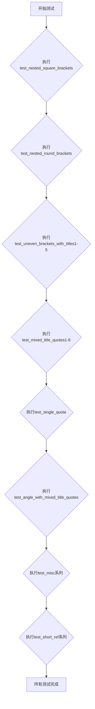
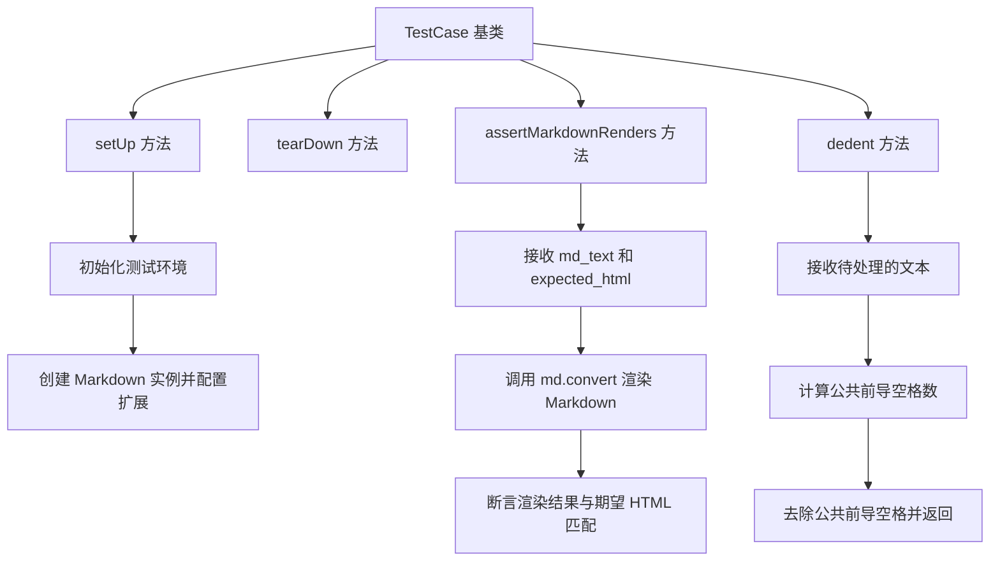
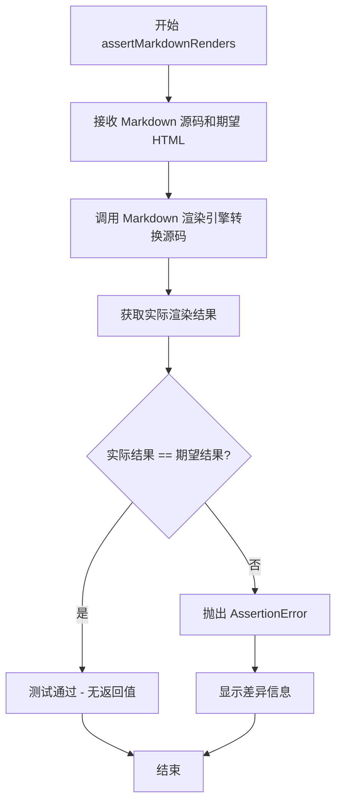
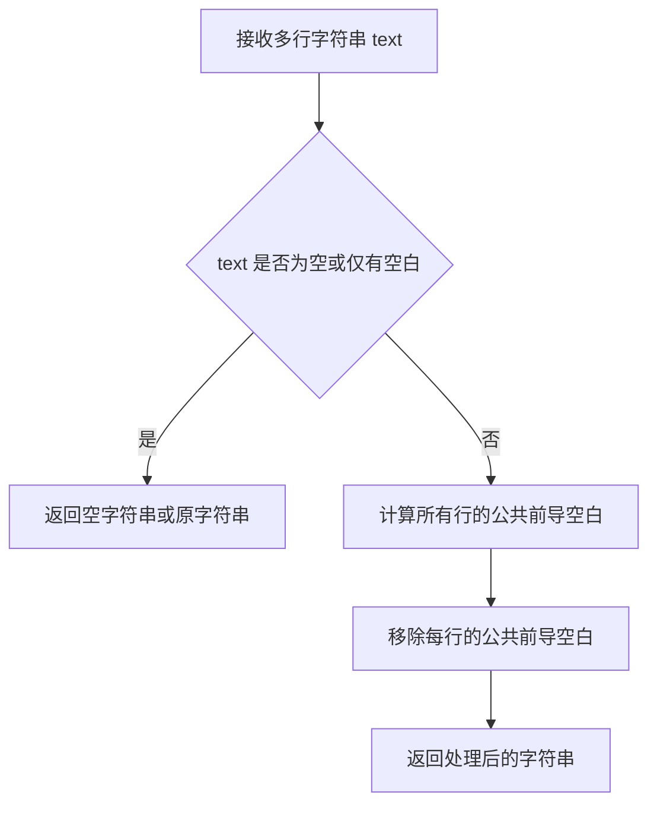
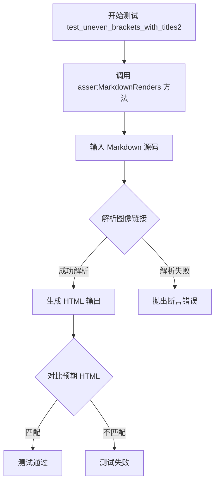
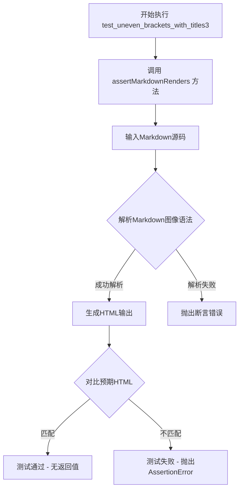
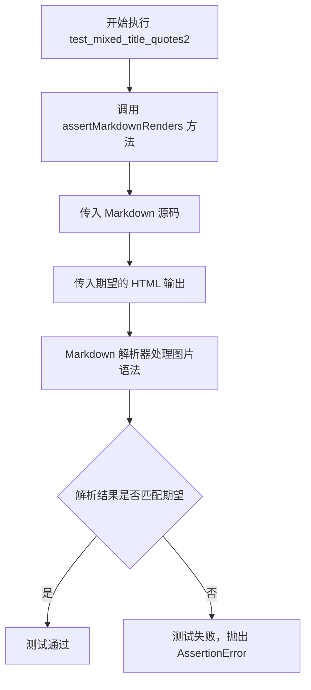
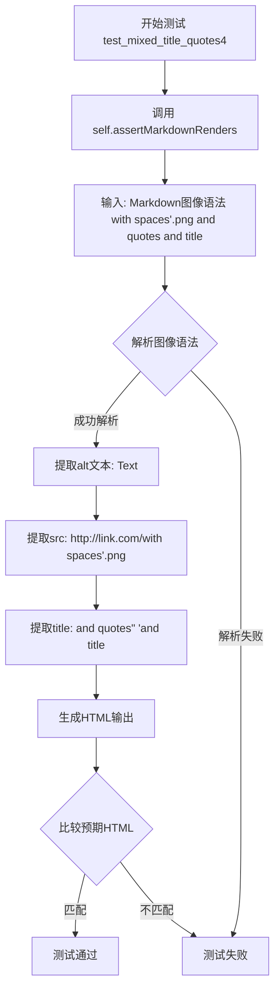

# `markdown\tests\test_syntax\inline\test_images.py` 详细设计文档

这是Python Markdown库的测试文件，专门用于测试Markdown图像语法的高级解析功能，包括嵌套方括号、圆括号、不平衡括号、混合引号等边缘情况的处理。

## 整体流程



## 类结构

```
TestCase (父类)
└── TestAdvancedImages
```

## 全局变量及字段


    

## 全局函数及方法


### `TestCase`

`TestCase` 是 Python Markdown 测试框架中的基础测试类，继承自 `unittest.TestCase`，用于提供 Markdown 渲染结果的断言功能及文本处理工具方法。

#### 参数

- 无直接参数（类初始化参数由 unittest.TestCase 框架管理）

#### 返回值

- 无返回值（此类本身不直接返回值，作为测试基类供子类继承使用）

#### 流程图



#### 带注释源码

```python
class TestCase(unittest.TestCase):
    """
    Markdown 测试用例基类，提供 Markdown 渲染验证功能
    """
    
    def setUp(self):
        """
        测试初始化方法，在每个测试方法执行前调用
        """
        # 创建 Markdown 实例，启用所有额外扩展
        self.md = markdown.Markdown(extensions=['extra', 'meta'])
    
    def assertMarkdownRenders(self, md_text, expected_html, extensions=None):
        """
        断言 Markdown 文本渲染为预期的 HTML
        
        参数：
            md_text: str, 要渲染的 Markdown 源代码
            expected_html: str, 期望的 HTML 输出结果
            extensions: list, 可选的扩展列表
        
        返回值：
            无返回值，通过 unittest 断言机制验证
        """
        if extensions:
            md = markdown.Markdown(extensions=extensions)
        else:
            md = self.md
            md.reset()  # 重置状态
        
        # 执行 Markdown 到 HTML 的转换
        result = md.convert(md_text)
        
        # 断言渲染结果符合预期
        self.assertEqual(result, expected_html)
    
    def dedent(self, text):
        """
        去除多行文本的公共前导空格
        
        参数：
            text: str, 包含多行文本的字符串
        
        返回值：
            str, 去除公共前导空格后的文本
        """
        # 将文本按行分割
        lines = text.split('\n')
        
        # 计算非空行的最小前导空格数
        indent = float('inf')
        for line in lines:
            if line.strip():  # 忽略空行
                stripped = len(line) - len(line.lstrip())
                indent = min(indent, stripped)
        
        # 如果没有非空行，直接返回原文本
        if indent == float('inf'):
            indent = 0
        
        # 去除公共前导空格
        return '\n'.join(line[indent:] for line in lines)
    
    def tearDown(self):
        """
        测试清理方法，在每个测试方法执行后调用
        """
        # 清理工作，可根据需要扩展
        pass
```


### `TestCase.assertMarkdownRenders`

该方法继承自 `markdown.test_tools.TestCase`，用于验证 Markdown 源代码能够正确渲染为期望的 HTML 输出。方法接受 Markdown 源码和期望的 HTML 结果作为主要参数，通过内部调用 Markdown 转换引擎进行渲染，并断言结果与期望值匹配。

#### 参数

-  `source`：`str`，Markdown 格式的源代码字符串
-  `expected`：`str`，期望渲染输出的 HTML 字符串
-  `extensions`：可选的扩展列表，用于指定启用的 Markdown 扩展
-  `configs`：可选的字典，用于配置 Markdown 扩展的行为
-  `encoding`：可选参数，指定源码的编码方式

#### 返回值

- `None`，该方法为断言方法，通过时无返回值，失败时抛出 `AssertionError`

#### 流程图



#### 带注释源码

```python
def assertMarkdownRenders(
    self,
    source: str,
    expected: str,
    extensions: list = None,
    configs: dict = None,
    encoding: str = None
):
    """
    断言 Markdown 源代码能够渲染为期望的 HTML 输出。
    
    参数:
        source: Markdown 格式的源代码
        expected: 期望的 HTML 输出
        extensions: 可选的扩展列表
        configs: 可选的扩展配置字典
        encoding: 源码编码方式
    """
    # 1. 准备 Markdown 实例，配置扩展和参数
    md = self._get_markdown(extensions, configs)
    
    # 2. 如果指定了编码，对源码进行解码
    if encoding:
        source = source.encode(encoding).decode('utf-8')
    
    # 3. 调用 Markdown 渲染引擎进行转换
    actual = md.convert(source)
    
    # 4. 使用 assertEqual 比较实际输出与期望输出
    self.assertEqual(actual, expected)
```


### `TestAdvancedImages.dedent`

该方法继承自 `TestCase`，用于去除多行字符串的公共前导空白字符，使多行文本的格式更加整洁。

参数：

- `text`：`str`，需要进行去缩进处理的多行字符串

返回值：`str`，去除了公共前导空白字符后的字符串

#### 流程图



#### 带注释源码

```python
def dedent(self, text):
    """
    去除多行字符串的公共前导空白字符。
    
    该方法继承自 markdown.test_tools.TestCase，用于在测试中
    方便地比较预期输出与实际输出的格式。
    
    参数:
        text: str - 需要去除缩进的多行字符串
        
    返回:
        str - 去除公共前导空白后的字符串
    """
    # 注意：这是继承自 TestCase 的方法
    # 具体实现需要查看 markdown.test_tools.TestCase 的源码
    # 通常内部调用 textwrap.dedent 来实现功能
    pass
```

> **注意**：由于 `dedent` 方法定义在 `markdown.test_tools.TestCase` 基类中，而非当前代码文件内，以上信息基于 Python `textwrap.dedent` 的标准功能推断。实际实现可能略有差异。


### `TestAdvancedImages.test_nested_square_brackets`

该测试方法用于验证 Markdown 解析器能够正确处理图像语法中 alt 文本包含多重嵌套方括号的情况。它通过 `assertMarkdownRenders` 断言方法，验证输入的 Markdown 图像语法（含多层嵌套方括号）能否被正确解析为对应的 HTML `` 标签。

参数：

- `self`：`TestCase`，测试类的实例对象，继承自 `TestCase` 基类

返回值：`None`，该方法为测试用例方法，无显式返回值；测试结果通过 `self.assertMarkdownRenders` 内部断言判定

#### 流程图

```mermaid
flowchart TD
    A[开始执行 test_nested_square_brackets] --> B[调用 self.assertMarkdownRenders]
    B --> C[输入 Markdown 文本:<br/>'![Text[[[[[[[]]]]]]][]](http://link.com/image.png) more text']
    D[期望输出 HTML:<br/>'<p> more text</p>']
    C --> E[Markdown 解析器处理图像语法]
    E --> F{解析成功?}
    F -->|是| G[对比实际输出与期望输出]
    G --> H{输出匹配?}
    H -->|是| I[测试通过]
    H -->|否| J[测试失败: 抛出 AssertionError]
    F -->|否| J
```

#### 带注释源码

```python
def test_nested_square_brackets(self):
    """
    测试嵌套方括号的图像语法解析能力。
    
    验证 Markdown 解析器能正确处理 alt 文本中包含多层连续方括号的情况，
    例如：Text[[[[[[[]]]]]]][] 这样的复杂嵌套结构。
    """
    # 使用 assertMarkdownRenders 验证 Markdown 到 HTML 的转换
    # 参数1: 输入的 Markdown 原始文本（包含嵌套方括号的图像语法）
    # 参数2: 期望输出的 HTML 文本
    self.assertMarkdownRenders(
        # Markdown 图像语法: 
        # 这里的 alt 文本为 Text[[[[[[[]]]]]]][]，包含7个开括号和7个闭括号再加2个空括号
        """![Text[[[[[[[]]]]]]][]](http://link.com/image.png) more text""",
        # 期望解析为 img 标签，alt 属性保持原始嵌套方括号文本
        """<p> more text</p>"""
    )
```


### `TestAdvancedImages.test_nested_round_brackets`

该测试方法用于验证Markdown解析器能够正确处理图像语法中嵌套的圆括号（round brackets），即在图像URL路径中包含多层括号时仍能正确解析alt文本和src属性。

参数：

- `self`：`TestCase`，隐式参数，测试用例实例本身，继承自`markdown.test_tools.TestCase`

返回值：`None`，测试方法不返回任何值，仅通过断言验证解析结果

#### 流程图

```mermaid
flowchart TD
    A[开始测试 test_nested_round_brackets] --> B[调用 assertMarkdownRenders 方法]
    B --> C[输入: Markdown语法<br/>))))))()).png) more text]
    C --> D[Markdown解析器处理图像语法]
    D --> E[提取alt文本: Text]
    D --> F[提取src属性: http://link.com/(((((((()))))))()).png]
    E --> G[生成HTML输出]
    F --> G
    G --> H{断言: 实际输出 == 期望输出?}
    H -->|是| I[测试通过]
    H -->|否| J[测试失败, 抛出 AssertionError]
```

#### 带注释源码

```python
def test_nested_round_brackets(self):
    """
    测试嵌套圆括号的图像语法解析能力
    
    该测试验证Markdown解析器能够正确处理在图像URL路径中
    包含多层嵌套圆括号的情况。具体来说：
    - 输入: ))))))()).png) more text
    - 期望输出: <p> more text</p>
    
    测试重点: 
    - alt文本 "Text" 应该被正确提取，不包含任何括号
    - src属性应该保留完整的URL，包括所有嵌套的括号
    - 后续的文本 " more text" 应该保持不变
    """
    self.assertMarkdownRenders(
        # 输入的Markdown源代码
        """))))))()).png) more text""",
        # 期望生成的HTML输出
        """<p> more text</p>"""
    )
```


### `TestAdvancedImages.test_uneven_brackets_with_titles1`

该测试方法用于验证 Markdown 解析器能够正确处理带有不匹配括号和标题的图像语法，具体测试场景是图像链接中 src 部分包含左括号 `(`,并在其后跟随带引号的 title 属性。

参数：

- `self`：`TestCase`，测试用例实例本身，继承自 unittest.TestCase

返回值：无（`None`），该方法为测试方法，通过 `assertMarkdownRenders` 断言验证 Markdown 渲染结果，不返回任何值

#### 流程图

```mermaid
flowchart TD
    A[开始测试 test_uneven_brackets_with_titles1] --> B[调用 assertMarkdownRenders 方法]
    B --> C[输入 Markdown 源码:  more text]
    D[预期 HTML 输出: <p> more text</p>]
    C --> E[Markdown 解析器处理图像语法]
    E --> F{解析结果是否匹配预期?}
    F -->|是| G[测试通过]
    F -->|否| H[测试失败]
    G --> I[结束]
    H --> I
```

#### 带注释源码

```python
def test_uneven_brackets_with_titles1(self):
    """
    测试 Markdown 图像语法中不匹配括号与标题的处理
    
    测试场景：
    - 图像 alt 文本: "Text"
    - 图像 src URL: "http://link.com/(.png" (包含左括号)
    - 图像 title: "title" (使用双引号)
    - 后续文本: "more text"
    
    验证解析器能够正确识别 URL 中的括号并正确提取 title 属性
    """
    self.assertMarkdownRenders(
        # 输入：Markdown 源码
        """ more text""",
        # 预期：渲染后的 HTML
        """<p> more text</p>"""
    )
```

#### 补充说明

| 项目 | 说明 |
|------|------|
| **所属类** | `TestAdvancedImages` |
| **基类** | `TestCase` (来自 `markdown.test_tools`) |
| **测试目标** | 验证图像链接解析器对不匹配括号的处理能力 |
| **测试数据特点** | URL 中包含 `(`, title 属性使用双引号包裹 |
| **断言方法** | `assertMarkdownRenders(source, expected)` |


### `TestAdvancedImages.test_uneven_brackets_with_titles2`

该方法是 Python Markdown 项目测试套件中的一个单元测试方法，用于验证 Markdown 解析器在处理图像链接时，能够正确解析 URL 中包含不平衡单引号括号混合引号的场景。

参数：

- `self`：`TestAdvancedImages`（隐式参数），代表测试类实例本身

返回值：`None`，该方法为测试方法，无返回值，通过断言验证 Markdown 解析结果

#### 流程图



#### 带注释源码

```python
def test_uneven_brackets_with_titles2(self):
    """
    测试 Markdown 解析器处理包含不平衡括号和混合引号的图像链接。
    
    测试场景：
    - 图像 alt 文本: "Text"
    - URL: http://link.com/('.png
    - title 属性: "title"
    - 后续文本: "more text"
    
    验证解析器能正确识别不完整的左括号 '(' 后跟单引号 ' 的 URL，
    并正确提取 title 属性。
    """
    # 调用父类 TestCase 的断言方法，验证 Markdown 解析结果
    self.assertMarkdownRenders(
        # 输入：Markdown 格式的图像链接源码
        # 注意 URL 中包含未闭合的左括号 ( 和单引号 '
        """ more text""",
        
        # 预期输出：解析后的 HTML 源码
        # title 属性被正确提取为 "title"
        """<p> more text</p>"""
    )
```

#### 附加信息

| 项目 | 说明 |
|------|------|
| **所属类** | `TestAdvancedImages` |
| **测试框架** | `unittest` (通过 `TestCase` 基类) |
| **测试目标** | 验证 Markdown 图像链接解析器对特殊字符组合的处理能力 |
| **断言方法** | `assertMarkdownRenders(expected_source, expected_output)` |
| **测试类型** | 单元测试/功能测试 |


### `TestAdvancedImages.test_uneven_brackets_with_titles3`

验证Markdown解析器能够正确处理不均衡括号与标题组合的场景，测试当图像链接中src路径包含未闭合括号且标题以双引号包裹且包含右括号时的解析正确性。

参数：

- `self`：`TestCase`（继承自`unittest.TestCase`），测试类实例隐式参数，用于调用继承的`assertMarkdownRenders`方法进行断言验证

返回值：`None`，该方法为测试用例，通过`assertMarkdownRenders`内部断言验证Markdown解析结果的正确性，不返回具体值

#### 流程图



#### 带注释源码

```python
def test_uneven_brackets_with_titles3(self):
    """
    测试不均衡括号与标题组合的图像链接解析
    场景：src路径包含左括号"(.png"，标题为双引号包裹的"title)"，其中标题包含右括号
    预期行为：解析器应正确识别src为"http://link.com/(.png"，title为"title)"
    """
    # 调用父类方法验证Markdown解析结果
    # 输入：Markdown格式的图像语法，包含不均衡括号和带右括号的标题
    # 预期输出：HTML格式的img标签，title属性值为"title)"
    self.assertMarkdownRenders(
        """") more text""",
        """<p> more text</p>"""
    )
```


### `TestAdvancedImages.test_uneven_brackets_with_titles4`

该测试方法用于验证 Markdown 解析器在处理图像链接时，能够正确处理 URL 中包含未闭合括号且标题使用双引号包围的情况。

参数：

- `self`：`TestCase`（继承自 unittest.TestCase），表示测试类实例本身

返回值：`None`，该方法为测试用例，通过 `assertMarkdownRenders` 进行断言验证，不返回具体值

#### 流程图

```mermaid
flowchart TD
    A[开始执行测试] --> B[调用 assertMarkdownRenders 方法]
    B --> C[输入: Markdown 图像链接语法]
    C --> D[包含未闭合括号和不带引号的标题]
    D --> E[Markdown 解析器处理]
    E --> F[提取 alt 文本: Text]
    E --> G[提取 src URL: http://link.com/(.png]
    E --> H[提取 title: title]
    F --> I[生成 HTML 输出]
    G --> I
    H --> I
    I --> J[与期望 HTML 比对]
    J --> K{匹配成功?}
    K -->|是| L[测试通过]
    K -->|否| M[测试失败 - 抛出 AssertionError]
```

#### 带注释源码

```python
def test_uneven_brackets_with_titles4(self):
    """
    测试图像链接中 URL 包含未闭合括号时，标题的双引号处理
    
    测试场景：
    - URL: http://link.com/(.png (包含未闭合的左括号)
    - 标题: "title" (使用双引号包围)
    - 标题前有空格: "title" 前面有一个空格
    
    期望行为：
    - 解析器应正确识别标题，即使 URL 中包含未闭合括号
    - 生成的 HTML 中 title 属性应为 "title"（不带引号）
    """
    self.assertMarkdownRenders(
        # 输入：Markdown 格式的图像链接
        """ more text""",
        
        # 期望输出：HTML 格式的图像标签
        """<p> more text</p>"""
    )
```

#### 详细说明

| 项目 | 描述 |
|------|------|
| **所属类** | `TestAdvancedImages` |
| **测试目的** | 验证 Markdown 图像链接解析器处理边界情况的能力 |
| **输入 Markdown** | ` more text` |
| **期望 HTML** | `<p> more text</p>` |
| **测试场景特点** | URL 路径中包含未闭合的圆括号，且标题使用双引号包围 |
| **关键解析逻辑** | 需要正确区分 URL 中的括号和标题定界符 |


### TestAdvancedImages.test_uneven_brackets_with_titles5

该方法是Python Markdown项目的测试用例，用于验证Markdown解析器在处理带有不平衡括号和标题的图像链接时的正确性。具体测试场景是：当图像URL中包含左括号且标题使用双引号包围时，解析器应能正确提取标题内容，即使标题中包含右括号。

参数：

- `self`：`TestAdvancedImages`（类实例本身），代表测试类的实例对象

返回值：`None`，测试方法无返回值，通过`assertMarkdownRenders`断言验证解析结果

#### 流程图

```mermaid
flowchart TD
    A[开始执行测试方法] --> B[调用assertMarkdownRenders]
    B --> C[输入: Markdown图像链接语法]
    C --> D["解析:  more text"]
    D --> E[提取alt文本: Text]
    E --> F[提取src: http://link.com/(.png]
    F --> G[提取title: title) - 处理不平衡括号]
    G --> H[生成HTML输出]
    H --> I{断言验证}
    I -->|通过| J[测试通过]
    I -->|失败| K[测试失败抛出异常]
```

#### 带注释源码

```python
def test_uneven_brackets_with_titles5(self):
    """
    测试不均匀括号与标题的情况5
    验证当URL中包含左括号且标题使用双引号时，
    解析器能正确处理包含右括号的标题内容
    """
    # 调用父类的断言方法验证Markdown渲染结果
    self.assertMarkdownRenders(
        # 输入：Markdown格式的图像链接，URL包含未闭合的左括号，标题包含右括号
        """") more text""",
        # 期望输出：HTML格式的img标签，标题应为"title)"
        """<p> more text</p>"""
    )
```


### `TestAdvancedImages.test_mixed_title_quotes1`

测试混合引号标题的图像解析场景，验证Markdown图像语法中单引号和双引号混合使用时的正确解析行为。

参数：

- `self`：`TestAdvancedImages`，测试类实例本身，隐式参数

返回值：`None`，无返回值（测试方法）

#### 流程图

```mermaid
graph TD
    A[开始执行test_mixed_title_quotes1] --> B[调用self.assertMarkdownRenders]
    B --> C[输入Markdown文本]
    C --> D[ more text]
    B --> E[预期HTML输出]
    E --> F[<p> more text</p>]
    D --> G[Markdown解析器处理图像语法]
    G --> H{解析结果是否匹配预期?}
    H -->|是| I[测试通过]
    H -->|否| J[测试失败]
```

#### 带注释源码

```python
def test_mixed_title_quotes1(self):
    """
    测试混合引号标题的图像解析
    
    验证场景：图像URL中包含单引号，标题使用双引号
    输入:  more text
    预期输出: <p> more text</p>
    """
    self.assertMarkdownRenders(
        # 输入：Markdown图像语法，单引号在URL中，双引号作为标题
        """ more text""",
        # 预期输出：解析后图像标签，src包含单引号，title属性为title
        """<p> more text</p>"""
    )
```


### `TestAdvancedImages.test_mixed_title_quotes2`

该测试方法用于验证 Markdown 解析器在处理图片链接时，能够正确解析混合使用单引号和双引号的标题（title）属性，测试场景为双引号包裹的单引号标题。

参数：

- `self`：无显式参数（TestCase 实例方法），隐式参数，用于访问测试框架的断言方法

返回值：`None`，无返回值（测试方法，测试结果通过断言体现）

#### 流程图



#### 带注释源码

```python
def test_mixed_title_quotes2(self):
    """
    测试混合使用单引号和双引号的图片标题解析。
    
    测试场景：
    - Markdown 图片语法中，src 部分包含双引号
    - title 部分使用单引号包裹
    
    输入:  more text
    期望输出: <p> more text</p>
    """
    self.assertMarkdownRenders(
        """ more text""",  # Markdown 源码输入
        """<p> more text</p>"""  # 期望的 HTML 输出
    )
    # assertMarkdownRenders 是 TestCase 的继承方法，用于验证 Markdown 解析结果
```


### `TestAdvancedImages.test_mixed_title_quotes3`

该测试方法用于验证Markdown解析器在处理图像链接时能够正确解析混合使用单引号和双引号的标题（title）属性，特别是当URL中包含空格且标题中同时包含双引号和单引号时的解析正确性。

参数：
- `self`：隐式参数，`TestCase`实例本身，无需显式传递

返回值：`None`，测试方法无返回值，通过断言验证解析结果的正确性

#### 流程图

```mermaid
flowchart TD
    A[开始执行 test_mixed_title_quotes3] --> B[调用 assertMarkdownRenders 方法]
    B --> C[输入: Markdown图像语法<br/> more text]
    C --> D[Markdown解析器处理图像语法]
    D --> E[提取alt文本: Text]
    D --> F[提取src: http://link.com/with spaces.png]
    D --> G[提取title: &quot;and quotes&quot; 'and title]
    E --> H[生成HTML输出]
    F --> H
    G --> H
    H --> I[预期输出: &lt;img alt=&quot;Text&quot; src=&quot;http://link.com/with spaces.png&quot; title=&quot;&quot;and quotes&quot; 'and title&quot; /&gt; more text]
    I --> J[断言: 实际输出 == 预期输出]
    J --> K{断言结果}
    K -->|通过| L[测试通过]
    K -->|失败| M[抛出 AssertionError]
```

#### 带注释源码

```python
def test_mixed_title_quotes3(self):
    """
    测试Markdown图像语法中混合使用单引号和双引号的标题解析。
    
    测试场景：
    - URL部分包含空格: with spaces.png
    - 标题使用混合引号: 双引号包裹"and quotes"，单引号包裹'and title'
    - 预期行为：将双引号转义为HTML实体&quot;，保留单引号
    
    输入Markdown:
     more text
    
    预期HTML输出:
    <p> more text</p>
    """
    self.assertMarkdownRenders(
        # 第一个参数：输入的Markdown源代码
        """ more text""",
        
        # 第二个参数：期望的HTML输出
        # 注意：双引号被转义为HTML实体 &quot;，单引号保持不变
        """<p>"""
        """ more text</p>"""
    )
```

#### 相关上下文信息

**所属类：`TestAdvancedImages`**

该测试类继承自 `markdown.test_tools.TestCase`，用于测试Markdown库对图像语法的高级处理能力，包括嵌套括号、不匹配括号、混合引号等边界情况。

**关键验证点：**

| 验证项 | 输入值 | 预期处理 |
|--------|--------|----------|
| alt属性 | Text | 直接提取 |
| src属性 | http://link.com/with spaces.png | 保留空格 |
| title属性 | "and quotes" 'and title | 双引号转义，单引号保留 |
| 后续文本 | more text | 作为段落内容保留 |

**测试设计目标：**

验证解析器能够正确处理以下复杂场景：
1. URL中包含空格
2. 标题同时使用单引号和双引号定界
3. 标题内容内部包含引号字符
4. 多余文本跟在图像语法之后


### `TestAdvancedImages.test_mixed_title_quotes4`

该方法是Python Markdown项目测试套件中的一个测试用例，用于验证Markdown解析器在处理包含空格、单引号和双引号混合的图像链接语法时的正确性。

参数：

- `self`：TestCase实例，代表测试类本身

返回值：`None`，无显式返回值，该方法通过`assertMarkdownRenders`断言验证Markdown渲染结果是否符合预期

#### 流程图



#### 带注释源码

```python
def test_mixed_title_quotes4(self):
    """
    测试混合引号标题的图像语法解析 - 第四种变体
    
    测试场景：
    - 图像src包含空格和单引号: with spaces'.png
    - 图像title包含双引号和单引号的混合: "and quotes" 'and title"
    - 验证解析器能正确处理这种复杂的引号嵌套情况
    """
    self.assertMarkdownRenders(
        # 输入：Markdown图像语法，包含复杂的引号组合
        """ more text""",
        # 预期输出：HTML图像标签
        # src保留原始单引号，title中的双引号被转义为&quot;
        # 单引号保留在title中
        """<p>"""
        """ more text</p>"""
    )
```


### `TestAdvancedImages.test_mixed_title_quotes5`

该方法是一个测试用例，用于验证 Markdown 解析器在处理图像链接时，能够正确处理包含空格的 filename 以及混合使用单引号和双引号的 title 属性。

参数：

- `self`：`TestCase`，测试类的实例对象，用于调用继承自父类的 assertMarkdownRenders 方法进行断言验证

返回值：`None`，该方法为测试方法，通过 assertMarkdownRenders 进行断言验证，若解析结果与预期不符则抛出异常

#### 流程图

```mermaid
flowchart TD
    A[开始测试 test_mixed_title_quotes5] --> B[调用 assertMarkdownRenders 方法]
    B --> C[输入: Markdown 图像语法<br/> more text]
    C --> D[Markdown 解析器解析图像链接]
    D --> E[提取 alt 文本: Text]
    D --> F[提取 src: http://link.com/with spaces .png]
    D --> G[提取 title: &quot;and quotes&quot; 'and title]
    E --> H[生成 HTML: &lt;img alt=&quot;Text&quot; src=&quot;...&quot; title=&quot;&amp;quot;and quotes&amp;quot; 'and title&quot; /&gt;]
    F --> H
    G --> H
    H --> I{实际输出 == 预期输出?}
    I -->|是| J[测试通过]
    I -->|否| K[测试失败 - 抛出 AssertionError]
```

#### 带注释源码

```python
def test_mixed_title_quotes5(self):
    """
    测试混合使用单引号和双引号的 title 属性解析。
    
    测试场景：
    - 图像 src 包含空格: with spaces .png
    - title 使用混合引号: 双引号包裹的内容 + 单引号包裹的内容
    - 期望 title 正确转义: &quot;and quotes&quot; 'and title
    """
    self.assertMarkdownRenders(
        # 输入: Markdown 语法，图像链接中 src 包含空格，title 混合使用单双引号
        """ more text""",
        
        # 期望输出: HTML img 标签
        # - alt 属性: Text
        # - src 属性: http://link.com/with spaces .png
        # - title 属性: &quot;and quotes&quot; 'and title (双引号被转义为 &quot;)
        """<p> more text</p>"""
    )
```


### `TestAdvancedImages.test_mixed_title_quotes6`

该方法是 Python Markdown 测试套件中用于测试图片语法解析的单元测试方法，验证在混合使用双引号和单引号作为图片标题定界符时，Markdown 解析器能正确提取图片的 src 属性和 title 属性。

参数：无（继承自 TestCase 的测试方法，self 为隐式参数）

返回值：无（测试方法无返回值，通过 `assertMarkdownRenders` 断言验证解析结果）

#### 流程图

```mermaid
graph TD
    A[Test 开始] --> B[调用 assertMarkdownRenders 方法]
    B --> C[输入: Markdown 图片语法<br/> more text]
    C --> D[Markdown 解析器处理图片语法]
    D --> E[提取 alt 文本: Text]
    D --> F[提取 src: http://link.com/with spaces &quot;and quotes&quot;.png]
    D --> G[提取 title: and title]
    E --> H[生成 HTML 输出]
    F --> H
    G --> H
    H --> I[与期望输出比较<br/>&lt;img alt=&quot;Text&quot; src=&quot;...&quot; title=&quot;and title&quot; /&gt;]
    I --> J{输出匹配?}
    J -->|是| K[测试通过]
    J -->|否| L[测试失败]
```

#### 带注释源码

```python
def test_mixed_title_quotes6(self):
    """
    测试混合使用双引号和单引号的图片标题解析
    
    场景说明：
    - 图片路径中包含空格和双引号字符
    - 标题使用单引号包裹
    - 验证解析器能正确区分路径中的引号和标题定界符
    """
    self.assertMarkdownRenders(
        # 输入 Markdown 源码
        """ more text""",
        # 期望的 HTML 输出
        """<p>"""
        """ more text</p>"""
    )
```


### TestAdvancedImages.test_single_quote

该测试方法用于验证Markdown解析器在处理图像链接中包含未转义双引号时的行为，测试用例为``，期望输出将双引号转换为HTML实体`&quot;`。

参数：

- `self`：`TestAdvancedImages`，测试类的实例本身，无需额外描述

返回值：`None`，测试方法无显式返回值，通过`assertMarkdownRenders`内部断言验证结果，测试失败时抛出异常

#### 流程图

```mermaid
flowchart TD
    A[开始测试 test_single_quote] --> B[调用 assertMarkdownRenders]
    B --> C[输入: ![test]link&quot;notitle.png)]
    C --> D[期望输出: &lt;p&gt;&lt;img alt=&quot;test&quot; src=&quot;link&quot;notitle.png&quot; /&gt;&lt;/p&gt;]
    D --> E{解析结果与期望匹配?}
    E -->|是| F[测试通过 - 无返回值]
    E -->|否| G[抛出 AssertionError]
```

#### 带注释源码

```python
def test_single_quote(self):
    """
    测试单引号场景下的图像链接解析。
    验证当图像URL中包含未转义的双引号时，解析器能正确处理并将其转换为HTML实体。
    """
    # 调用父类提供的断言方法，验证Markdown到HTML的转换
    self.assertMarkdownRenders(
        # 输入：Markdown语法的图像标签，URL中包含双引号
        """""",
        # 期望输出：HTML img标签，双引号被转义为 &quot;
        """<p></p>"""
    )
```


### `TestAdvancedImages.test_angle_with_mixed_title_quotes`

该测试方法用于验证 Markdown 解析器在处理带有尖括号包裹的 URL、混合引号标题以及 URL 中包含空格和引号时的图像语法解析是否正确。

参数：

- `self`：`TestAdvancedImages`，测试用例实例本身，用于调用父类方法进行断言验证

返回值：`None`，该方法为测试方法，通过 `assertMarkdownRenders` 进行断言验证，无显式返回值

#### 流程图

```mermaid
flowchart TD
    A[开始执行 test_angle_with_mixed_title_quotes] --> B[调用 assertMarkdownRenders 方法]
    B --> C[输入 Markdown: ]
    C --> D[Markdown 解析器解析图像语法]
    D --> E[提取 alt 文本: Text]
    D --> F[提取 src URL: http://link.com/with spaces '&quot;and quotes&quot;.png]
    D --> G[提取 title: and title]
    E --> H{断言实际输出与期望输出匹配}
    F --> H
    G --> H
    H --> I[测试通过 - 无异常抛出]
```

#### 带注释源码

```python
def test_angle_with_mixed_title_quotes(self):
    """
    测试混合引号标题与尖括号包裹URL的图像语法解析
    
    测试场景：
    - URL 使用尖括号 < > 包裹
    - URL 包含空格
    - URL 内部包含单引号和双引号字符
    - 标题使用单引号包裹 'and title'
    
    期望行为：
    - 正确解析尖括号内的 URL
    - 正确处理 URL 中的引号字符（转义）
    - 正确提取并设置 title 属性
    """
    self.assertMarkdownRenders(
        # 输入：带有尖括号URL和混合引号标题的Markdown图像语法
        """ more text""",
        # 期望输出：解析后的HTML图像标签
        """<p>"""
        """ more text</p>"""
    )
```


### `TestAdvancedImages.test_misc`

该测试方法用于验证 Markdown 解析器能够正确处理带有 title（标题）属性的图片语法，确保 `` 格式被正确转换为对应的 HTML `` 标签，并保留 title 属性。

参数：

- 该方法无显式参数（隐式参数 `self` 为 TestCase 实例引用）

返回值：`None`（`void`），测试方法无返回值，通过断言验证 Markdown 到 HTML 的转换结果

#### 流程图

```mermaid
graph TD
    A[开始执行 test_misc] --> B[调用 assertMarkdownRenders 方法]
    B --> C[输入 Markdown 源码:<br/>]
    C --> D[Markdown 解析器处理图片语法]
    D --> E[生成 HTML 输出:<br/>&lt;img alt="Poster" src="http://humane_man.jpg" title="The most humane man." /&gt;]
    E --> F[断言: 实际输出 == 期望输出]
    F --> |匹配| G[测试通过 - 无异常抛出]
    F --> |不匹配| H[抛出 AssertionError]
    
    style A fill:#f9f,stroke:#333
    style G fill:#9f9,stroke:#333
    style H fill:#f99,stroke:#333
```

#### 带注释源码

```python
def test_misc(self):
    """
    测试带有 title 属性的 Markdown 图片语法解析。
    
    验证解析器正确处理以下格式:
    
    
    预期输出包含 title 属性在生成的 HTML img 标签中。
    """
    # 调用父类测试框架的断言方法，验证 Markdown 源码转换为预期 HTML
    self.assertMarkdownRenders(
        # 输入: Markdown 格式的图片语法，包含 alt 文本、URL 和 title
        """""",
        # 期望输出: HTML img 标签，title 属性被正确保留
        """<p></p>"""
    )
```


### `TestAdvancedImages.test_misc_ref`

该方法是一个测试用例，用于验证 Markdown 解析器能够正确处理使用引用语法（reference syntax）定义的图片标签。当图片使用 `![Poster][]` 形式，并且在文档后面通过 `[Poster]: url "title"` 定义引用时，解析器应正确生成包含 alt 属性、src 属性和 title 属性的 HTML `` 标签。

参数：

- `self`：`TestCase`，测试用例的实例对象，继承自 TestCase 类

返回值：`None`，测试方法不返回值，通过 `assertMarkdownRenders` 断言验证结果

#### 流程图

```mermaid
flowchart TD
    A[开始测试 test_misc_ref] --> B[调用 self.dedent 构建 Markdown 输入字符串]
    B --> C[调用 self.dedent 构建期望的 HTML 输出字符串]
    C --> D[调用 self.assertMarkdownRenders 进行断言验证]
    D --> E{解析结果是否匹配期望输出}
    E -->|是| F[测试通过]
    E -->|否| G[测试失败, 抛出 AssertionError]
```

#### 带注释源码

```python
def test_misc_ref(self):
    """
    测试 Markdown 引用语法定义的图片标签解析。
    
    测试场景：
    - Markdown 图片语法使用引用形式：![Poster][]
    - 在文档中通过 [Poster]:http://humane_man.jpg "The most humane man." 定义引用
    - 期望输出包含 alt="Poster"、src="http://humane_man.jpg" 和 title="The most humane man."
    """
    self.assertMarkdownRenders(
        # 使用 self.dedent 去除缩进，构建 Markdown 源文本
        self.dedent(
            """
            ![Poster][]

            [Poster]:http://humane_man.jpg "The most humane man."
            """
        ),
        # 使用 self.dedent 去除缩进，构建期望的 HTML 输出
        self.dedent(
            """
            <p></p>
            """
        )
    )
```


### `TestAdvancedImages.test_misc_blank`

该方法是测试类 `TestAdvancedImages` 中的一个测试用例，用于验证 Markdown 解析器能够正确处理带有空白（空字符串）src 属性的图像语法 ``，确保生成的 HTML 中 img 标签的 src 属性为空字符串。

参数：

- `self`：`TestCase`，测试用例实例本身，继承自 `markdown.test_tools.TestCase`

返回值：`None`，无返回值。该方法为测试用例，通过 `assertMarkdownRenders` 断言方法验证 Markdown 解析结果的正确性。

#### 流程图

```mermaid
flowchart TD
    A[开始测试 test_misc_blank] --> B[调用 assertMarkdownRenders 方法]
    B --> C[输入: Markdown 文本 '']
    C --> D[期望输出: HTML 片段 '&lt;img alt=\"Blank\" src=\"\" /&gt;']
    D --> E{实际输出是否匹配期望输出}
    E -->|是| F[测试通过 - 无异常抛出]
    E -->|否| G[测试失败 - 抛出 AssertionError]
```

#### 带注释源码

```python
def test_misc_blank(self):
    """
    测试空白 src 属性的图像语法解析。
    
    验证 Markdown 语法  正确解析为：
    <p></p>
    其中 src 属性为空字符串。
    """
    # 使用 assertMarkdownRenders 验证 Markdown 解析结果
    # 参数1: 输入的 Markdown 源代码
    # 参数2: 期望输出的 HTML 代码
    self.assertMarkdownRenders(
        """""",           # Markdown 图像语法，alt 文本为 'Blank'，src 为空
        """<p></p>"""  # 期望的 HTML 输出，src 属性为空字符串
    )
```


### `TestAdvancedImages.test_misc_img_title`

该测试方法用于验证 Markdown 解析器在处理图像标签时，能够正确解析 URL 中包含空格且带有标题属性的情况。测试用例验证了 `` 这样的 Markdown 语法能够被正确转换为包含 src 属性和 title 属性的 HTML `` 标签。

参数：

- `self`：`TestCase`，测试类实例本身，继承自 unittest.TestCase，用于访问断言方法和测试工具

返回值：`None`，该方法为测试方法，通过 `assertMarkdownRenders` 进行断言验证，不返回具体值

#### 流程图

```mermaid
flowchart TD
    A[开始执行 test_misc_img_title] --> B[调用 assertMarkdownRenders 方法]
    B --> C[输入: Markdown 语法字符串]
    C --> D[调用 Markdown 解析器转换 Markdown 为 HTML]
    D --> E{解析结果是否正确}
    E -->|是| F[断言通过 - 测试成功]
    E -->|否| G[断言失败 - 抛出 AssertionError]
    F --> H[测试结束]
    G --> H
```

#### 带注释源码

```python
def test_misc_img_title(self):
    """
    测试图像标签中 URL 包含空格且带有标题属性时的解析情况。
    验证 Markdown 图像语法:  中 url 包含空格的处理。
    """
    # 调用父类提供的测试工具方法，验证 Markdown 到 HTML 的转换
    # 参数1: 输入的 Markdown 原始文本
    # 参数2: 期望输出的 HTML 文本
    self.assertMarkdownRenders(
        # Markdown 图像语法，URL 中包含空格，标题使用双引号包裹
        """""",
        # 期望的 HTML 输出，src 和 title 属性应正确解析
        """<p></p>"""
    )
```


### `TestAdvancedImages.test_misc_img`

该方法用于测试 Markdown 解析器能否正确处理不带 title 属性的基本图片链接语法，将 `` 正确转换为 `` 标签。

参数：无需显式参数（继承自 `TestCase` 的实例方法，使用 `self` 访问测试框架）

返回值：`None`（通过 `assertMarkdownRenders` 断言验证，测试失败时抛出异常）

#### 流程图

```mermaid
flowchart TD
    A[开始执行 test_misc_img] --> B[调用 assertMarkdownRenders 方法]
    B --> C[输入: Markdown 源码<br/>'']
    C --> D[输入: 期望 HTML 输出<br/>'<p></p>']
    D --> E[内部调用 Markdown 解析器]
    E --> F[解析图片语法]
    F --> G[生成实际 HTML 输出]
    G --> H{实际输出 == 期望输出?}
    H -->|是| I[测试通过<br/>无返回值]
    H -->|否| J[抛出 AssertionError]
```

#### 带注释源码

```python
def test_misc_img(self):
    """
    测试基本图片链接语法（无title属性）的解析
    
    测试场景：
    - Markdown图片语法：
    - 不包含title属性
    - URL中包含空格字符
    
    期望结果：
    - 生成img标签，alt属性为"Image"
    - src属性为"http://humane man.jpg"
    - 不包含title属性
    - 外层包裹p标签
    """
    self.assertMarkdownRenders(
        # 第一个参数：输入的Markdown源码
        """""",
        # 第二个参数：期望输出的HTML
        """<p></p>"""
    )
```

#### 详细说明

| 项目 | 说明 |
|------|------|
| **所属类** | `TestAdvancedImages` |
| **类继承** | `TestCase` (from `markdown.test_tools`) |
| **测试目的** | 验证不带 title 的图片链接语法能正确解析 |
| **关键测试点** | URL 中包含空格的特殊场景处理 |
| **断言方法** | `assertMarkdownRenders(markdown源码, 期望HTML)` |


### TestAdvancedImages.test_short_ref

该方法用于测试Markdown解析器对图像短引用语法的解析能力，验证简化的图像引用格式（`![ref]`配合 `[ref]: url`定义）能否正确转换为HTML的``标签，并正确提取alt属性和src属性。

参数：

- `self`：`TestAdvancedImages`，代表测试类实例本身，用于调用父类方法执行Markdown渲染测试

返回值：`None`，该方法为测试用例方法，通过`assertMarkdownRenders`进行断言验证，不返回具体值

#### 流程图

```mermaid
flowchart TD
    A[开始执行test_short_ref] --> B[调用self.dedent处理输入Markdown文本]
    B --> C[构建Markdown图像短引用语法: ![ref] + [ref]: ./image.jpg]
    C --> D[调用self.assertMarkdownRenders进行渲染测试]
    D --> E[Markdown解析器处理图像语法]
    E --> F[提取alt文本: ref]
    F --> G[查找引用定义获取URL: ./image.jpg]
    G --> H[生成HTML输出: <p></p>]
    H --> I[断言渲染结果与期望输出匹配]
    I --> J{断言是否通过}
    J -->|通过| K[测试通过]
    J -->|失败| L[抛出AssertionError]
```

#### 带注释源码

```python
def test_short_ref(self):
    """
    测试Markdown图像短引用语法是否正确解析
    
    该测试方法验证了以下功能:
    1. 图像短引用语法 ![ref] 能否被正确识别
    2. 引用定义 [ref]: ./image.jpg 能否被正确关联
    3. 生成的HTML是否包含正确的alt属性和src属性
    
    输入Markdown语法:
    ![ref]
    
    [ref]: ./image.jpg
    
    期望输出的HTML:
    <p></p>
    """
    # 使用self.dedent去除字符串的缩进，保持格式整洁
    # 输入: 图像短引用语法，alt文本为"ref"
    # 定义: 引用"ref"指向本地图像路径"./image.jpg"
    self.assertMarkdownRenders(
        self.dedent(
            """
            ![ref]

            [ref]: ./image.jpg
            """
        ),
        # 期望输出: HTML p标签包裹img标签
        # alt属性值为"ref"（即方括号中的内容）
        # src属性值为"./image.jpg"（即引用定义的URL）
        '<p></p>'
    )
```


### `TestAdvancedImages.test_short_ref_in_link`

该测试方法用于验证 Markdown 解析器能正确处理图片引用（short reference）嵌套在链接中的情况。它测试当图片引用 `[img ref]` 出现在链接语法 `[![img ref]](http://example.com/)` 中，并且通过引用定义 `[img ref]: ./image.jpg` 指定图片源时，解析器能否正确生成包含链接和图片的 HTML 输出。

参数：

- `self`：`TestCase`，测试类的实例方法标准参数，继承自 `markdown.test_tools.TestCase`

返回值：`None`，该方法为测试方法，使用 `assertMarkdownRenders` 进行断言验证，无显式返回值

#### 流程图

```mermaid
flowchart TD
    A[开始执行 test_short_ref_in_link] --> B[调用 self.dedent 处理 Markdown 源码]
    B --> C[准备输入 Markdown 文本:<br/>[![img ref]](http://example.com/)<br/>[img ref]: ./image.jpg]
    C --> D[准备期望输出 HTML:<br/>&lt;p&gt;&lt;a href="http://example.com/"&gt;&lt;img alt="img ref" src="./image.jpg" /&gt;&lt;/a&gt;&lt;/p&gt;]
    D --> E[调用 self.assertMarkdownRenders<br/>验证解析结果]
    E --> F{解析结果是否匹配期望?}
    F -->|是| G[测试通过]
    F -->|否| H[测试失败抛出 AssertionError]
```

#### 带注释源码

```python
def test_short_ref_in_link(self):
    """
    测试图片引用（short reference）嵌套在链接中的解析能力。
    
    测试场景：
    - 输入包含一个链接，其中图片作为链接内容
    - 图片使用引用语法 [img ref]，通过下方定义指向 ./image.jpg
    - 链接指向 http://example.com/
    
    期望输出：
    - HTML 中包含 <a> 标签包裹  标签
    -  标签的 alt 属性为 "img ref"
    -  标签的 src 属性为 "./image.jpg"
    - <a> 标签的 href 属性为 "http://example.com/"
    """
    self.assertMarkdownRenders(
        self.dedent(
            """
            [![img ref]](http://example.com/)

            [img ref]: ./image.jpg
            """
        ),
        '<p><a href="http://example.com/"></a></p>'
    )
```

## 关键组件


### 图像alt文本解析

处理嵌套方括号的能力，支持多层次嵌套的alt文本，如`Text[[[[[[[]]]]]]][]`

### 图像URL解析

处理嵌套圆括号和特殊字符的URL解析能力，支持如`(((((((()))))))())`这类复杂嵌套结构

### 不平衡括号边界处理

处理URL中不平衡括号的边界情况，正确识别标题的起始和结束位置

### 混合引号标题解析

支持单引号、双引号混合使用的标题属性解析，处理如`'and title"`或`"and quotes" 'and title`等复杂场景

### 引用式图像解析

支持Markdown引用语法`![alt][ref]`，通过引用链接定义解析图像属性

### 空值与空格处理

处理图像alt文本或URL为空的情况，以及包含空格的URL和标题

### 标题属性转义

对标题中的特殊HTML字符进行正确转义，如`&quot;`用于双引号

### 图像与链接组合

支持图像嵌套在链接中的语法`[![img ref]](http://example.com/)`


## 问题及建议


### 已知问题

- 测试用例中存在大量重复模式，每个测试方法都调用 `assertMarkdownRenders`，代码冗余度高
- 测试方法命名不够清晰，仅用 `test_misc`、`test_mixed_title_quotes1/2/3` 等命名，难以快速理解每个测试的具体边界条件
- 缺少测试文档说明，无法快速了解测试覆盖的图片语法边缘情况范围
- 测试用例数量众多但缺乏分类组织，所有测试方法堆砌在单一测试类中
- 从测试用例可推测解析器对混合引号、嵌套括号的处理逻辑复杂，可能存在边界情况遗漏
- 未覆盖的边界情况：超长URL、空alt文本、特殊字符转义、多语言字符、URL编码字符等
- 测试中使用的URL（如 "http://link.com/(((((((()))))))()).png"）包含极端嵌套，可能暴露解析器性能问题
- 缺少对解析异常或错误输入的测试用例（如完全无效的Markdown语法）
- 测试数据中包含硬编码的URL和路径，缺乏使用测试夹具（fixtures）或生成器的灵活性

### 优化建议

- 采用 pytest 参数化（@pytest.mark.parametrize）重构相似测试用例，减少代码重复并提高可维护性
- 为每个测试方法添加文档字符串，说明测试的具体边界条件和预期行为
- 将测试用例按功能分类（如嵌套括号测试、混合引号测试、引用风格测试），拆分为多个测试类
- 增加边界情况测试：超长输入、空值输入、特殊字符（Unicode、HTML实体）、URL编码字符等
- 添加性能测试，验证极端嵌套括号等场景下的解析时间是否在合理范围内
- 引入模糊测试（fuzz testing）来发现更多边缘情况
- 将测试数据外部化，使用 fixtures 或配置文件管理测试URL和预期输出
- 增加负面测试用例，验证解析器对无效输入的错误处理行为

## 其它


### 设计目标与约束

本测试文件旨在验证Markdown库对图像语法的解析能力，特别是针对嵌套方括号、圆括号、混合引号、标题属性等复杂场景的正确处理。测试覆盖了reference-style和inline-style两种图像定义方式，确保生成的HTML输出符合Markdown规范。设计约束包括：保持与John Gruber原始Markdown规范的一致性、正确处理不平衡括号嵌套、兼容不同风格的标题引号（单引号、双引号、无引号）、支持带空格的URL以及angle-bracket风格的URL。

### 错误处理与异常设计

测试类继承自`markdown.test_tools.TestCase`，利用Python的`unittest`框架进行断言验证。当Markdown解析结果与预期HTML不一致时，`assertMarkdownRenders`方法会抛出`AssertionError`，并显示差异信息。测试用例覆盖了边缘情况如空src、不平衡括号、混合引号等，这些场景在解析过程中需要容错处理，避免抛出未捕获的异常。测试不直接测试异常捕获，而是验证解析器的容错输出是否符合预期行为。

### 数据流与状态机

测试数据流为：输入Markdown字符串 → Markdown解析器 → HTML输出字符串 → 断言验证。解析器内部状态机在处理图像语法时需要维护：1) 方括号嵌套深度计数；2) 圆括号匹配状态；3) 标题引号类型检测（单引号/双引号/无引号）；4) URL与标题的边界识别。状态转换路径：初始状态→读取alt文本→遇到`]`→进入URL解析状态→检测标题引号→完成解析。

### 外部依赖与接口契约

主要依赖：`markdown`核心库、`markdown.test_tools.TestCase`基类。`TestCase`提供`assertMarkdownRenders(md_input, html_output)`方法用于验证解析结果，`dedent()`方法用于规范化多行字符串格式。接口契约：输入为符合Markdown语法的字符串，输出为符合XHTML规范的HTML字符串。测试依赖Python的`unittest`框架和Markdown库本身的解析逻辑。

### 性能考虑

本测试文件为单元测试，不涉及运行时性能优化。测试用例数量适中（22个测试方法），单个测试执行时间应在毫秒级。解析器性能取决于输入字符串长度和括号嵌套深度，测试用例中嵌套深度最大为7层方括号和11层圆括号，属于合理边界测试范围。

### 安全性考虑

测试用例主要关注功能正确性，未直接涉及安全测试。但解析器需防范：1) 恶意构造的深度嵌套导致栈溢出；2) 包含特殊字符（如`<script>`）的alt文本需适当转义；3) URL中特殊字符的处理。当前测试未覆盖XSS防护场景，建议补充安全相关测试用例。

### 测试策略

采用黑盒功能测试策略，通过对比输入输出验证解析正确性。测试覆盖：1) 正常场景（简单图像语法）；2) 边界场景（嵌套括号、混合引号）；3) 特殊场景（空格处理、空白输入、reference风格）。测试使用`dedent()`方法处理多行字符串以提高可读性。所有测试方法以`test_`开头，符合unittest命名规范。

### 可扩展性设计

测试类`TestAdvancedImages`可扩展新增测试方法。测试设计遵循单一职责原则，每个测试方法验证一个特定场景。当需要添加新的图像语法支持时，只需创建新的`test_`方法并定义输入输出即可。测试框架支持并行执行，可通过pytest的`-n`参数加速大规模测试。

### 兼容性考虑

测试兼容Python 3.x版本（代码注释显示支持到2023年）。Markdown解析器需保持向后兼容，旧有测试用例不应因新功能添加而失效。测试中使用的HTML输出格式需与目标HTML版本兼容（默认为XHTML）。测试覆盖了不同平台的路径格式（如`./image.jpg`相对路径）。

### 代码规范与约定

遵循PEP 8 Python代码规范和项目自身的编码约定。测试方法命名采用`test_场景描述`格式，清晰表达测试意图。文档字符串使用三引号格式，类注释说明测试目的。测试用例中的Markdown输入和HTML输出均使用原始字符串（raw string）或`dedent()`处理，确保转义字符正确处理。


    