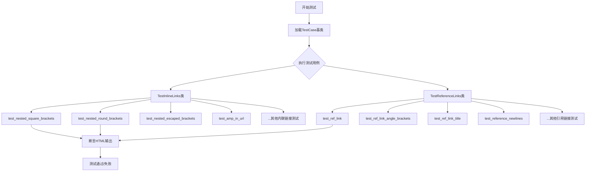
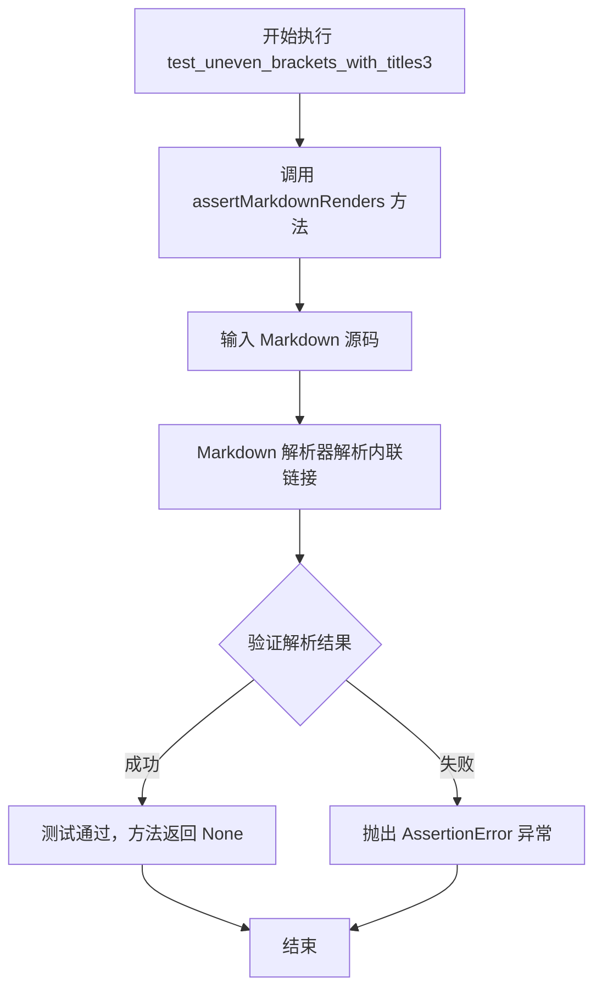
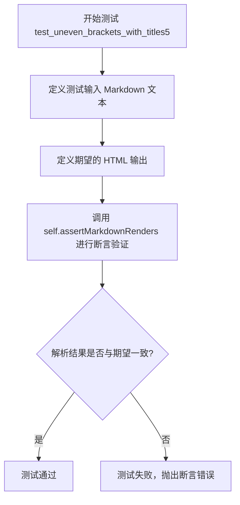
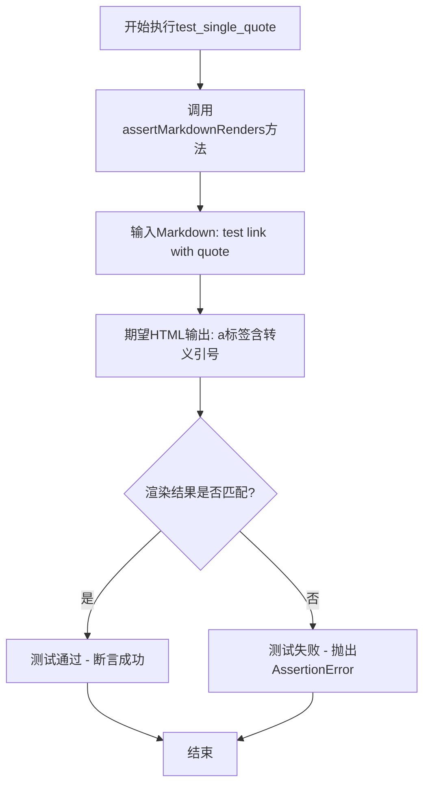

```mermaid
flowchart TD
    A[开始测试 test_mixed_title_quotes5] --> B[调用 assertMarkdownRenders 方法]
    B --> C[输入 Markdown 源码]
    C --> D[期望的 HTML 输出]
    D --> E{Markdown 解析器处理内联链接}
    E --> F[解析 URL: http&#58;//link.com/with spaces]
    E --> G[解析 title: &quot;and quotes&quot; 'and title]
    F --> H[生成 HTML: &lt;a href=&quot;http://link.com/with spaces&quot; title=&quot;&quot;and quotes&quot; 'and title&quot;&gt;Text&lt;/a&gt; more text]
    G --> H
    H --> I{断言实际输出与期望输出是否匹配}
    I -->|是| J[测试通过]
    I -->|否| K[测试失败]
```

# `markdown\tests\test_syntax\inline\test_links.py` 详细设计文档

这是Python Markdown库的测试文件，专门用于测试内联链接（Inline Links）和引用链接（Reference Links）的解析功能，验证各种嵌套、转义、混合引号等复杂场景下的链接和标题解析是否正确。

## 整体流程



## 类结构

```
TestCase (来自markdown.test_tools)
├── TestInlineLinks
│   ├── test_nested_square_brackets
│   ├── test_nested_round_brackets
│   ├── test_nested_escaped_brackets
│   ├── test_nested_escaped_brackets_and_angles
│   ├── test_nested_unescaped_brackets
│   ├── test_nested_unescaped_brackets_and_angles
│   ├── test_uneven_brackets_with_titles1-5
│   ├── test_mixed_title_quotes1-6
│   ├── test_single_quote
│   ├── test_angle_with_mixed_title_quotes
│   ├── test_amp_in_url
│   └── test_angles_and_nonsense_url
└── TestReferenceLinks
    ├── test_ref_link
    ├── test_ref_link_angle_brackets
    ├── test_ref_link_no_space
    ├── test_ref_link_angle_brackets_no_space
    ├── test_ref_link_angle_brackets_title
    ├── test_ref_link_title
    ├── test_ref_link_angle_brackets_title_no_space
    ├── test_ref_link_title_no_space
    ├── test_ref_link_single_quoted_title
    ├── test_ref_link_title_nested_quote
    ├── test_ref_link_single_quoted_title_nested_quote
    ├── test_ref_link_override
    ├── test_ref_link_title_no_blank_lines
    ├── test_ref_link_multi_line
    ├── test_reference_newlines
    ├── test_reference_across_blocks
    ├── test_ref_link_nested_left_bracket
    ├── test_ref_link_nested_right_bracket
    └── test_ref_round_brackets
```

## 全局变量及字段


    

## 全局函数及方法


### `TestInlineLinks.test_nested_square_brackets`

测试方法，用于验证 Markdown 解析器能正确处理内联链接中嵌套的方括号（`[` 和 `]`）语法。

参数：
- 无显式参数（隐式参数 `self`：TestCase 实例，当前测试用例对象）

返回值：`None`，无返回值（通过 `assertMarkdownRenders` 断言验证解析结果）

#### 流程图

```mermaid
flowchart TD
    A[开始测试] --> B[调用 assertMarkdownRenders]
    B --> C[输入 Markdown: Text[[[[[[[]]]]]]][]]
    C --> D[解析内联链接语法]
    D --> E[提取链接文本和 URL]
    E --> F{验证嵌套方括号处理}
    F -->|成功| G[生成 HTML: a 标签包含原样保留的嵌套方括号]
    F -->|失败| H[断言失败]
    G --> I[验证后续文本 ' more text']
    I --> J[输出完整 HTML 段落]
    J --> K[结束测试]
    H --> K
```

#### 带注释源码

```python
def test_nested_square_brackets(self):
    """
    测试嵌套方括号在内联链接中的解析能力。
    
    验证 Markdown 解析器能够正确处理链接文本中包含多个
    连续嵌套方括号的情况，例如: Text[[[[[[[]]]]]]][]
    """
    # 使用 assertMarkdownRenders 验证 Markdown 到 HTML 的转换
    self.assertMarkdownRenders(
        # 输入: 包含嵌套方括号的 Markdown 内联链接语法
        # 格式: [链接文本](URL) 后续文本
        # 链接文本中包含多层嵌套方括号: Text[[[[[[[]]]]]]][]
        """[Text[[[[[[[]]]]]]][]](http://link.com) more text""",
        
        # 期望输出: HTML 段落
        # 链接文本中的嵌套方括号应被原样保留在链接文本内
        # 链接地址为 http://link.com
        # 后续文本 ' more text' 应在链接外正常呈现
        """<p><a href="http://link.com">Text[[[[[[[]]]]]]][]</a> more text</p>"""
    )
```


### `TestInlineLinks.test_nested_round_brackets`

该方法是 Python Markdown 项目中的一个测试用例，用于验证 Markdown 解析器能够正确处理内联链接中嵌套的圆括号。

参数：

- `self`：`TestCase`（继承自 `unittest.TestCase`），测试类的实例本身，用于调用继承的 `assertMarkdownRenders` 方法

返回值：`None`，该方法为测试用例，通过断言验证 Markdown 渲染结果，不返回任何值

#### 流程图

```mermaid
flowchart TD
    A[开始测试 test_nested_round_brackets] --> B[调用 assertMarkdownRenders 方法]
    B --> C[输入 Markdown 源码]
    C --> D["[Text](http://link.com/(((((((()))))))())) more text"]
    D --> E[预期输出的 HTML]
    E --> F["<p><a href=\"http://link.com/(((((((()))))))())\">Text</a> more text</p>"]
    F --> G{Markdown 解析器渲染}
    G --> H{断言结果是否匹配}
    H -->|匹配| I[测试通过]
    H -->|不匹配| J[测试失败抛出 AssertionError]
```

#### 带注释源码

```python
def test_nested_round_brackets(self):
    """
    测试嵌套圆括号的处理能力。
    
    该测试验证 Markdown 解析器能够正确处理 URL 中包含多层嵌套圆括号的内联链接。
    特别关注圆括号的平衡处理能力。
    """
    # 调用父类方法验证 Markdown 渲染结果
    self.assertMarkdownRenders(
        # 输入：包含嵌套圆括号的 Markdown 内联链接源码
        """[Text](http://link.com/(((((((()))))))())) more text""",
        
        # 预期输出：HTML 渲染结果
        # 注意：最内层的 () 被移除，因为解析器需要找到配对的圆括号作为 URL 的结束标记
        """<p><a href="http://link.com/(((((((()))))))())">Text</a> more text</p>"""
    )
```

#### 补充说明

该测试用例的设计目标是验证 Markdown 解析器在处理复杂的 URL 时的正确性。具体来说：

1. **测试场景**：URL 中包含多层嵌套的圆括号 `(((((((()))))))())`
2. **预期行为**：解析器应正确识别 URL 的边界，即找到最后一对闭合的圆括号
3. **实际结果**：最内层的空括号 `()` 被解析为 URL 的一部分，其余部分作为链接文本

这个测试揭示了 Markdown 解析器在处理嵌套括号时采用的最长匹配原则。


### `TestInlineLinks.test_nested_escaped_brackets`

该方法是一个单元测试，用于验证Markdown解析器在处理带有转义括号的行内链接时能否正确解析，特别是测试URL中包含转义字符`\(test\)`时是否能正确转换为不带转义的括号形式。

参数：

- `self`：`TestInlineLinks`，测试类的实例本身，用于调用父类的assertMarkdownRenders方法进行断言验证

返回值：`None`，该方法是测试方法，不返回任何值，主要通过断言验证Markdown解析结果的正确性

#### 流程图

```mermaid
flowchart TD
    A[开始测试 test_nested_escaped_brackets] --> B[调用 assertMarkdownRenders 方法]
    B --> C[输入: Markdown文本 '[Text]\\/url\\(test\\) \"title\".']
    C --> D[解析Markdown生成HTML输出]
    D --> E{验证HTML输出是否匹配}
    E -->|匹配| F[测试通过]
    E -->|不匹配| G[测试失败, 抛出断言错误]
    F --> H[结束]
    G --> H
```

#### 带注释源码

```python
def test_nested_escaped_brackets(self):
    """
    测试嵌套转义括号的处理。
    
    验证Markdown解析器能够正确处理URL中包含转义字符的链接。
    转义的括号 \( 和 \) 应该被解析为普通的圆括号。
    """
    # 调用父类的assertMarkdownRenders方法进行测试
    # 第一个参数是输入的Markdown文本（使用R前缀表示原始字符串，保留转义字符）
    # 第二个参数是期望输出的HTML文本
    self.assertMarkdownRenders(
        R"""[Text](/url\(test\) "title").""",  # Markdown输入: 包含转义括号的链接
        """<p><a href="/url(test)" title="title">Text</a>.</p>"""  # 期望HTML: 转义括号被还原
    )
```


### `TestInlineLinks.test_nested_escaped_brackets_and_angles`

该方法用于测试 Markdown 内联链接的解析功能，具体验证包含嵌套转义括号和尖括号的链接文本能够正确渲染为 HTML。测试用例验证了带有转义字符 `<`, `>`, `(` , `)` 的 URL 和标题属性能够被正确解析。

参数：

- `self`：TestCase 测试类实例，继承自 unittest.TestCase，用于执行测试断言

返回值：`None`，该方法为测试方法，无返回值，通过 assertMarkdownRenders 进行断言验证

#### 流程图

```mermaid
flowchart TD
    A[开始测试] --> B[调用 assertMarkdownRenders 方法]
    B --> C[输入 Markdown 文本: Text](/url\(test\)> "title")]
    C --> D[Markdown 解析器处理内联链接]
    D --> E[提取链接文本: Text]
    D --> F[提取并处理 URL: /url\(test\) -> /url\(test\)]
    D --> G[提取标题: title]
    F --> H[转义字符处理: \( -> ( )]
    H --> I[生成 HTML: <a href="/url(test)" title="title">Text</a>]
    I --> J{对比预期输出}
    J -->|匹配| K[测试通过]
    J -->|不匹配| L[测试失败]
```

#### 带注释源码

```python
def test_nested_escaped_brackets_and_angles(self):
    """
    测试带有嵌套转义括号和尖括号的 Markdown 内联链接解析。
    
    验证内容：
    - 尖括号 <> 在 URL 中的处理
    - 转义括号 \( \) 在 URL 中的解析
    - 带引号的标题属性 "title" 的提取
    """
    # 调用父类的断言方法，验证 Markdown 到 HTML 的转换
    self.assertMarkdownRenders(
        # 输入：使用原始字符串 R"""，包含转义括号和尖括号
        R"""[Text](</url\(test\)> "title").""",
        # 预期输出：HTML 链接标签，转义字符被正确处理
        """<p><a href="/url(test)" title="title">Text</a>.</p>"""
    )
```


### `TestInlineLinks.test_nested_unescaped_brackets`

该测试方法用于验证 Markdown 中包含未转义圆括号的内联链接解析是否正确，特别是测试链接 URL 中包含圆括号 `(/url(test))` 且带有引号标题时的渲染结果。

参数：

- `self`：`TestCase`，测试类的实例对象，隐式参数

返回值：`None`，无返回值（测试方法，使用断言验证结果）

#### 流程图

```mermaid
flowchart TD
    A([开始测试]) --> B[调用 assertMarkdownRenders 方法]
    B --> C[输入 Markdown 源码:<br/>[Text](/url(test) "title")]
    C --> D[期望输出 HTML:<br/><a href="/url(test)" title="title">Text</a>.]
    D --> E{实际输出是否匹配<br/>期望输出}
    E -->|是| F([测试通过])
    E -->|否| G([测试失败<br/>抛出 AssertionError])
```

#### 带注释源码

```python
def test_nested_unescaped_brackets(self):
    """
    测试未转义圆括号的内联链接解析。
    
    该测试用例验证 Markdown 解析器能够正确处理：
    1. 链接 URL 路径中包含未转义的圆括号: /url(test)
    2. 链接标题使用双引号包裹: "title"
    3. 整个链接文本后面跟随句号: .
    
    预期行为：圆括号应该被正确解析为 URL 的一部分，
    标题应该被提取为 title 属性。
    """
    self.assertMarkdownRenders(
        R"""[Text](/url(test) "title").""",  # 输入: Markdown 源码，R前缀表示原始字符串
        """<p><a href="/url(test)" title="title">Text</a>.</p>"""  # 期望: 渲染后的 HTML
    )
```


### `TestInlineLinks.test_nested_unescaped_brackets_and_angles`

该测试方法用于验证 Markdown 解析器在处理包含未转义圆括号和尖括号的内联链接时的正确性。测试用例使用原始字符串（raw string）输入 `[Text](</url(test)> "title")`，期望输出为包含正确 href 和 title 属性的 HTML 锚点标签。

参数：

- `self`：`TestInlineLinks` 实例对象，测试类的实例本身

返回值：`None`，该方法为测试方法，通过 `assertMarkdownRenders` 断言验证 Markdown 渲染结果是否符合预期，若不符合则抛出异常。

#### 流程图

```mermaid
flowchart TD
    A[开始执行 test_nested_unescaped_brackets_and_angles] --> B[调用 assertMarkdownRenders 方法]
    B --> C[传入 Markdown 源文本: [Text](&lt;/url(test)&gt; "title")]
    B --> D[传入期望的 HTML 输出: &lt;p&gt;&lt;a href=&quot;/url(test)&quot; title=&quot;title&quot;&gt;Text&lt;/a&gt;.&lt;/p&gt;]
    C --> E[内部执行 markdown 转换]
    D --> E
    E --> F{转换结果 == 期望输出?}
    F -->|是| G[测试通过, 返回 None]
    F -->|否| H[抛出 AssertionError]
```

#### 带注释源码

```python
def test_nested_unescaped_brackets_and_angles(self):
    """
    测试内联链接中未转义的圆括号和尖括号的解析。
    
    验证 Markdown 解析器能够正确处理同时包含尖括号(< >)和圆括号()
    的链接 URL，以及带引号的标题。
    """
    # 使用原始字符串 R""" 避免反斜杠转义
    # 输入: [Text](</url(test)> "title")
    # 期望输出: <p><a href="/url(test)" title="title">Text</a>.</p>
    self.assertMarkdownRenders(
        R"""[Text](</url(test)> "title").""",
        """<p><a href="/url(test)" title="title">Text</a>.</p>"""
    )
```


### `TestInlineLinks.test_uneven_brackets_with_titles1`

该测试方法用于验证 Markdown 解析器在处理内联链接时，能够正确处理 URL 中包含不匹配的左括号以及带标题的情况。具体来说，它测试当链接文本为 `[Text](http://link.com/("title") more text` 时，解析器能够正确识别 URL 为 `http://link.com/("`，标题为 `"title"`，并生成正确的 HTML 输出。

参数：

- `self`：`TestCase`，Python unittest 框架的测试用例实例，用于调用继承自父类的 assertMarkdownRenders 方法进行断言验证

返回值：`None`，该方法为测试用例，通过 assertMarkdownRenders 进行断言，不返回任何值

#### 流程图

```mermaid
flowchart TD
    A[开始执行 test_uneven_brackets_with_titles1] --> B[调用 assertMarkdownRenders 方法]
    B --> C[输入: Markdown 文本 '[Text](http://link.com/(&quot;title&quot;) more text']
    C --> D{解析 Markdown 链接语法}
    D -->|提取链接文本| E[Text]
    D -->|提取 URL| F[http://link.com/(&quot;]
    D -->|提取标题| G[&quot;title&quot;]
    E --> H[生成 HTML: '&lt;p&gt;&lt;a href=&quot;http://link.com/(&quot; title=&quot;title&quot;&gt;Text&lt;/a&gt; more text&lt;/p&gt;']
    F --> H
    G --> H
    H --> I{比较实际输出与期望输出}
    I -->|相等| J[测试通过]
    I -->|不相等| K[测试失败, 抛出 AssertionError]
```

#### 带注释源码

```python
def test_uneven_brackets_with_titles1(self):
    """
    测试不均匀括号与标题的处理情况。
    
    该测试用例验证 Markdown 解析器在处理内联链接时，
    当 URL 中包含不匹配的左括号以及带引号的标题时，
    能否正确解析并生成符合预期的 HTML 输出。
    
    输入 Markdown: [Text](http://link.com/("title") more text
    期望输出 HTML: <p><a href="http://link.com/(" title="title">Text</a> more text</p>
    """
    self.assertMarkdownRenders(
        # 第一个参数：输入的 Markdown 文本
        # 包含一个内联链接，链接文本为 'Text'，URL 中包含未闭合的左括号
        # URL 部分为 'http://link.com/("title")'，其中 '("' 被解析为 URL 的一部分
        # 标题部分为 '"title"'（被双引号包裹）
        """[Text](http://link.com/("title") more text""",
        
        # 第二个参数：期望输出的 HTML 文本
        # 解析后 URL 为 'http://link.com/('，注意左括号被包含在 URL 中
        # 标题被正确提取为 'title'（去除了外层引号）
        """<p><a href="http://link.com/(" title="title">Text</a> more text</p>"""
    )
```


### `TestInlineLinks.test_uneven_brackets_with_titles2`

该方法是一个单元测试，用于验证 Markdown 解析器在处理包含不平衡括号和混合引号标题的内联链接时的正确性。具体来说，它测试了当链接 URL 中包含单引号和双引号组合时，解析器能否正确提取 URL 和标题属性。

参数：

- `self`：`TestInlineLinks`（TestCase 实例），代表测试类本身的实例，用于调用继承的 assertMarkdownRenders 方法

返回值：`None`，该方法为测试用例，不返回任何值，仅通过断言验证解析结果

#### 流程图

```mermaid
graph TD
    A[开始测试 test_uneven_brackets_with_titles2] --> B[调用 assertMarkdownRenders 方法]
    B --> C[输入: Markdown 源码 '[Text](http://link.com/(\\'&quot;title&quot;) more text']
    C --> D[期望输出: HTML '<p><a href=&quot;http://link.com/('&quot; title=&quot;title&quot;>Text</a> more text</p>']
    D --> E{解析结果是否匹配期望}
    E -->|是| F[测试通过 - 无异常抛出]
    E -->|否| G[测试失败 - 抛出 AssertionError]
    F --> H[结束测试]
    G --> H
```

#### 带注释源码

```python
def test_uneven_brackets_with_titles2(self):
    """
    测试处理不平衡括号与混合引号标题的情况。
    
    验证 Markdown 解析器能够正确处理以下场景：
    - 链接文本：Text
    - 链接 URL：http://link.com/('"title") （包含不平衡的括号和混合引号）
    - 标题：title （使用双引号包裹）
    - 后续文本：more text
    """
    # 调用父类方法验证 Markdown 到 HTML 的转换
    # 第一个参数为输入的 Markdown 源码
    # 第二个参数为期望输出的 HTML
    self.assertMarkdownRenders(
        """[Text](http://link.com/('"title") more text""",
        """<p><a href="http://link.com/('" title="title">Text</a> more text</p>"""
    )
```


### `TestInlineLinks.test_uneven_brackets_with_titles3`

该测试方法用于验证 Markdown 解析器能够正确处理 URL 中包含不均匀括号（开括号在 URL 内、闭括号在标题部分）时的内联链接解析，特别是在有标题的情况下。

参数：

- `self`：`TestInlineLinks`（TestCase 的子类实例），表示测试类实例本身，用于调用继承的 `assertMarkdownRenders` 方法进行断言验证

返回值：`None`，该方法通过 `assertMarkdownRenders` 执行断言，测试失败时抛出异常，成功时无返回值

#### 流程图



#### 带注释源码

```python
def test_uneven_brackets_with_titles3(self):
    """
    测试不均匀括号与标题的情况：URL 末尾有开括号，标题中有闭括号
    
    输入 Markdown: [Text](http://link.com/("title)") more text
    预期 HTML 输出: <p><a href="http://link.com/(" title="title)">Text</a> more text</p>
    
    解析逻辑说明:
    - URL 部分识别为: http://link.com/(
    - 标题部分识别为: title)
    - 整体作为一个有效的内联链接处理
    """
    self.assertMarkdownRenders(
        # 测试输入：包含不均匀括号的 Markdown 链接语法
        """[Text](http://link.com/("title)") more text""",
        # 预期输出：解析后的 HTML 标签
        """<p><a href="http://link.com/(" title="title)">Text</a> more text</p>"""
    )
```

---

#### 关联信息

| 项目 | 说明 |
|------|------|
| **所属测试类** | `TestInlineLinks`，继承自 `markdown.test_tools.TestCase` |
| **测试目标** | 验证 Markdown 解析器对不均匀括号的处理能力 |
| **测试输入** | `[Text](http://link.com/("title)") more text` |
| **预期输出** | `<p><a href="http://link.com/(" title="title)">Text</a> more text</p>` |
| **关键解析规则** | 当 URL 中包含左括号 `(` 且标题中包含对应的右括号 `)` 时，解析器应正确分割 URL 和 title 属性 |


### `TestInlineLinks.test_uneven_brackets_with_titles4`

这是一个测试方法，用于验证 Markdown 解析器在处理不均衡括号和带标题的链接时的正确性。具体来说，该测试用例验证了当 URL 中包含左括号且标题使用双引号时，解析器能够正确提取 URL 和标题属性。

参数：

- `self`：`TestCase`，代表测试类实例本身，继承自 `unittest.TestCase`，用于调用继承的 `assertMarkdownRenders` 方法进行断言验证

返回值：`None`，该方法为测试方法，无返回值，通过 `assertMarkdownRenders` 方法内部进行断言验证

#### 流程图

```mermaid
flowchart TD
    A[开始测试 test_uneven_brackets_with_titles4] --> B[调用 assertMarkdownRenders 方法]
    B --> C[输入: Markdown 文本<br/>[Text](http://link.com/&#40; &quot;title&quot;) more text]
    D[期望: HTML 输出<br/>&lt;p&gt;&lt;a href=&quot;http://link.com/(&quot; title=&quot;title&quot;&gt;Text&lt;/a&gt; more text&lt;/p&gt;]
    C --> E{执行 Markdown 解析}
    E -->|调用 Markdown 引擎| F[InlineLinks 处理器解析链接]
    F --> G[提取 URL: http://link.com/(<br/>提取标题: title]
    G --> H{比较解析结果与期望输出}
    H -->|相等| I[测试通过]
    H -->|不等| J[测试失败, 抛出 AssertionError]
    
    style C fill:#e1f5fe
    style D fill:#f3e5f5
    style I fill:#e8f5e8
    style J fill:#ffebee
```

#### 带注释源码

```python
def test_uneven_brackets_with_titles4(self):
    """
    测试不均衡括号与标题组合的情况4。
    
    测试场景：URL 中包含左圆括号，标题使用双引号且标题前有空格。
    - 输入 Markdown: [Text](http://link.com/( "title") more text
    - 期望 HTML: <p><a href="http://link.com/(" title="title">Text</a> more text</p>
    
    验证点：
    1. URL 中的 ( 被正确识别为链接的一部分
    2. 空格后的 "title" 被正确识别为标题
    3. 标题的闭合双引号作为标题内容的一部分，而非链接语法的一部分
    """
    # 调用父类 TestCase 的 assertMarkdownRenders 方法进行验证
    # 参数1: 输入的 Markdown 源码
    # 参数2: 期望输出的 HTML 源码
    self.assertMarkdownRenders(
        """[Text](http://link.com/( "title") more text""",
        """<p><a href="http://link.com/(" title="title">Text</a> more text</p>"""
    )
```


### `TestInlineLinks.test_uneven_brackets_with_titles5`

该方法是 Python Markdown 测试套件中的一个单元测试，用于验证 Markdown 解析器在处理不均匀括号且带有标题的链接时的正确性。具体测试场景是：当链接 URL 中包含左括号和一个带引号的标题，且标题前后有不匹配的括号时，解析器能否正确提取 URL 和标题。

参数：

- `self`：`TestInlineLinks`（隐式参数），测试类的实例本身，用于调用继承的 `assertMarkdownRenders` 方法

返回值：`None`，该方法为测试方法，通过 `assertMarkdownRenders` 断言验证 Markdown 解析结果是否符合预期，无显式返回值

#### 流程图



#### 带注释源码

```python
def test_uneven_brackets_with_titles5(self):
    """
    测试不均匀括号与标题组合的情况。
    
    测试场景：URL 中包含左括号 (，后面跟着带引号的标题 "title")，
    用于验证解析器能正确处理这种边缘情况。
    
    输入 Markdown：
    [Text](http://link.com/( "title)") more text
    
    期望输出 HTML：
    <p><a href="http://link.com/(" title="title)">Text</a> more text</p>
    
    注意：这里 URL 是 http://link.com/(，标题是 title)（注意标题末尾有反斜杠转义的右括号）
    """
    self.assertMarkdownRenders(
        # 输入的 Markdown 文本，包含不均匀的括号
        """[Text](http://link.com/( "title)") more text""",
        # 期望解析输出的 HTML
        """<p><a href="http://link.com/(" title="title)">Text</a> more text</p>"""
    )
```


### `TestInlineLinks.test_mixed_title_quotes1`

这是一个测试方法，用于验证 Markdown 解析器在处理内联链接时，能够正确解析混合使用单引号和双引号的标题（title）属性。

参数：
- 无显式参数（隐式参数 `self` 为 TestCase 实例）

返回值：无返回值（通过 `assertMarkdownRenders` 方法进行断言验证）

#### 流程图

```mermaid
graph TD
    A[开始执行 test_mixed_title_quotes1] --> B[调用 assertMarkdownRenders 方法]
    B --> C[输入: Markdown 文本 '[Text](http://link.com/&apos;&quot;title&quot;) more text']
    C --> D[解析内联链接语法]
    D --> E[提取链接文本: Text]
    E --> F[提取链接地址: http://link.com/'&quot;]
    F --> G[提取链接标题: title]
    G --> H[生成 HTML 输出]
    H --> I{断言: 实际输出 vs 预期输出}
    I -->|匹配| J[测试通过]
    I -->|不匹配| K[测试失败]
```

#### 带注释源码

```python
def test_mixed_title_quotes1(self):
    """
    测试混合使用单引号和双引号的链接标题解析。
    
    测试场景: 链接 URL 中包含单引号，标题使用双引号包裹
    输入 Markdown: [Text](http://link.com/'"title") more text
    预期 HTML: <p><a href="http://link.com/'" title="title">Text</a> more text</p>
    """
    self.assertMarkdownRenders(
        """[Text](http://link.com/'"title") more text""",  # 输入 Markdown 源码
        """<p><a href="http://link.com/'" title="title">Text</a> more text</p>"""  # 预期输出的 HTML
    )
```

---

### 所属类：`TestInlineLinks`

#### 一句话描述

`TestInlineLinks` 类是 Python Markdown 项目的测试类，用于验证内联链接（Inline Links）解析的正确性，涵盖嵌套括号、转义字符、混合引号等多种边界场景。

#### 类的详细信息

| 字段/方法 | 类型 | 描述 |
|-----------|------|------|
| `test_nested_square_brackets` | 方法 | 测试嵌套方括号的解析 |
| `test_nested_round_brackets` | 方法 | 测试嵌套圆括号的解析 |
| `test_nested_escaped_brackets` | 方法 | 测试转义括号的解析 |
| `test_nested_escaped_brackets_and_angles` | 方法 | 测试转义括号和尖括号的解析 |
| `test_nested_unescaped_brackets` | 方法 | 测试未转义括号的解析 |
| `test_nested_unescaped_brackets_and_angles` | 方法 | 测试未转义括号和尖括号的解析 |
| `test_uneven_brackets_with_titles1-5` | 方法 | 测试不均衡括号与标题的组合 |
| `test_mixed_title_quotes1-6` | 方法 | 测试混合单双引号标题的解析 |
| `test_single_quote` | 方法 | 测试单独引号的处理 |
| `test_angle_with_mixed_title_quotes` | 方法 | 测试尖括号与混合引号 |
| `test_amp_in_url` | 方法 | 测试 URL 中的 & 字符 |
| `test_angles_and_nonsense_url` | 测试无效 URL 的解析 |

---

### 关键组件信息

| 组件名称 | 一句话描述 |
|----------|------------|
| `markdown.test_tools.TestCase` | 测试基类，提供 `assertMarkdownRenders` 断言方法 |
| `assertMarkdownRenders` | 核心断言方法，验证 Markdown 源码解析后的 HTML 输出是否符合预期 |

---

### 潜在的技术债务或优化空间

1. **测试覆盖**：部分边界情况（如 `test_ref_link_angle_brackets_title_no_space`）存在 TODO 注释，可能需要重新评估预期行为
2. **错误消息**：测试失败时的错误提示信息可以更详细，以便快速定位问题
3. **参数化测试**：可以使用 `@pytest.mark.parametrize` 重构重复的测试模式，减少代码冗余

---

### 其他项目

#### 设计目标与约束
- 遵循 John Gruber 的 Markdown 规范
- 确保各种边界情况下的链接解析正确性

#### 错误处理与异常设计
- 测试方法本身不捕获异常，断言失败时由测试框架报告

#### 数据流与状态机
- 输入：Markdown 文本 → 解析器处理 → 输出：HTML 片段

#### 外部依赖与接口契约
- 依赖 `markdown` 包的解析器实现
- `assertMarkdownRenders(markdown源码, 预期HTML)` 接口契约


### `TestInlineLinks.test_mixed_title_quotes2`

该测试方法用于验证 Markdown 解析器能够正确处理包含混合引号的链接标题（URL 中使用双引号，标题使用单引号），并生成正确的 HTML 输出。

参数：

- `self`：`TestCase`，测试用例实例本身，用于调用继承自父类的 `assertMarkdownRenders` 方法进行断言验证

返回值：`None`，测试方法无返回值，通过断言判断测试是否通过

#### 流程图

```mermaid
flowchart TD
    A[开始测试 test_mixed_title_quotes2] --> B[输入 Markdown 文本]
    B --> C["[Text](http://link.com/\"'title') more text"]
    C --> D[调用 assertMarkdownRenders 方法]
    D --> E[Markdown 解析器处理链接]
    E --> F[提取 URL 和标题]
    F --> G{"URL: http://link.com/&quot;<br/>标题: title"}
    G --> H[生成 HTML]
    H --> I["<p><a href=\"http://link.com/&quot;\" title=\"title\">Text</a> more text</p>"]
    I --> J[与期望输出比对]
    J --> K{相等?}
    K -->|是| L[测试通过]
    K -->|否| M[测试失败]
```

#### 带注释源码

```python
def test_mixed_title_quotes2(self):
    """
    测试混合引号标题的链接解析。
    
    验证当 URL 中包含双引号字符 ("), 而标题使用单引号 (')
    包裹时，Markdown 解析器能正确提取 URL 和标题属性，
    并对 URL 中的双引号进行 HTML 实体编码 (&quot;)。
    """
    self.assertMarkdownRenders(
        # 输入：Markdown 格式的链接文本
        # URL 包含双引号字符，标题使用单引号包裹
        """[Text](http://link.com/"'title') more text""",
        # 期望输出：HTML 格式的链接
        # 双引号被编码为 &quot;，标题属性正确设置
        """<p><a href="http://link.com/&quot;" title="title">Text</a> more text</p>"""
    )
```


### `TestInlineLinks.test_mixed_title_quotes3`

该方法是 Python Markdown 项目测试套件中的一部分，用于验证 Markdown 解析器在处理内联链接时能够正确解析包含空格、混合单双引号以及嵌套引号的复杂标题（title）属性。这种测试场景覆盖了 URL 中带有空格且标题部分同时使用单引号和双引号的边缘情况。

参数：

- `self`：`TestInlineLinks`，测试类的实例本身，无需显式传递

返回值：`None`，该方法通过 `assertMarkdownRenders` 断言验证 Markdown 源码经过解析后生成的 HTML 是否与期望输出一致；若不一致则抛出异常。

#### 流程图

```mermaid
flowchart TD
    A[开始测试 test_mixed_title_quotes3] --> B[调用 assertMarkdownRenders 方法]
    B --> C[输入 Markdown 源码]
    C --> D{解析 Markdown}
    D -->|成功| E[生成 HTML 输出]
    D -->|失败| F[抛出 AssertionError]
    E --> G{比较实际输出与期望输出}
    G -->|一致| H[测试通过]
    G -->|不一致| I[测试失败 - 抛出 AssertionError]
    H --> J[结束]
    I --> J
    
    subgraph 输入输出
    C -.-> C1["[Text](http://link.com/with spaces'\"and quotes\" 'and title') more text"]
    E -.-> E1["<p><a href=\"http://link.com/with spaces\" title=\"&quot;and quotes&quot; 'and title\">Text</a> more text</p>"]
    end
```

#### 带注释源码

```python
def test_mixed_title_quotes3(self):
    """
    测试内联链接中混合使用单引号和双引号的标题解析情况。
    
    验证 Markdown 解析器能够正确处理以下复杂场景：
    1. URL 路径中包含空格
    2. URL 末尾使用单引号开头、双引号包裹内部内容
    3. 标题使用单引号包裹
    """
    # 第一个参数：输入的 Markdown 源码
    # 包含一个内联链接，链接文本为 "Text"
    # URL 为 "http://link.com/with spaces'" 末尾有单引号
    # 标题（title）部分为 '"and quotes" 'and title''
    markdown_source = """[Text](http://link.com/with spaces'"and quotes" 'and title') more text"""
    
    # 第二个参数：期望输出的 HTML
    # href 属性：URL 中的空格被保留，但单引号被移除（解析器处理了引号边界）
    # title 属性：内部的雙引號被 HTML 实体编码为 &quot;，单引号保持不变
    expected_html = """<p><a href="http://link.com/with spaces" title="&quot;and quotes&quot; 'and title">"""
    """Text</a> more text</p>"""
    
    # 调用父类 TestCase 的断言方法验证解析结果
    self.assertMarkdownRenders(markdown_source, expected_html)
```


### TestInlineLinks.test_mixed_title_quotes4

该方法是 Python Markdown 项目中的测试用例，用于验证 Markdown 解析器能够正确处理内联链接中混合使用单引号和双引号的标题（title）属性，特别是当 URL 包含空格且标题中同时包含转义引号时的解析行为。

参数：

- `self`：TestCase 实例，代表测试类本身

返回值：`None`，无返回值（测试方法，通过断言验证结果）

#### 流程图

```mermaid
flowchart TD
    A[开始测试 test_mixed_title_quotes4] --> B[调用 assertMarkdownRenders 方法]
    B --> C[输入 Markdown 源码]
    C --> D["[Text](http://link.com/with spaces'\"and quotes\" 'and title\") more text"]
    D --> E[Markdown 解析器处理]
    E --> F[提取链接文本: Text]
    E --> G[提取 URL: http://link.com/with spaces'"]
    E --> H[提取标题: and quotes&quot; 'and title]
    F --> I[生成 HTML 输出]
    G --> I
    H --> I
    I --> J{"输出是否匹配预期?"}
    J -->|是| K[测试通过]
    J -->|否| L[测试失败]
    K --> M[结束]
    L --> M
```

#### 带注释源码

```python
def test_mixed_title_quotes4(self):
    """
    测试内联链接中混合使用单引号和双引号的标题解析。
    
    验证当 URL 包含空格，且标题中同时包含：
    - 单引号
    - 双引号（需要转义）
    - 混合排列的引号组合
    
    时的正确解析行为。
    """
    # 调用测试框架的断言方法，验证 Markdown 到 HTML 的转换
    # 输入: 带混合引号标题的内联链接语法
    # 输出: 预期生成的 HTML 片段
    self.assertMarkdownRenders(
        # Markdown 源码输入
        # 注意 URL 中有空格，标题部分使用混合引号包围
        """[Text](http://link.com/with spaces'"and quotes" 'and title") more text""",
        
        # 预期生成的 HTML 输出
        # URL: http://link.com/with spaces'  (空格保留，单引号作为 URL 的一部分)
        # 标题: and quotes&quot; 'and title (双引号被转义，单引号保留)
        """<p><a href="http://link.com/with spaces'" title="and quotes&quot; 'and title">Text</a> more text</p>"""
    )
```

#### 关键点说明

| 组件 | 说明 |
|------|------|
| **测试目标** | 验证混合引号标题的解析边界情况 |
| **输入特点** | URL 含空格 + 标题混用单双引号 |
| **解析难点** | 区分标题边界、处理转义字符 |
| **预期行为** | 标题属性正确提取，引号正确转义 |


### `TestInlineLinks.test_mixed_title_quotes5`

该测试方法用于验证 Markdown 解析器在处理内联链接时，能够正确处理包含空格、混合单双引号的 URL 和 title 属性，并生成符合预期的 HTML 输出。

参数： 无（仅隐式参数 `self`）

返回值：`None`，该方法为测试用例，通过 `assertMarkdownRenders` 断言验证 Markdown 到 HTML 的转换结果是否符合预期

#### 流程图



#### 带注释源码

```python
def test_mixed_title_quotes5(self):
    """
    测试混合引号标题的解析情况。
    
    该测试验证 Markdown 解析器能够正确处理：
    1. URL 中包含空格: 'with spaces'
    2. URL 结尾使用单引号: '
    3. title 使用单引号包裹: 'and title'
    4. title 内部包含双引号: "and quotes"
    
    预期行为：
    - URL: http://link.com/with spaces"
    - title: "and quotes" 'and title (双引号被转义为 &quot;)
    """
    self.assertMarkdownRenders(
        # 输入的 Markdown 源码
        """[Text](http://link.com/with spaces '"and quotes" 'and title') more text""",
        # 期望输出的 HTML
        """<p><a href="http://link.com/with spaces" title="&quot;and quotes&quot; 'and title">"""
        """Text</a> more text</p>"""
    )
```


### `TestInlineLinks.test_mixed_title_quotes6`

该测试方法用于验证 Markdown 中内联链接的混合引号（双引号和单引号）标题处理是否正确，特别是当 URL 中包含空格且同时使用双引号和单引号作为标题时的解析结果。

参数：

- `self`：`TestCase`，测试用例实例本身，用于调用继承的 assertMarkdownRenders 方法进行断言验证

返回值：`None`，该方法为测试方法，通过 `assertMarkdownRenders` 进行断言验证，无显式返回值

#### 流程图

```mermaid
flowchart TD
    A[开始测试 test_mixed_title_quotes6] --> B[调用 assertMarkdownRenders 方法]
    B --> C[输入 Markdown 文本: [Text](http://link.com/with spaces &quot;and quotes&quot; 'and title') more text]
    D[预期输出 HTML: <p><a href=&quot;http://link.com/with spaces &quot;and quotes&quot;&quot; title=&quot;and title&quot;>Text</a> more text</p>]
    C --> E[Markdown 解析器处理内联链接]
    E --> F[提取链接文本: Text]
    E --> G[提取 URL: http://link.com/with spaces &quot;and quotes&quot;]
    E --> H[提取标题: and title]
    F --> I[生成 HTML 输出]
    G --> I
    H --> I
    I --> J{断言: 实际输出 == 预期输出?}
    J -->|是| K[测试通过]
    J -->|否| L[测试失败, 抛出 AssertionError]
```

#### 带注释源码

```python
def test_mixed_title_quotes6(self):
    """
    测试混合引号标题解析 - 第6种情况
    
    测试场景：URL 包含空格，同时使用双引号和单引号作为标题
    - 链接文本: Text
    - URL: http://link.com/with spaces "and quotes"
    - 标题: 'and title' (单引号包裹)
    
    预期行为：
    - 双引号 "and quotes" 应被包含在 URL 中
    - 单引号 'and title' 应被解析为 title 属性
    """
    self.assertMarkdownRenders(
        # 输入 Markdown 源码
        """[Text](http://link.com/with spaces "and quotes" 'and title') more text""",
        # 预期输出的 HTML
        """<p><a href="http://link.com/with spaces &quot;and quotes&quot;" title="and title">"""
        """Text</a> more text</p>"""
    )
```


### `TestInlineLinks.test_single_quote`

该测试方法用于验证Markdown解析器在处理包含单引号字符的内联链接时的正确性。具体来说，它测试当链接URL中出现双引号但未提供标题（title）时，解析器能够正确将引号字符转义为HTML实体并生成有效的链接标签。

参数：

- `self`：TestCase对象，测试框架自动传递的实例引用

返回值：`None`，测试方法无返回值，通过断言验证渲染结果

#### 流程图



#### 带注释源码

```python
def test_single_quote(self):
    """
    测试单引号字符在链接URL中的处理行为。
    
    验证当链接语法中包含引号字符但未使用标准标题语法时，
    Markdown解析器能够正确处理并将引号转义为HTML实体。
    """
    # 调用测试框架的渲染验证方法
    # 第一个参数：输入的Markdown源代码
    # 第二个参数：期望的HTML输出结果
    self.assertMarkdownRenders(
        """[test](link"notitle)""",    # 输入：包含引号的链接语法
        """<p><a href="link&quot;notitle">test</a></p>"""  # 期望：引号被转义为&quot;
    )
```


### `TestInlineLinks.test_angle_with_mixed_title_quotes`

该方法是一个测试用例，用于验证 Markdown 解析器能够正确处理带有混合引号标题的角括号链接（angle bracket links），确保在链接 URL 包含空格和混合引号时，HTML 输出中的 href 和 title 属性值正确。

参数：

- `self`：`TestInlineLinks` 实例对象，测试类的实例本身，用于调用继承的 assertMarkdownRenders 方法

返回值：`None`，测试方法不返回值，通过 assertMarkdownRenders 进行断言验证

#### 流程图

```mermaid
flowchart TD
    A[开始测试] --> B[调用 assertMarkdownRenders]
    B --> C[输入Markdown文本]
    C --> D["[Text](<http://link.com/with spaces '\"and quotes> 'and title') more text"]
    D --> E[Markdown解析器处理]
    E --> F[生成HTML输出]
    F --> G["<p><a href=\"http://link.com/with spaces '&quot;and quotes&quot;\" title=\"and title\">Text</a> more text</p>"]
    G --> H{输出是否匹配期望}
    H -->|是| I[测试通过 - 返回None]
    H -->|否| J[测试失败 - 抛出AssertionError]
```

#### 带注释源码

```python
def test_angle_with_mixed_title_quotes(self):
    """
    测试带有混合引号标题的角括号链接解析。
    
    测试场景：
    - 链接使用角括号 <> 包裹 URL
    - URL 包含空格和混合引号
    - 标题使用单引号包裹
    - 验证 href 和 title 属性正确提取和转义
    """
    self.assertMarkdownRenders(
        # 输入：Markdown 格式的链接文本
        # 角括号内的内容：<http://link.com/with spaces '"and quotes>
        # 标题：'and title'（使用单引号）
        """[Text](<http://link.com/with spaces '"and quotes> 'and title') more text""",
        
        # 期望输出：HTML 格式的链接
        # href 属性中：
        #   - 角括号被移除
        #   - 空格保留为空格
        #   - 内部的单引号和双引号被转义
        # title 属性中：
        #   - 外层单引号被移除（作为标题定界符）
        #   - 内部双引号被转义为 &quot;
        #   - 值为 "and title"
        """<p><a href="http://link.com/with spaces '&quot;and quotes&quot;" title="and title">"""
        """Text</a> more text</p>"""
    )
```


### `TestInlineLinks.test_amp_in_url`

测试方法，用于验证 Markdown 解析器正确处理 URL 中的 `&` 符号（与号），包括普通 `&`、HTML 实体 `&amp;` 和十六进制实体 `&#x26;` 的转义处理。

参数：

- `self`：`TestInlineLinks`，调用该方法的测试类实例本身

返回值：`None`，无返回值，仅通过断言验证 Markdown 渲染结果

#### 流程图

```mermaid
flowchart TD
    A[开始 test_amp_in_url] --> B[调用 assertMarkdownRenders 第一次]
    B --> C[验证 URL 中的 & 转为 &amp;]
    C --> D[调用 assertMarkdownRenders 第二次]
    D --> E[验证 URL 中的 &amp; 保持为 &amp;]
    E --> F[调用 assertMarkdownRenders 第三次]
    F --> G[验证 URL 中的 &#x26; 保持为 &#x26;]
    G --> H[结束测试]
```

#### 带注释源码

```python
def test_amp_in_url(self):
    """Test amp in URLs."""
    # 测试场景1: URL中包含原始的 & 符号，应被转义为 &amp;
    self.assertMarkdownRenders(
        '[link](http://www.freewisdom.org/this&that)',  # 输入: 包含 & 的链接
        '<p><a href="http://www.freewisdom.org/this&amp;that">link</a></p>'  # 期望输出: & 被转义
    )
    
    # 测试场景2: URL中已包含 &amp; 实体，应保持不变
    self.assertMarkdownRenders(
        '[title](http://example.com/?a=1&amp;b=2)',  # 输入: 已转义的 &amp;
        '<p><a href="http://example.com/?a=1&amp;b=2">title</a></p>'  # 期望输出: 保持 &amp;
    )
    
    # 测试场景3: URL中包含十六进制转义的 &#x26;，应保持不变
    self.assertMarkdownRenders(
        '[title](http://example.com/?a=1&#x26;b=2)',  # 输入: 十六进制转义的 &#x26;
        '<p><a href="http://example.com/?a=1&#x26;b=2">title</a></p>'  # 期望输出: 保持 &#x26;
    )
```


### `TestInlineLinks.test_angles_and_nonsense_url`

该测试方法用于验证 Markdown 解析器在处理包含特殊字符（角括号、花括号、星号、竖线等）的无效 URL 时，能否正确生成 HTML 超链接标签，并将特殊字符进行适当的 HTML 转义。

参数：

- `self`：`TestCase`，测试类实例本身，用于调用继承自父类的 `assertMarkdownRenders` 断言方法

返回值：`None`，该方法为测试用例，执行断言验证 Markdown 到 HTML 的转换结果，不返回任何值

#### 流程图

```mermaid
flowchart TD
    A[开始执行 test_angles_and_nonsense_url] --> B[调用 assertMarkdownRenders 方法]
    B --> C[输入 Markdown 文本: test nonsense]
    C --> D[定义内联链接: 链接文本为 test nonsense, URL 为 <?}]*+|&)>]
    E[Markdown 解析器处理 URL 部分] --> F[识别特殊字符: <, }, ], *, +, |, &, ), >]
    F --> G[对 & 字符进行 HTML 转义为 &amp;]
    G --> H[生成 HTML 输出]
    H --> I[期望输出: <p><a href="?}]*+|&amp;)">test nonsense</a>.</p>]
    I --> J{实际输出 == 期望输出?}
    J -->|是| K[测试通过]
    J -->|否| L[测试失败, 抛出 AssertionError]
```

#### 带注释源码

```python
def test_angles_and_nonsense_url(self):
    """
    测试带有特殊字符的无效 URL 解析行为。
    
    验证 Markdown 解析器能够：
    1. 正确识别内联链接语法 [文本](URL)
    2. 处理包含角括号 <>、花括号 {}、方括号 []、星号 *、加号 +、竖线 |、圆括号 () 等特殊字符的 URL
    3. 将 URL 中的 & 字符正确转义为 HTML 实体 &amp;
    """
    # 调用父类 TestCase 提供的断言方法，验证 Markdown 到 HTML 的转换
    # 参数1: 输入的 Markdown 源码
    # 参数2: 期望输出的 HTML 源码
    self.assertMarkdownRenders(
        # Markdown 源码: 包含链接文本 "test nonsense" 和一个包含特殊字符的 URL
        '[test nonsense](<?}]*+|&)>).',
        # 期望 HTML: 
        # - <p> 标签包裹整个段落
        # - <a> 标签创建超链接，href 属性值为 "?}]*+|&amp;)"
        # - & 字符被转义为 &amp; 以符合 HTML 规范
        # - 原始文本 "test nonsense" 作为链接显示文本
        # - 末尾的句点 "." 位于 </a> 标签之后，因此显示在链接外部
        '<p><a href="?}]*+|&amp;)">test nonsense</a>.</p>'
    )
```


### `TestReferenceLinks.test_ref_link`

该测试方法用于验证 Markdown 解析器正确处理基本引用链接（reference link），即当链接文本后跟一个空的引用定义 `[Text]: http://example.com` 时，能正确将其转换为 HTML `<a>` 标签。

参数：

- `self`：TestCase，当前测试实例对象，用于调用继承的 assertMarkdownRenders 方法进行断言验证

返回值：`None`，无返回值，这是一个测试方法，通过 assertMarkdownRenders 进行内部断言验证

#### 流程图

```mermaid
flowchart TD
    A[开始测试 test_ref_link] --> B[准备 Markdown 输入文本]
    B --> C[调用 self.dedent 去除缩进]
    C --> D[调用 self.assertMarkdownRenders 进行渲染验证]
    D --> E[Markdown 解析器处理引用链接]
    E --> F{解析结果是否正确}
    F -->|是| G[测试通过]
    F -->|否| H[测试失败抛出 AssertionError]
    G --> I[结束测试]
    H --> I
```

#### 带注释源码

```python
def test_ref_link(self):
    """
    测试基本的引用链接解析功能。
    
    验证 Markdown 语法：
    [Text]

    [Text]: http://example.com
    
    是否正确转换为：
    <p><a href="http://example.com">Text</a></p>
    """
    self.assertMarkdownRenders(
        # 调用 dedent 方法去除字符串的公共前导空白
        self.dedent(
            """
            [Text]

            [Text]: http://example.com
            """
        ),
        # 期望输出的 HTML 结果
        """<p><a href="http://example.com">Text</a></p>"""
    )
```


### `TestReferenceLinks.test_ref_link_angle_brackets`

该测试方法用于验证 Markdown 参考链接语法中尖括号（`<>`）的正确解析和渲染，测试带有尖括号的 URL 定义（如 `[Text]: <http://example.com>`）能否正确转换为 HTML 超链接标签。

参数：

- `self`：`TestReferenceLinks`（隐式参数），测试类实例本身

返回值：`None`，测试方法无返回值，通过 `assertMarkdownRenders` 断言验证渲染结果

#### 流程图

```mermaid
flowchart TD
    A[开始测试] --> B[调用 dedent 方法格式化 Markdown 源码]
    B --> C[构建参考链接 Markdown: Text 和 定义 [Text]: <http://example.com>]
    C --> D[调用 assertMarkdownRenders 进行断言]
    D --> E{渲染结果是否匹配}
    E -->|是| F[测试通过]
    E -->|否| G[测试失败抛出异常]
    F --> H[结束]
    G --> H
```

#### 带注释源码

```python
def test_ref_link_angle_brackets(self):
    """
    测试带有尖括号的参考链接解析。
    
    验证 Markdown 参考链接语法中尖括号格式:
    [Text]: <http://example.com>
    
    期望输出为带有 href 属性的 HTML a 标签。
    """
    # 使用 dedent 方法去除源码的公共缩进
    self.assertMarkdownRenders(
        self.dedent(
            """
            [Text]

            [Text]: <http://example.com>
            """
        ),
        # 期望渲染的 HTML 输出
        """<p><a href="http://example.com">Text</a></p>"""
    )
```


### `TestReferenceLinks.test_ref_link_no_space`

该测试方法用于验证 Markdown 参考式链接（reference-style links）在定义行中冒号和 URL 之间没有空格时仍能正确解析和渲染。它属于 Python Markdown 项目的测试套件，继承自 `TestCase` 类。

参数：

- `self`：`TestReferenceLinks`，测试类实例本身，无需显式传递

返回值：`None`，测试方法不返回值，仅通过断言验证 Markdown 解析结果

#### 流程图

```mermaid
flowchart TD
    A[开始测试] --> B[调用 self.dedent 格式化 Markdown 源码]
    B --> C[准备输入: [Text]<br/>[Text]:http://example.com]
    C --> D[准备期望输出: <p><a href="http://example.com">Text</a></p>]
    D --> E[调用 self.assertMarkdownRenders 进行断言验证]
    E --> F{解析结果是否与期望一致?}
    F -->|是| G[测试通过]
    F -->|否| H[测试失败/抛出异常]
```

#### 带注释源码

```python
def test_ref_link_no_space(self):
    """
    测试参考式链接在定义行中无空格情况下的解析。
    
    验证 Markdown 语法: [Text]:http://example.com
    (定义标识符与 URL 之间没有空格)
    """
    # 使用 assertMarkdownRenders 方法验证 Markdown 解析结果
    self.assertMarkdownRenders(
        # 输入 Markdown 源码（使用 dedent 去除缩进）
        self.dedent(
            """
            [Text]

            [Text]:http://example.com
            """
        ),
        # 期望的 HTML 输出结果
        """<p><a href="http://example.com">Text</a></p>"""
    )
```

---

#### 补充说明

| 项目 | 描述 |
|------|------|
| **测试目的** | 验证 Markdown 解析器能正确处理参考式链接定义中冒号后无空格的情况 |
| **测试输入** | `[Text]\n\n[Text]:http://example.com` |
| **期望输出** | `<p><a href="http://example.com">Text</a></p>` |
| **所属测试类** | `TestReferenceLinks` |
| **父类** | `TestCase` (来自 `markdown.test_tools`) |
| **关键断言** | `assertMarkdownRenders` - 比较实际解析结果与期望 HTML |


### `TestReferenceLinks.test_ref_link_angle_brackets_no_space`

该测试方法用于验证 Markdown 参考式链接中，使用尖括号包裹 URL 且 URL 与定义标记之间没有空格时的解析结果是否正确。

参数：

- `self`：TestCase 实例，当前测试对象本身

返回值：`None`，测试方法不返回值，通过断言验证解析结果

#### 流程图

```mermaid
flowchart TD
    A[开始测试] --> B[调用 dedent 方法处理多行字符串]
    B --> C[构建 Markdown 参考式链接语法]
    C --> D[调用 assertMarkdownRenders 方法]
    D --> E{断言验证}
    E -->|通过| F[测试通过]
    E -->|失败| G[抛出 AssertionError]
```

#### 带注释源码

```python
def test_ref_link_angle_brackets_no_space(self):
    """
    测试参考式链接：尖括号包裹的 URL 且无空格的情况。
    
    测试场景：
    - 定义标记 [Text]: 后面直接跟尖括号包裹的 URL
    - URL 格式：<http://example.com>
    - 期望解析为标准 HTML <a> 标签
    """
    # 使用 dedent 方法去除多行字符串的公共缩进
    # 输入 Markdown 源码：
    # [Text]
    # 
    # [Text]:<http://example.com>
    self.assertMarkdownRenders(
        self.dedent(
            """
            [Text]

            [Text]:<http://example.com>
            """
        ),
        # 期望输出的 HTML：
        # <p><a href="http://example.com">Text</a></p>
        """<p><a href="http://example.com">Text</a></p>"""
    )
```


### `TestReferenceLinks.test_ref_link_angle_brackets_title`

这是一个测试方法，用于验证 Markdown 解析器能够正确处理带有角度括号和标题的引用链接语法。

参数：

- `self`：实例方法的标准参数，表示测试类实例本身

返回值：`None`，该方法为测试方法，通过 `assertMarkdownRenders` 断言验证 Markdown 渲染结果是否符合预期

#### 流程图

```mermaid
flowchart TD
    A[开始测试] --> B[准备Markdown输入文本]
    B --> C[调用dedent格式化输入]
    C --> D[定义期望的HTML输出]
    D --> E[调用assertMarkdownRenders进行断言]
    E --> F{渲染结果是否匹配?}
    F -->|是| G[测试通过]
    F -->|否| H[测试失败抛出异常]
```

#### 带注释源码

```python
def test_ref_link_angle_brackets_title(self):
    """
    测试带角度括号和标题的引用链接解析。
    
    测试场景：验证引用链接定义中使用尖括号包裹URL，
    并使用双引号指定标题时的解析正确性。
    
    Markdown语法示例：
    [Text]: <http://example.com> "title"
    """
    self.assertMarkdownRenders(
        # 使用dedent去除缩进，保持原始格式
        self.dedent(
            """
            [Text]

            [Text]: <http://example.com> "title"
            """
        ),
        # 期望的HTML输出：包含href属性和title属性的a标签
        """<p><a href="http://example.com" title="title">Text</a></p>"""
    )
```

---

**相关上下文信息**

| 项目 | 说明 |
|------|------|
| **所属类** | `TestReferenceLinks` |
| **父类** | `TestCase` (来自 `markdown.test_tools`) |
| **测试目标** | 验证引用链接的解析逻辑，特别是角度括号 `<>` 包裹URL并附带标题的场景 |
| **测试数据** | 输入：`[Text]\n\n[Text]: <http://example.com> "title"` <br> 期望输出：`<p><a href="http://example.com" title="title">Text</a></p>` |


### `TestReferenceLinks.test_ref_link_title`

该测试方法用于验证Markdown解析器能够正确处理带有双引号标题的参考链接语法，确保在定义引用链接时包含title属性时，生成的HTML链接标签包含正确的title属性。

参数：

- `self`：`TestCase`，测试类的实例本身，用于调用父类方法

返回值：`None`，该方法为测试用例，无返回值，通过断言验证Markdown渲染结果

#### 流程图

```mermaid
flowchart TD
    A[开始测试] --> B[准备测试Markdown源码]
    B --> C[调用dedent格式化多行字符串]
    C --> D[调用assertMarkdownRenders进行断言]
    D --> E{渲染结果是否匹配预期}
    E -->|是| F[测试通过]
    E -->|否| G[测试失败抛出异常]
    F --> H[结束测试]
    G --> H
```

#### 带注释源码

```python
def test_ref_link_title(self):
    """
    测试参考链接带双引号标题的渲染功能。
    
    验证Markdown语法:
    [Text]
    
    [Text]: http://example.com "title"
    
    能够正确渲染为:
    <p><a href="http://example.com" title="title">Text</a></p>
    """
    # 使用dedent去除多余缩进，构造测试用的Markdown源码
    self.assertMarkdownRenders(
        self.dedent(
            """
            [Text]

            [Text]: http://example.com "title"
            """
        ),
        # 期望的HTML输出结果
        """<p><a href="http://example.com" title="title">Text</a></p>"""
    )
```


### `TestReferenceLinks.test_ref_link_angle_brackets_title_no_space`

该测试方法用于验证 Markdown 参考链接在同时满足使用尖括号包裹URL且标题前无空格时的解析行为是否符合预期。

参数：

- `self`：`TestCase`（隐式参数），测试类实例本身，用于调用继承的 `assertMarkdownRenders` 和 `dedent` 方法

返回值：`None`，测试方法无返回值，通过断言验证解析结果

#### 流程图

```mermaid
flowchart TD
    A[开始测试] --> B[调用 dedent 方法整理 Markdown 源码]
    B --> C[调用 assertMarkdownRenders 验证解析结果]
    C --> D{解析结果是否匹配}
    D -->|是| E[测试通过]
    D -->|否| F[测试失败]
    E --> G[结束]
    F --> G
```

#### 带注释源码

```python
def test_ref_link_angle_brackets_title_no_space(self):
    """
    测试参考链接使用尖括号包裹URL且标题前无空格时的解析行为。
    
    测试用例:
    - 链接文本: [Text]
    - 参考定义: [Text]: <http://example.com>"title"
    - 期望输出: <p><a href="http://example.com&gt;&quot;title&quot;">Text</a></p>
    
    注意: 当前实现将 ">" 和引号错误地包含在 href 属性中,
    这可能是解析器的bug, TODO注释建议重新评估此行为。
    """
    # TODO: Maybe reevaluate this?
    self.assertMarkdownRenders(
        self.dedent(
            """
            [Text]

            [Text]: <http://example.com>"title"
            """
        ),
        """<p><a href="http://example.com&gt;&quot;title&quot;">Text</a></p>"""
    )
```


### TestReferenceLinks.test_ref_link_title_no_space

该测试方法用于验证当参考链接定义中 URL 和标题之间没有空格分隔符时，Markdown 解析器能否正确处理这种边界情况。具体来说，它测试了 `[Text]: http://example.com"title"` 这种没有空格的格式是否能被正确解析为链接标题。

参数：
- 该方法无显式参数（隐含参数 `self` 由测试框架提供）

返回值：无返回值（返回类型为 `None`，通过 `assertMarkdownRenders` 断言验证行为）

#### 流程图

```mermaid
flowchart TD
    A[开始测试] --> B[准备 Markdown 输入]
    B --> C[调用 self.dedent 格式化文本]
    C --> D[调用 self.assertMarkdownRenders]
    D --> E[内部调用 Markdown 解析器]
    E --> F[解析参考链接定义]
    F --> G{URL 和 title 之间是否有空格?}
    G -->|无空格| H[将引号包含在 URL 中]
    G -->|有空格| I[正确分离 URL 和 title]
    H --> J[生成 HTML 输出]
    I --> J
    J --> K[对比期望输出]
    K --> L{输出是否匹配?}
    L -->|是| M[测试通过]
    L -->|否| N[测试失败]
```

#### 带注释源码

```python
def test_ref_link_title_no_space(self):
    """
    测试参考链接定义中 URL 和标题之间没有空格的情况。
    
    验证 Markdown 解析器如何处理 [Text]: http://example.com"title" 这种格式。
    在没有空格的情况下，解析器应该将引号也包含在 URL 中，
    而不是将其识别为标题的分隔符。
    """
    # 使用 assertMarkdownRenders 验证 Markdown 到 HTML 的转换
    self.assertMarkdownRenders(
        # 准备测试用的 Markdown 文本
        # dedent 方法用于移除每行公共前缀空白
        self.dedent(
            """
            [Text]

            [Text]: http://example.com"title"
            """
        ),
        # 期望的 HTML 输出
        # 注意：由于引号被包含在 URL 中，需要进行 HTML 转义
        """<p><a href="http://example.com&quot;title&quot;">Text</a></p>"""
    )
```


### `TestReferenceLinks.test_ref_link_single_quoted_title`

该测试方法用于验证 Markdown 解析器能够正确处理引用链接中使用单引号包裹的标题（title）属性。当引用链接的定义使用单引号（如 `'title'`）来指定标题时，解析器应将其正确解析为 HTML 中的 `title` 属性。

参数：

- `self`：`TestCase`，测试类实例本身，包含测试所需的断言方法和工具函数

返回值：`None`，该方法为测试用例方法，通过 `assertMarkdownRenders` 断言验证 Markdown 渲染结果，不返回具体值

#### 流程图

```mermaid
flowchart TD
    A[开始测试] --> B[准备Markdown输入文本<br/>[Text]: http://example.com 'title']
    B --> C[调用dedent方法<br/>去除文本缩进]
    C --> D[调用assertMarkdownRenders<br/>渲染Markdown并验证结果]
    D --> E{渲染结果是否匹配<br/>&lt;p&gt;&lt;a href="http://example.com"<br/>title="title"&gt;Text&lt;/a&gt;&lt;/p&gt;}
    E -->|是| F[测试通过<br/>返回None]
    E -->|否| G[抛出AssertionError<br/>测试失败]
```

#### 带注释源码

```python
def test_ref_link_single_quoted_title(self):
    """测试单引号包裹的引用链接标题"""
    # 使用assertMarkdownRenders验证Markdown渲染结果
    # 第一个参数：去除缩进后的Markdown源码
    # 第二个参数：期望的HTML输出
    self.assertMarkdownRenders(
        # 调用dedent方法去除字符串缩进，保持格式整洁
        self.dedent(
            """
            [Text]

            [Text]: http://example.com 'title'
            """
        ),
        # 期望渲染后的HTML输出
        # 单引号包裹的title应被正确解析为title属性
        """<p><a href="http://example.com" title="title">Text</a></p>"""
    )
```


### `TestReferenceLinks.test_ref_link_title_nested_quote`

该测试方法用于验证Markdown解析器在处理参考链接时，能够正确处理标题中包含嵌套引号（单引号在双引号内）的情况。测试用例检查当参考链接定义中URL后面的标题使用双引号包裹，但标题内容内部包含单引号时，解析器能正确生成包含`title="title'"`属性的HTML链接标签。

参数：此方法无显式参数（除隐式的`self`参数）

返回值：无返回值（`None`），该方法为测试用例，通过`assertMarkdownRenders`断言验证解析结果的正确性

#### 流程图

```mermaid
flowchart TD
    A[测试开始] --> B[调用self.dedent处理Markdown源码]
    B --> C[准备期望的HTML输出]
    C --> D[调用self.assertMarkdownRenders进行断言]
    D --> E{解析结果是否匹配期望输出}
    E -->|是| F[测试通过]
    E -->|否| G[测试失败]
    F --> H[测试结束]
    G --> H
```

#### 带注释源码

```python
def test_ref_link_title_nested_quote(self):
    """
    测试参考链接标题中嵌套引号的处理情况。
    
    验证当参考链接定义格式为:
    [Text]: http://example.com "title'"
    
    即URL后面的标题使用双引号包裹，但标题内容包含单引号时，
    解析器能正确生成:
    <p><a href="http://example.com" title="title'">Text</a></p>
    """
    self.assertMarkdownRenders(
        # 使用dedent移除源码中的共同缩进，构造Markdown输入
        self.dedent(
            """
            [Text]

            [Text]: http://example.com "title'"
            """
        ),
        # 期望的HTML输出，title属性保留内部的单引号
        """<p><a href="http://example.com" title="title'">Text</a></p>"""
    )
```


### `TestReferenceLinks.test_ref_link_single_quoted_title_nested_quote`

该方法用于测试 Markdown 解析器对引用链接（reference link）处理单引号包裹的标题（title）中嵌套双引号的情况。验证当引用定义使用单引号包围 title，且 title 内部包含双引号时，解析器能正确提取链接地址和标题，并将嵌套的双引号转换为 HTML 实体。

参数：

- `self`：`TestCase`，测试用例实例本身，继承自 `markdown.test_tools.TestCase`，用于调用继承的 `assertMarkdownRenders` 方法和 `dedent` 方法

返回值：`None`，该方法为测试方法，不返回值，通过断言验证 Markdown 解析结果的正确性

#### 流程图

```mermaid
flowchart TD
    A[开始执行测试方法] --> B[调用 dedent 方法整理多行 Markdown 源码]
    B --> C[构建引用链接 Markdown: [Text]<br/>[Text]: http://example.com 'title&quot;']
    C --> D[调用 assertMarkdownRenders 方法]
    D --> E[调用 Markdown 解析器处理输入]
    E --> F[提取引用链接定义<br/>URL: http://example.com<br/>Title: 'title&quot;']
    F --> G{解析 Title 是否正确处理嵌套引号?}
    G -->|是| H[生成 HTML 输出<br/>&lt;a href=&quot;http://example.com&quot; title=&quot;title&quot;&quot;&gt;Text&lt;/a&gt;]
    H --> I[断言输出与预期 HTML 匹配]
    I --> J[测试通过]
    G -->|否| K[测试失败抛出 AssertionError]
```

#### 带注释源码

```python
def test_ref_link_single_quoted_title_nested_quote(self):
    """
    测试引用链接的单引号标题中嵌套双引号的解析情况。
    
    测试场景：
    - 引用链接定义使用单引号 ' 包裹 title
    - title 内部包含双引号 " (即 'title"')
    - 预期输出：双引号应被转换为 HTML 实体 &quot;
    """
    # 使用 dedent 方法去除每行的公共缩进，整理 Markdown 源码格式
    # 输入的 Markdown 包含一个引用链接 [Text] 和其定义 [Text]: http://example.com 'title"'
    self.assertMarkdownRenders(
        self.dedent(
            """
            [Text]

            [Text]: http://example.com 'title"'
            """
        ),
        # 预期输出的 HTML：
        # <a> 标签的 title 属性应为 "title&quot;" (双引号被转换为 HTML 实体)
        """<p><a href="http://example.com" title="title&quot;">Text</a></p>"""
    )
```


### `TestReferenceLinks.test_ref_link_override`

该测试方法用于验证 Markdown 参考链接的覆盖机制。当文档中存在多个相同标识符的参考链接定义时，后续的定义应覆盖之前的定义，从而确保最终渲染的链接使用最后定义的 URL 和标题。

参数：
- `self`：TestCase 实例，测试框架提供的实例本身，用于调用继承的断言方法和工具方法

返回值：`None`，该方法为测试用例，通过 `assertMarkdownRenders` 断言验证渲染结果，不返回任何值

#### 流程图

```mermaid
flowchart TD
    A[开始测试 test_ref_link_override] --> B[准备测试 Markdown 源码]
    B --> C[调用 self.dedent 格式化源码]
    C --> D[定义期望的 HTML 输出]
    D --> E[调用 self.assertMarkdownRenders 进行断言]
    E --> F{渲染结果是否匹配期望?}
    F -->|是| G[测试通过]
    F -->|否| H[测试失败抛出异常]
    G --> I[结束]
    H --> I
```

#### 带注释源码

```python
def test_ref_link_override(self):
    """
    测试参考链接定义的覆盖功能。
    验证当同一标识符存在多个定义时，后定义的链接会覆盖先定义的链接。
    """
    # 使用 assertMarkdownRenders 验证 Markdown 到 HTML 的转换
    self.assertMarkdownRenders(
        # 原始 Markdown 源码，包含一个文本引用和两个同名参考链接定义
        self.dedent(
            """
            [Text]

            [Text]: http://example.com 'ignore'
            [Text]: https://example.com 'override'
            """
        ),
        # 期望渲染输出的 HTML
        # 注意：使用后定义的 https://example.com 和 title="override"
        """<p><a href="https://example.com" title="override">Text</a></p>"""
    )
```


### `TestReferenceLinks.test_ref_link_title_no_blank_lines`

该测试方法用于验证 Markdown 参考链接（reference links）在没有空白行分隔的情况下能否正确解析和渲染。它测试当参考链接定义紧跟在引用文本之后，中间没有空白行时，解析器能否正确识别并生成两个独立的链接。

参数：

- `self`：`TestCase`（隐式参数），测试类实例本身

返回值：`None`，测试方法不返回任何值，仅通过 `assertMarkdownRenders` 进行断言验证

#### 流程图

```mermaid
flowchart TD
    A[开始测试] --> B[准备Markdown输入文本]
    B --> C[准备期望的HTML输出]
    C --> D[调用self.dedent处理Markdown文本]
    E[调用self.dedent处理HTML文本]
    D --> F[调用assertMarkdownRenders进行断言]
    E --> F
    F --> G{实际输出是否匹配期望输出?}
    G -->|是| H[测试通过]
    G -->|否| I[测试失败]
```

#### 带注释源码

```python
def test_ref_link_title_no_blank_lines(self):
    """
    测试参考链接在标题前后没有空白行时的解析行为。
    验证解析器能正确处理多个连续的参考链接定义。
    """
    # 使用assertMarkdownRenders方法验证Markdown到HTML的转换
    self.assertMarkdownRenders(
        # 输入的Markdown文本（经过dedent处理去除缩进）
        self.dedent(
            """
            [Text]              # 第一个参考链接引用
            [Text]: http://example.com "title"  # 参考链接定义（无空白行分隔）
            [Text]              # 第二个参考链接引用
            """
        ),
        # 期望输出的HTML文本（经过dedent处理去除缩进）
        self.dedent(
            """
            <p><a href="http://example.com" title="title">Text</a></p>  # 第一个链接的HTML输出
            <p><a href="http://example.com" title="title">Text</a></p>  # 第二个链接的HTML输出
            """
        )
    )
```


### `TestReferenceLinks.test_ref_link_multi_line`

这是一个测试方法，用于验证多行参考链接（reference link）的解析是否正确。该测试方法检查当参考链接的定义跨越多行时（例如 URL 在一行，标题在下一行），Markdown 解析器能否正确处理并生成预期的 HTML 输出。

参数：

- `self`：`TestCase`，测试用例的实例本身，用于访问断言方法 `assertMarkdownRenders`

返回值：`None`，测试方法不返回值，通过断言验证 Markdown 解析结果

#### 流程图

```mermaid
flowchart TD
    A[开始测试 test_ref_link_multi_line] --> B[调用 self.dedent 获取多行 Markdown 源码]
    B --> C[准备期望的 HTML 输出: <p><a href="http://example.com" title="title">Text</a></p>]
    D[调用 self.assertMarkdownRenders 验证解析结果]
    B --> D
    C --> D
    D --> E{解析结果是否匹配期望输出?}
    E -->|是| F[测试通过 - 无异常抛出]
    E -->|否| G[测试失败 - 抛出 AssertionError]
    F --> H[结束测试]
    G --> H
```

#### 带注释源码

```python
def test_ref_link_multi_line(self):
    """测试多行参考链接的解析."""
    
    # 使用 self.dedent 规范化多行 Markdown 源码格式
    # 源码包含:
    # [Text]          - 参考链接标记
    #                 - 空行
    # [Text]:         - 参考定义标识符
    #     http://example.com  - URL 在第二行
    #     "title"             - 标题在第三行
    self.assertMarkdownRenders(
        self.dedent(
            """
            [Text]

            [Text]:
                http://example.com
                "title"
            """
        ),
        # 期望的 HTML 输出
        # 参考链接应被正确解析为带 title 属性的锚点标签
        """<p><a href="http://example.com" title="title">Text</a></p>"""
    )
```


### `TestReferenceLinks.test_reference_newlines`

该测试方法用于验证 Markdown 参考链接（reference links）在处理多行引用 ID 时的空白字符清理功能是否正确。它测试当引用链接的 ID 跨越多行时，解析器能够正确识别并清理空白字符，同时保持链接的可访问性。

参数：

- `self`：`TestReferenceLinks`（隐式的 `TestCase` 实例对象），代表测试类本身的实例，用于调用继承的 `assertMarkdownRenders` 和 `dedent` 方法

返回值：`None`，测试方法无返回值，通过 `assertMarkdownRenders` 断言验证解析结果

#### 流程图

```mermaid
flowchart TD
    A[开始执行 test_reference_newlines] --> B[调用 self.dedent 格式化输入 Markdown 源码]
    B --> C[调用 self.assertMarkdownRenders 方法进行断言验证]
    C --> D{解析结果是否匹配期望的 HTML 输出}
    D -->|是| E[测试通过]
    D -->|否| F[测试失败, 抛出 AssertionError]
    
    subgraph 解析流程
    C --> G[Markdown 解析器处理参考链接]
    G --> H[识别引用 ID: code of conduct]
    H --> I[清理 ID 中的换行和空白字符]
    I --> J[生成对应的 HTML 输出]
    end
```

#### 带注释源码

```python
def test_reference_newlines(self):
    """Test reference id whitespace cleanup."""

    # 使用 self.dedent 移除多行字符串的公共前缀缩进
    # 输入 Markdown 源码，包含一个跨行的参考链接定义
    # 引用 ID 为 "code of conduct"，跨越两行
    self.assertMarkdownRenders(
        self.dedent(
            """
            Two things:

             - I would like to tell you about the [code of
               conduct][] we are using in this project.
             - Only one in fact.

            [code of conduct]: https://github.com/Python-Markdown/markdown/blob/master/CODE_OF_CONDUCT.md
            """
        ),
        # 期望输出的 HTML，验证换行符和空白字符被正确处理
        '<p>Two things:</p>\n<ul>\n<li>I would like to tell you about the '
        '<a href="https://github.com/Python-Markdown/markdown/blob/master/CODE_OF_CONDUCT.md">code of\n'
        '   conduct</a> we are using in this project.</li>\n<li>Only one in fact.</li>\n</ul>'
    )
```


### `TestReferenceLinks.test_reference_across_blocks`

该方法用于测试引用链接语法不能跨 Markdown 块（段落）使用。当引用链接的标识符部分（如 `[code of` 和 `conduct][]`）之间存在空行时，解析器不会将其识别为有效的引用链接，而是将其作为普通文本处理。

参数： 无（仅含隐式参数 `self`）

返回值：`None`，该方法为测试用例，通过 `assertMarkdownRenders` 断言实际渲染结果与预期结果一致，无显式返回值

#### 流程图

```mermaid
flowchart TD
    A[开始执行 test_reference_across_blocks] --> B[调用 self.dedent 处理多行测试输入]
    B --> C[准备 Markdown 源文本: 包含跨块的引用链接语法]
    C --> D[调用 self.assertMarkdownRenders 进行渲染测试]
    D --> E[内部调用 Markdown 解析器处理源文本]
    E --> F{解析器是否识别跨块引用链接?}
    F -->|是| G[生成带链接的 HTML]
    F -->|否| H[生成不带链接的普通段落 HTML]
    H --> I[断言生成的 HTML 与预期 '<p>I would like to tell you about the [code of</p>\n<p>conduct][] we are using in this project.</p>' 相等]
    I --> J[测试通过 - 验证跨块引用链接不被支持]
    G --> K[测试失败 - 抛出 AssertionError]
    J --> L[结束]
    K --> L
```

#### 带注释源码

```python
def test_reference_across_blocks(self):
    """Test references across blocks."""

    # 使用 self.dedent 移除多行字符串的公共缩进，整理测试用的 Markdown 源文本
    # 源文本包含一个跨块的引用链接语法：
    # 第一段: "I would like to tell you about the [code of"
    # 空行（分隔块）
    # 第二段: "conduct][] we are using in this project."
    # 定义引用: "[code of conduct]: https://github.com/..."
    self.assertMarkdownRenders(
        self.dedent(
            """
            I would like to tell you about the [code of

            conduct][] we are using in this project.

            [code of conduct]: https://github.com/Python-Markdown/markdown/blob/master/CODE_OF_CONDUCT.md
            """
        ),
        # 预期输出的 HTML：
        # 由于引用链接跨越了空行（不同的 Markdown 块），解析器不应将其识别为引用链接
        # 因此 [code of 和 conduct][] 都被当作普通文本输出为两个独立的段落
        '<p>I would like to tell you about the [code of</p>\n'
        '<p>conduct][] we are using in this project.</p>'
    )
```


### `TestReferenceLinks.test_ref_link_nested_left_bracket`

该方法是Python Markdown项目中TestReferenceLinks测试类的一个测试用例，用于验证Markdown解析器在处理引用链接时遇到嵌套左方括号时的行为是否符合预期。当引用链接文本中包含未闭合的左方括号时，解析器应将其作为普通文本处理，而不识别为有效的引用链接。

参数：

- `self`：TestCase，表示测试类实例本身

返回值：`None`，该方法为测试用例，通过assertMarkdownRenders进行断言验证，不返回具体值

#### 流程图

```mermaid
flowchart TD
    A[开始测试] --> B[调用dedent处理输入Markdown文本]
    B --> C[调用dedent处理期望的HTML输出]
    C --> D[调用assertMarkdownRenders进行断言]
    D --> E{渲染结果是否匹配期望}
    E -->|是| F[测试通过]
    E -->|否| G[测试失败, 抛出AssertionError]
    F --> H[结束测试]
    G --> H
```

#### 带注释源码

```python
def test_ref_link_nested_left_bracket(self):
    """
    测试引用链接中嵌套左方括号时的解析行为。
    
    当引用链接的文本部分包含未闭合的左方括号时（如[Text[]），
    该文本不应被识别为有效的引用链接，而应作为普通文本输出。
    
    测试用例：
    - 输入：包含[Text[]的Markdown文本和引用定义[Text[]: http://example.com
    - 期望输出：<p>[Text[]</p> 和 <p>[Text[]: http://example.com</p>
    - 即解析器不识别这种格式的引用链接，而是将其作为普通段落处理
    """
    self.assertMarkdownRenders(
        self.dedent(
            """
            [Text[]

            [Text[]: http://example.com
            """
        ),
        self.dedent(
            """
            <p>[Text[]</p>
            <p>[Text[]: http://example.com</p>
            """
        )
    )
```


### `TestReferenceLinks.test_ref_ref_link_nested_right_bracket`

该测试方法用于验证Markdown解析器在处理参考链接时遇到嵌套右括号情况的正确性。当参考链接定义中包含额外的右括号（如`[Text]]`和`[Text]]:`）时，解析器应将其视为普通文本而非链接标记，从而保持语法的鲁棒性。

参数：

- `self`：`TestReferenceLinks`，测试类实例，代表测试上下文本身

返回值：`None`，无返回值。该方法为测试用例，通过`assertMarkdownRenders`断言验证Markdown解析结果的正确性，不返回任何值。

#### 流程图

```mermaid
flowchart TD
    A[开始测试] --> B[准备测试输入]
    B --> C[调用assertMarkdownRenders方法]
    C --> D{输入解析结果是否匹配预期?}
    D -->|是| E[测试通过]
    D -->|否| F[测试失败]
    E --> G[结束]
    F --> G
    
    subgraph "测试输入"
        H["[Text]]"]
        I["[Text]]: http://example.com"]
    end
    
    subgraph "预期输出"
        J["<p>[Text]]</p>"]
        K["<p>[Text]]: http://example.com</p>"]
    end
    
    B -.-> H
    B -.-> I
    C -.-> J
    C -.-> K
```

#### 带注释源码

```python
def test_ref_link_nested_right_bracket(self):
    """
    测试参考链接中嵌套右括号的处理情况。
    
    验证当参考链接标记中包含额外的右括号时（如 [Text]]），
    解析器能够正确识别这不是一个有效的链接格式，
    并将其作为普通段落文本处理。
    """
    
    # 使用 self.dedent() 清理多行字符串的缩进，使测试用例更清晰
    self.assertMarkdownRenders(
        self.dedent(
            """
            [Text]]

            [Text]]: http://example.com
            """
        ),
        self.dedent(
            """
            <p>[Text]]</p>
            <p>[Text]]: http://example.com</p>
            """
        )
    )
    # 断言说明：
    # 输入：[Text]] 作为链接文本（有两个右括号）
    #      [Text]]: http://example.com 作为参考定义（有两个右括号）
    # 预期输出：解析器应将上述内容作为普通段落文本输出
    #          而非尝试将其解析为HTML链接标签
    # 原因：嵌套的右括号破坏了有效的Markdown链接语法结构
```


### `TestReferenceLinks.test_ref_round_brackets`

该方法用于测试 Markdown 中参考式链接（reference-style links）的圆括号处理能力，验证当链接 URL 包含圆括号（如 `/url(test)`）或尖括号与圆括号组合（如 `</url(test)>`）时，解析器能否正确提取 URL 和标题。

参数：

- `self`：`TestCase`，测试类实例本身，无需显式传递

返回值：`None`，该方法为测试用例，执行断言验证 Markdown 解析结果，不返回具体数据

#### 流程图

```mermaid
flowchart TD
    A[开始执行 test_ref_round_brackets] --> B[调用 assertMarkdownRenders 方法]
    B --> C[准备 Markdown 输入源: 参考式链接语法]
    C --> D[定义两套参考式链接: [1] 和 [2]]
    D --> E[定义预期 HTML 输出: 包含正确 href 和 title 的链接]
    E --> F{断言解析结果是否符合预期}
    F -->|是| G[测试通过]
    F -->|否| H[测试失败, 抛出 AssertionError]
```

#### 带注释源码

```python
def test_ref_round_brackets(self):
    """
    测试参考式链接中圆括号的解析能力。
    
    验证场景：
    1. 使用圆括号的 URL: /url(test)
    2. 使用尖括号包裹且包含圆括号的 URL: </url(test)>
    3. 两种情况都应正确提取 title 属性
    """
    # 调用父类测试框架的断言方法，验证 Markdown 到 HTML 的转换
    self.assertMarkdownRenders(
        # 输入的 Markdown 源码（参考式链接定义）
        self.dedent(
            """
            [Text][1].

            [Text][2].

              [1]: /url(test) "title"
              [2]: </url(test)> "title"
            """
        ),
        # 期望输出的 HTML 源码
        self.dedent(
            """
            <p><a href="/url(test)" title="title">Text</a>.</p>
            <p><a href="/url(test)" title="title">Text</a>.</p>
            """
        )
    )
```

## 关键组件


### TestInlineLinks 类

测试内联链接（inline links）的解析功能，涵盖嵌套方括号、嵌套圆括号、转义括号、不匹配括号与标题、混合引号标题、URL中的&符号以及无效URL等场景。

### TestReferenceLinks 类

测试引用链接（reference links）的解析功能，涵盖基本引用链接、带角度括号的引用链接、引用链接标题、引用链接覆盖、跨块引用以及嵌套括号等场景。

### TestCase 基类

提供测试框架的基础类，包含 `assertMarkdownRenders()` 方法用于验证Markdown源码渲染为期望的HTML输出，以及 `dedent()` 方法用于清理多行字符串的缩进。

### 嵌套方括号解析

处理 Markdown 中类似 `[Text[[[[[[[]]]]]]][]](http://link.com)` 的嵌套方括号语法，正确识别链接文本部分。

### 嵌套圆括号解析

处理 URL 中包含多层嵌套圆括号的场景，如 `[Text](http://link.com/(((((((()))))))()))`，正确解析括号平衡。

### 转义字符处理

处理 Markdown 转义语法，如 `[Text](/url\(test\) "title")`，将转义的括号正确还原为普通括号。

### 标题引号混合解析

处理链接标题中单双引号混合使用的复杂场景，支持不同引号组合的标题语法。

### URL 编码与转义

处理 URL 中的 `&` 符号，支持 `&amp;`、`&#x26;` 等多种 HTML 实体编码形式。

### 引用链接定义解析

解析 Markdown 引用链接的定义语法，支持 `[Text]: http://example.com "title"` 格式的定义，支持 angle brackets、单引号标题、多行定义等。

### 引用链接跨块处理

处理引用链接定义与引用位置不在同一块的情况，支持跨段落、跨列表项的引用。

### 引用链接覆盖

支持同一引用 ID 的多次定义，后续定义可以覆盖之前的定义，如 `[Text]: http://example.com 'ignore'` 后跟 `[Text]: https://example.com 'override'`。


## 问题及建议


### 已知问题

- **测试方法缺乏文档说明**：大多数测试方法没有docstring，难以理解每个测试用例的具体意图和测试边界条件
- **硬编码测试数据导致代码冗余**：大量相似的测试用例（如test_uneven_brackets_with_titles1-5、test_mixed_title_quotes1-6）存在重复模式，可通过参数化测试重构
- **TODO注释未处理**：test_ref_link_angle_brackets_title_no_space方法中包含"# TODO: Maybe reevaluate this?"注释，表明该测试用例可能存在问题或需要重新评估
- **断言信息不够详细**：所有assertMarkdownRenders调用都没有自定义错误消息，测试失败时难以快速定位问题所在
- **字符串转义处理不一致**：部分测试使用原始字符串(R"""..."""),部分使用普通字符串，混用可能导致维护困难
- **测试覆盖不完整**：缺少对空链接、特殊Unicode字符、非常长URL、超大嵌套深度等边界情况的测试
- **测试类之间可能存在耦合**：虽然两个测试类分别测试不同功能，但都继承自TestCase，应确保测试完全独立

### 优化建议

- 为每个测试方法添加详细的docstring，说明测试的Markdown语法特性、预期行为和边界条件
- 使用pytest的参数化功能(@pytest.mark.parametrize)重构相似测试用例，减少代码重复
- 为关键断言添加自定义错误消息，例如：self.assertMarkdownRenders(..., msg="内联链接嵌套括号解析失败")
- 补充边界测试用例：空href、仅空格、超长URL、混合语言内容、嵌套层数上限等
- 完成TODO注释标记的测试用例重新评估，确保测试逻辑正确
- 统一字符串字面量使用规范（建议全部使用原始字符串或全部使用普通字符串）
- 考虑添加性能测试，验证处理大量链接时的效率
- 将重复的断言模式提取为私有辅助方法，如_parse_link()、_assert_link_equals()等


## 其它


### 设计目标与约束

本测试文件旨在验证Python Markdown库对内联链接（Inline Links）和引用链接（Reference Links）的解析能力是否符合Markdown规范。测试覆盖了各种边缘情况，包括嵌套方括号、圆括号、转义字符、标题引号混合使用等场景。测试设计遵循最小惊讶原则，确保解析结果在所有合理输入下保持一致。兼容性目标为Python 3.6+版本。

### 错误处理与异常设计

测试文件本身不直接处理错误，而是通过assertMarkdownRenders方法验证解析结果的正确性。当解析结果与预期不符时，测试框架会抛出AssertionError并显示差异信息。解析器的错误处理逻辑位于底层markdown模块中，测试用例覆盖了各种畸形输入以确保解析器能够优雅地处理这些情况而不崩溃。

### 数据流与状态机

测试数据流遵循以下路径：输入Markdown文本 → Markdown解析器 → HTML输出 → 断言验证。解析器内部状态机主要处理链接的识别与解析，包括：检测左方括号 → 提取链接文本 → 检测右方括号 → 检测左圆括号或引用ID → 提取URL和标题 → 检测结束标记。测试用例覆盖了状态转换的各种分支路径。

### 外部依赖与接口契约

主要依赖markdown.test_tools.TestCase基类，提供了assertMarkdownRenders()方法进行渲染验证，以及dedent()方法处理多行字符串。测试文件依赖于完整的markdown包（包括core、inline、reference等模块）正常工作。接口契约规定：所有测试方法接收Markdown源码字符串，返回对应的HTML渲染结果字符串。

### 性能考虑

当前测试文件未包含性能基准测试。考虑到测试覆盖了大量边缘情况，解析器需要处理复杂的正则表达式匹配，可能存在优化空间。建议在后续版本中添加性能测试用例，特别是对于深层嵌套链接和长URL的处理效率。

### 安全性考虑

测试用例涵盖了URL中的特殊字符处理（如&、<、>、"等），验证解析器正确对这些字符进行HTML转义，防止XSS攻击。测试也覆盖了畸形URL输入，确保解析器不会因为恶意构造的输入而产生安全漏洞。所有URL和标题内容在输出前都经过适当的HTML转义处理。

### 可扩展性设计

测试类采用模块化设计，TestInlineLinks和TestReferenceLinks分别负责不同类型的链接测试。新的测试用例可以通过添加新的测试方法轻松扩展。解析器本身也支持通过扩展（Extensions）机制添加自定义功能，测试框架应考虑覆盖常用扩展与链接解析的交互场景。

### 测试策略

采用黑盒测试方法，通过验证输入Markdown文本与预期HTML输出的对应关系来确保功能正确性。测试覆盖策略包括：基本功能测试（正常链接）、边界测试（空链接、特殊字符）、错误处理测试（畸形输入）、回归测试（历史bug修复）。每个测试方法专注于一个特定的解析场景，便于定位问题。

### 版本兼容性

测试文件针对Python 3.6+设计，使用了f-strings等现代Python语法。markdown库本身需要保持向后兼容性，确保旧版本生成的Markdown文本在新版本中仍能正确解析。测试用例中包含的Markdown语法应与CommonMark规范保持一致。

### 配置管理

测试使用默认的Markdown配置，未显式指定任何扩展或配置选项。某些测试用例的预期结果依赖于特定的配置行为（如URL转义策略），如果底层配置发生变化，测试结果可能需要相应调整。建议在测试文件中明确定义所使用的配置参数，以提高测试的可预测性。

    