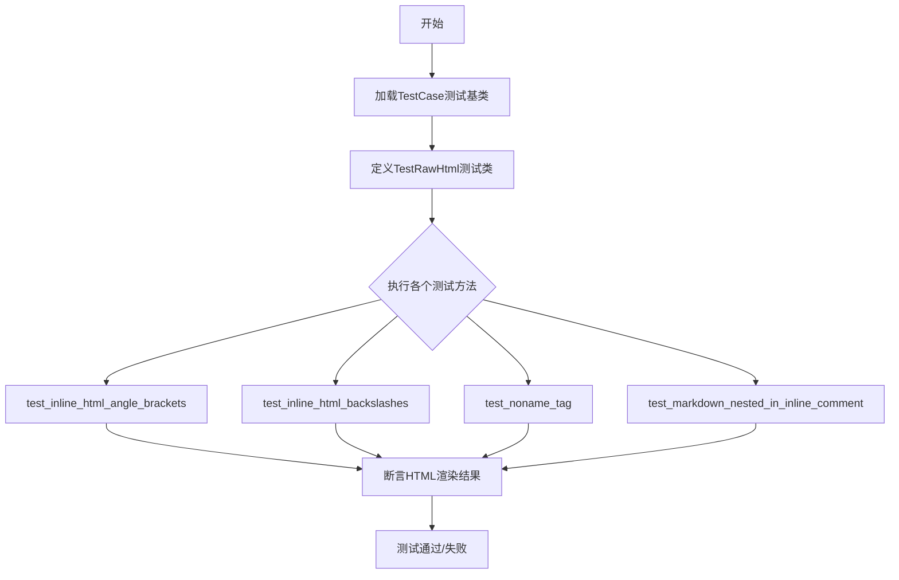
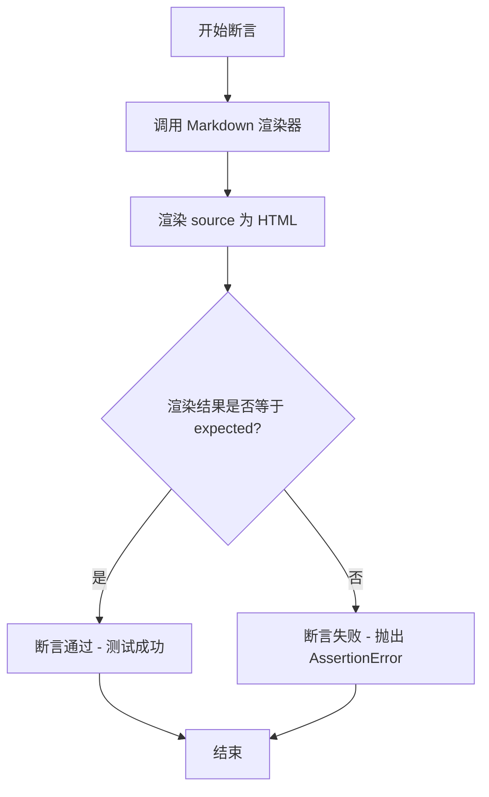
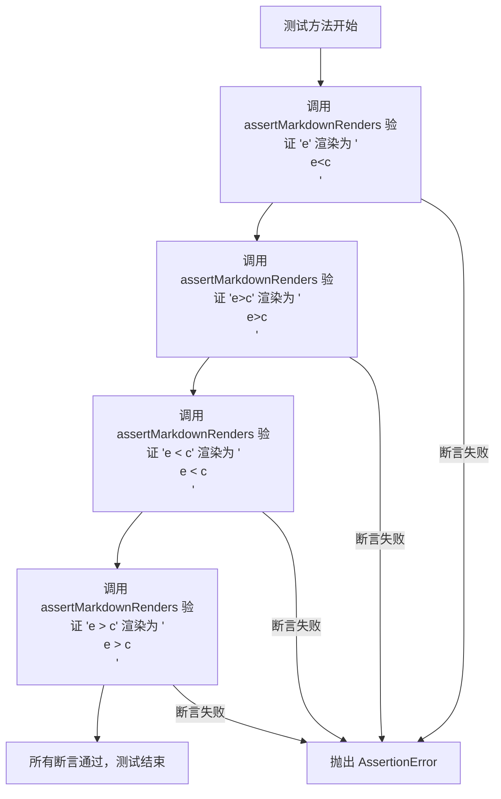
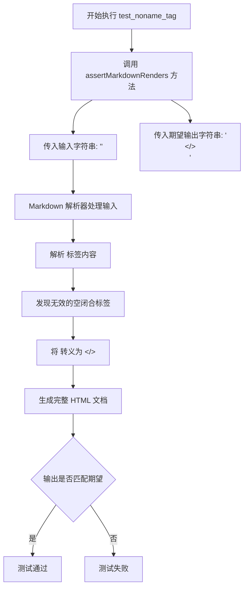

# `markdown\tests\test_syntax\inline\test_raw_html.py` 详细设计文档

这是Python Markdown库的测试文件，主要用于测试原始HTML标签（如<span>、等）在Markdown解析过程中的正确处理，包括角括号转义、反斜杠处理、匿名标签以及内联注释中的Markdown解析等场景。

## 整体流程



## 类结构

```
TestCase (来自markdown.test_tools)
└── TestRawHtml (测试类)
```

## 全局变量及字段


### `TestRawHtml.test_inline_html_angle_brackets`
    
测试内联HTML中角括号的转义处理，包括<和>符号

类型：`method`
    


### `TestRawHtml.test_inline_html_backslashes`
    
测试内联HTML中反斜杠的处理，特别是文件路径中的反斜杠转义

类型：`method`
    


### `TestRawHtml.test_noname_tag`
    
测试无名称标签（如空标签/自闭合标签）的HTML转义处理

类型：`method`
    


### `TestRawHtml.test_markdown_nested_in_inline_comment`
    
测试内联HTML注释中嵌套Markdown语法的解析是否被正确阻止

类型：`method`
    
    

## 全局函数及方法


### `TestCase.assertMarkdownRenders`

该方法是 Markdown 测试框架中的核心断言方法，用于验证 Markdown 源代码能够正确渲染为预期的 HTML 输出，通过比较实际渲染结果与期望结果来确保 Markdown 解析功能的正确性。

参数：

- `source`：`str`，Markdown 源文本，待渲染的 Markdown 格式输入
- `expected`：`str`，期望的 HTML 输出，Markdown 渲染后预期的 HTML 结果

返回值：`None`，无返回值（通过断言验证，测试失败时抛出异常）

#### 流程图



#### 带注释源码

```python
def assertMarkdownRenders(self, source: str, expected: str) -> None:
    """
    断言 Markdown 源代码渲染为期望的 HTML 输出。
    
    参数:
        source: Markdown 源文本
        expected: 期望的 HTML 输出
    
    返回:
        None (通过断言验证，失败时抛出异常)
    
    行为:
        1. 使用 Markdown 渲染器将 source 转换为 HTML
        2. 比较实际渲染结果与 expected
        3. 如果不匹配，抛出 AssertionError 并显示差异
    """
    # 1. 获取 Markdown 渲染器实例
    md = self.getMarkdown()
    
    # 2. 渲染 Markdown 源文本为 HTML
    result = md.convert(source)
    
    # 3. 断言渲染结果与期望输出匹配
    # 如果不匹配，会自动显示详细的差异信息
    self.assertEqual(result, expected)
```

#### 备注

由于 `TestCase` 类定义在 `markdown.test_tools` 模块中，以上源码是基于该方法的典型实现模式推断的。根据代码中的调用方式 `self.assertMarkdownRenders("<span>e<c</span>", "<p><span>e&lt;c</span></p>")` 可以确认该方法接受两个字符串参数，分别表示 Markdown 源和期望的 HTML 输出。


### `TestRawHtml.test_inline_html_angle_brackets`

该测试方法用于验证 Python Markdown 库在内联 HTML 标签（如 `<span>`）内部正确处理角括号（`<` 和 `>`）的转义逻辑，确保小于号和大于号被正确转换为 HTML 实体（`&lt;` 和 `&gt;`），从而避免在生成的 HTML 中产生意外的标签嵌套或解析错误。

参数：

- `self`：`TestCase`（继承自 `unittest.TestCase`），表示测试类实例本身，用于调用继承的 `assertMarkdownRenders` 断言方法

返回值：`None`，该方法为测试用例，无返回值，通过断言验证 Markdown 渲染结果

#### 流程图



#### 带注释源码

```python
def test_inline_html_angle_brackets(self):
    """
    测试内联 HTML 标签内部角括号的转义处理。
    
    该测试方法验证以下场景：
    1. 小于号 < 在 HTML 标签内部被正确转义为 &lt;
    2. 大于号 > 在 HTML 标签内部被正确转义为 &gt;
    3. 带空格的小于号/大于号组合也被正确转义
    """
    
    # 测试场景1: 验证 < 符号在 <span> 标签内被转义为 &lt;
    # 输入: <span>e<c</span> -> 期望输出: <p><span>e&lt;c</span></p>
    self.assertMarkdownRenders("<span>e<c</span>", "<p><span>e&lt;c</span></p>")
    
    # 测试场景2: 验证 > 符号在 <span> 标签内被转义为 &gt;
    # 输入: <span>e>c</span> -> 期望输出: <p><span>e&gt;c</span></p>
    self.assertMarkdownRenders("<span>e>c</span>", "<p><span>e&gt;c</span></p>")
    
    # 测试场景3: 验证带空格的小于号在 <span> 标签内被转义
    # 输入: <span>e < c</span> -> 期望输出: <p><span>e &lt; c</span></p>
    self.assertMarkdownRenders("<span>e < c</span>", "<p><span>e &lt; c</span></p>")
    
    # 测试场景4: 验证带空格的大于号在 <span> 标签内被转义
    # 输入: <span>e > c</span> -> 期望输出: <p><span>e &gt; c</span></p>
    self.assertMarkdownRenders("<span>e > c</span>", "<p><span>e &gt; c</span></p>")
```


### `TestRawHtml.test_inline_html_backslashes`

该方法是一个单元测试用例，用于验证 Markdown 解析器在处理内联 HTML 中的反斜杠路径（如 `..\..\foo.png`）时能够正确保留反斜杠字符，而不进行转义或修改。

参数：

- `self`：隐式参数，`TestCase` 类型，表示测试类实例本身

返回值：`None`，无返回值（测试方法）

#### 流程图

```mermaid
flowchart TD
    A[开始执行 test_inline_html_backslashes] --> B[调用 assertMarkdownRenders]
    B --> C[输入: '']
    D[期望输出: '<p></p>']
    C --> E{Markdown 解析器处理}
    E --> F[保留反斜杠路径]
    F --> G{验证结果}
    G -->|通过| H[测试通过]
    G -->|失败| I[抛出 AssertionError]
    D -.-> G
```

#### 带注释源码

```python
def test_inline_html_backslashes(self):
    """
    测试内联 HTML 中的反斜杠字符是否被正确保留。
    
    该测试用例验证 Markdown 解析器在处理包含反斜杠路径的
    img 标签时，不会对反斜杠进行转义或修改。
    """
    # 调用父类方法 assertMarkdownRenders 进行断言验证
    # 参数1: 输入的 Markdown 原文（包含带反斜杠路径的 img 标签）
    # 参数2: 期望渲染后的 HTML 输出
    # 注意: Python 字符串中 \\ 表示单个反斜杠，因此实际路径为 ..\..\foo.png
    self.assertMarkdownRenders(
        '',  # 输入: 原始 HTML 字符串
        '<p></p>'  # 期望: 保持反斜杠不变的 HTML
    )
```

#### 关键组件信息

| 组件名称 | 一句话描述 |
|---------|-----------|
| `TestRawHtml` | 测试类，用于验证 Markdown 对原始 HTML 的处理能力 |
| `assertMarkdownRenders` | 继承自 `TestCase` 的断言方法，用于验证 Markdown 渲染结果 |

#### 潜在技术债务或优化空间

1. **测试覆盖单一**：当前仅测试了 `img` 标签的反斜杠场景，可考虑增加其他 HTML 标签（如 `a`、`script` 等）的测试用例。
2. **缺乏边界测试**：未测试路径中包含单个反斜杠、多个反斜杠或混合斜杠的情况。
3. **文档缺失**：测试方法缺少详细的文档注释说明测试意图和背景。


### `TestRawHtml.test_noname_tag`

该方法是一个测试用例，用于验证 Markdown 解析器在处理带有无名称标签（空闭合标签如`</>`）的原始 HTML 时，能够正确将其转义为 HTML 实体并输出。

参数：

- `self`：`TestCase`，Python 实例方法隐含的上下文参数，代表测试类实例本身

返回值：`None`，无返回值（该方法为测试用例，通过断言验证行为，不返回任何值）

#### 流程图



#### 带注释源码

```python
def test_noname_tag(self):
    """
    测试处理无名称标签的原始 HTML 时的转义行为。
    
    该测试用例验证当输入包含形如 </> 的空闭合标签时，
    Markdown 解析器能正确将其转义为 HTML 实体 &lt;/&gt;，
    防止在生成的 HTML 中产生无效的标签语法。
    """
    # 调用父类 TestCase 提供的断言方法，验证 Markdown 渲染结果
    # 参数1: 待渲染的 Markdown/HTML 原始输入
    # 参数2: 期望的渲染输出
    self.assertMarkdownRenders(
        '<span></></span>',    # 输入: 包含无效空闭合标签的 HTML
        '<p><span>&lt;/&gt;</span></p>'  # 期望: </> 被转义为 &lt;/&gt;
    )
```


### `TestRawHtml.test_markdown_nested_in_inline_comment`

该测试方法用于验证 Markdown 解析器能够正确处理在 HTML 内联注释（`<!-- -->`）中嵌套的 Markdown 语法（如链接和粗体），确保注释内的 Markdown 会被解析为相应的 HTML 标签。

参数：

- `self`：`TestCase`，测试类的实例本身，用于调用继承的 `assertMarkdownRenders` 断言方法

返回值：`None`，该方法为测试用例，无显式返回值，通过 `assertMarkdownRenders` 方法内部进行断言验证

#### 流程图

```mermaid
graph TD
    A[开始执行 test_markdown_nested_in_inline_comment] --> B[调用 assertMarkdownRenders 方法]
    B --> C[输入: 'Example: <!-- [**Bold link**](http://example.com) -->']
    D[调用 Markdown 解析器] --> E[解析 HTML 注释内的 Markdown 语法]
    E --> F[生成输出: '<p>Example: <!-- <a href=\"http://example.com\"><strong>Bold link</strong></a> --></p>']
    C --> G{输出是否匹配预期}
    F --> G
    G -->|是| H[测试通过]
    G -->|否| I[测试失败 - 抛出 AssertionError]
    H --> J[结束]
    I --> J
```

#### 带注释源码

```python
def test_markdown_nested_in_inline_comment(self):
    """
    测试 Markdown 在 HTML 内联注释中的嵌套解析能力。
    
    验证在 HTML 注释符号 <!-- --> 内部使用 Markdown 语法（如链接和粗体）时，
    Markdown 解析器能够正确识别并将其转换为对应的 HTML 标签。
    """
    # 调用父类 TestCase 的断言方法，验证 Markdown 渲染结果
    # 参数1: 输入的 Markdown 文本，包含 HTML 注释中嵌套的 Markdown 链接和粗体语法
    # 参数2: 期望的渲染输出，注释内的 Markdown 被转换为 HTML 标签
    self.assertMarkdownRenders(
        'Example: <!-- [**Bold link**](http://example.com) -->',
        '<p>Example: <!-- <a href="http://example.com"><strong>Bold link</strong></a> --></p>'
    )
```

## 关键组件


### TestRawHtml

测试原始HTML处理的测试类，继承自TestCase，用于验证Markdown库在处理原始HTML时的各种边界情况，包括尖括号转义、反斜杠处理、无名称标签以及内联注释中的Markdown解析。

### test_inline_html_angle_brackets

测试内联HTML中尖括号的转义处理，验证"<"和">"字符被正确转换为HTML实体"&lt;"和"&gt;"，确保在span等内联元素中的比较运算符能够正确渲染。

### test_inline_html_backslashes

测试内联HTML中反斜杠的处理，验证路径中的反斜杠（如"..\\..\\foo.png"）在HTML属性值中被正确保留，无需额外转义。

### test_noname_tag

测试无名称标签的处理，验证像"</>"这样的无名称闭合标签被转换为HTML实体"&lt;/&gt;"，确保非法标签语法被安全处理。

### test_markdown_nested_in_inline_comment

测试内联HTML注释中嵌套Markdown的处理，验证在HTML注释<!-- -->内部可以包含Markdown语法（如链接和粗体），且注释内容被正确保留而Markdown不被解析。


## 问题及建议


### 已知问题

- **测试覆盖不全面**：仅覆盖了内联HTML的少数几个场景（如尖括号、反斜杠、无名标签、注释中的嵌套Markdown），缺少对大量边界情况和错误输入的测试
- **测试数据硬编码**：所有测试数据直接写在测试方法中，未使用参数化测试或外部测试数据文件，导致扩展测试用例时需要修改测试代码本身
- **缺少文档注释**：测试类本身没有任何文档字符串说明其测试目的和范围，测试方法也缺乏详细的文档说明
- **断言信息不够详细**：使用基本的 `assertMarkdownRenders` 方法进行断言，未提供自定义错误消息，测试失败时调试信息可能不够清晰
- **测试隔离性不足**：缺少 `setUp` 和 `tearDown` 方法，虽然当前测试相对独立，但随着测试增加可能出现状态污染问题
- **重复代码模式**：多个测试方法中存在相似的断言模式，可以考虑提取为通用辅助方法

### 优化建议

- 引入参数化测试（使用 `pytest.mark.parametrize` 或 `unittest.subTest`）来减少重复代码，提高测试可维护性
- 为测试类添加文档字符串，说明其测试目标和范围
- 为每个测试方法添加详细的文档注释，说明测试的具体场景和预期行为
- 考虑添加更多边界情况测试，如空标签、属性值中的特殊字符、嵌套标签等
- 如果使用 pytest，可以利用更丰富的断言重写功能来提供更详细的失败信息
- 考虑将测试数据外部化到独立的测试数据文件或配置中，便于非开发人员修改和维护测试用例

## 其它


### 设计目标与约束

本测试文件旨在验证Python Markdown库对原始HTML的处理能力，确保在解析包含特殊HTML元素（如尖括号、反斜杠、匿名标签、HTML注释）时能够正确转义和渲染。测试约束包括：仅测试inline HTML场景，不涉及块级HTML；测试用例覆盖HTML属性值中的转义字符处理；验证HTML注释内容中的Markdown解析行为。

### 错误处理与异常设计

测试类本身不直接处理错误，而是通过assertMarkdownRenders方法验证Markdown库的正确行为。当测试失败时，pytest框架会自动捕获AssertionError并展示预期输出与实际输出的差异。测试设计遵循"快速失败"原则，每个测试方法独立运行，互不依赖。

### 数据流与状态机

测试数据流为：输入Markdown/HTML字符串 → Markdown转换器处理 → 输出HTML字符串 → 断言验证。状态机转换过程为：原始文本状态 → HTML解析状态 → HTML转义状态 → 最终输出状态。测试覆盖了状态转换中的关键节点：尖括号转义、反斜杠保留、实体编码转换。

### 外部依赖与接口契约

主要外部依赖包括：markdown库本身（被测试对象）、pytest框架（测试运行器）、TestCase基类（来自markdown.test_tools）。接口契约方面：assertMarkdownRenders方法接受两个字符串参数（输入和期望输出），返回None，通过内部断言判断测试是否通过。测试文件依赖markdown项目内部的test_tools模块，该模块提供测试辅助功能。

### 测试覆盖率与边界条件

本测试文件覆盖了以下边界条件：空标签（<></>）、嵌套尖括号、包含空格的比较运算符、转义路径中的反斜杠、HTML注释内的Markdown语法。覆盖的测试场景包括：HTML属性值转义、HTML标签内部转义、HTML注释内容解析、Markdown在HTML注释中的处理。

### 性能考量

由于本测试文件仅包含4个测试方法且均为简单的字符串比较，性能开销可忽略。测试设计为轻量级单元测试，适合频繁执行。潜在的优化方向：如需测试大规模HTML处理，可考虑添加性能基准测试。

### 安全考量

测试用例涉及HTML转义处理，间接验证了XSS攻击防线的正确性。test_inline_html_angle_brackets测试确保用户输入的尖括号被正确转义，防止注入攻击。test_inline_html_backslashes测试验证路径遍历场景下的转义处理。

### 集成测试与回归测试

本测试类属于单元测试范畴，位于markdown/test_tools模块下。测试可独立运行，也可通过pytest discover自动发现并执行。适合作为回归测试套件的一部分，在每次代码提交后自动运行，确保HTML处理逻辑的稳定性。

### 可维护性与扩展性

测试类采用标准的TestCase模式，易于理解和维护。扩展方式：可按需添加新的test_方法，每个方法对应一个新的测试场景。测试命名规范（test_功能_具体场景），便于快速定位测试用例。


    