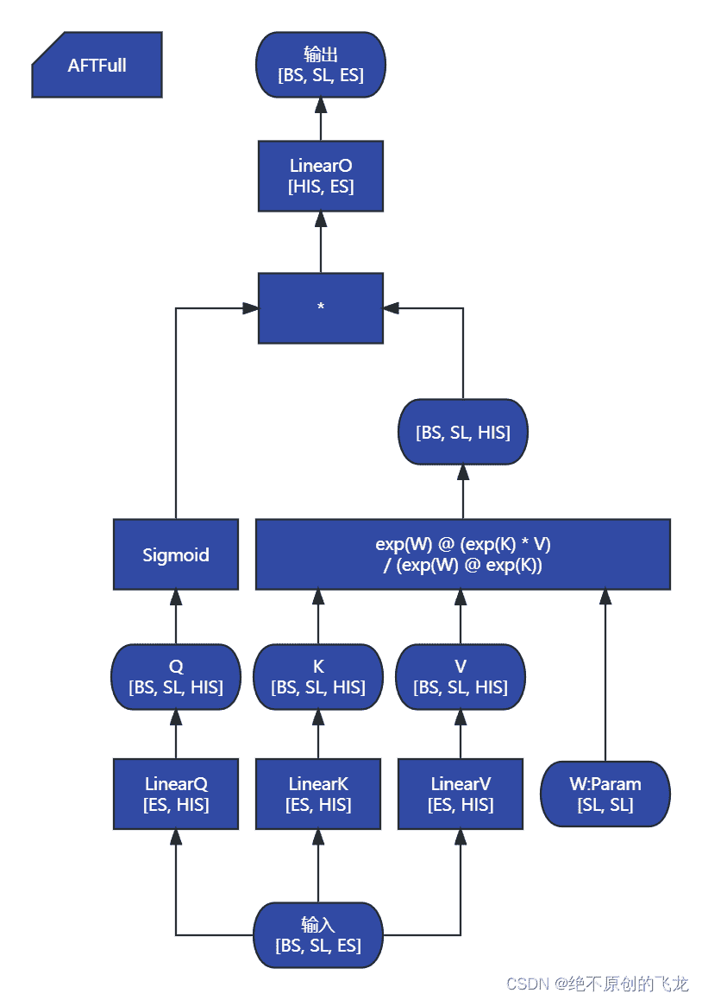
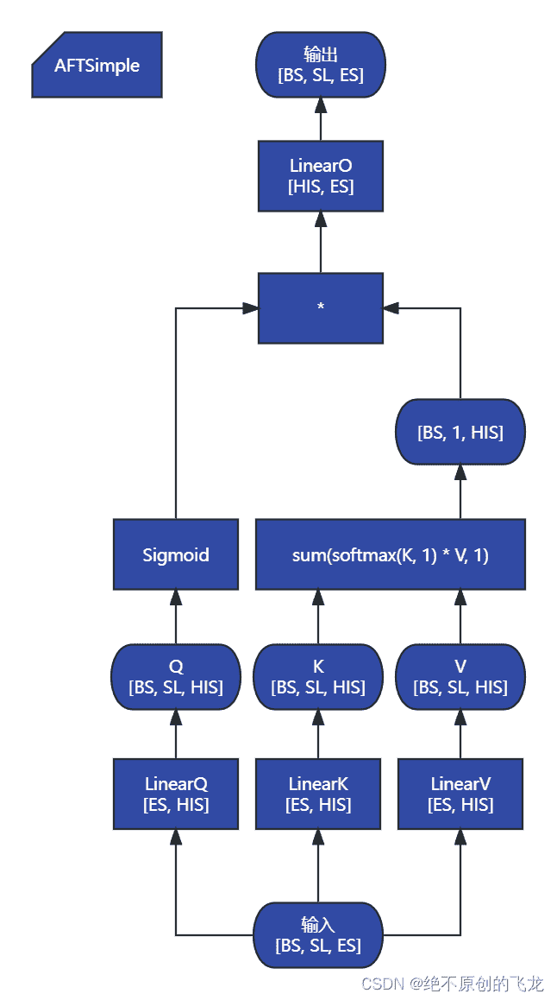

<!--yml
category: 未分类
date: 2023-10-10 23:19:28
-->

# AttentionFreeTransformer 源码解析（一）：AFTFull、AFTSimple、AFTLocal-CSDN博客

> 来源：[https://blog.csdn.net/wizardforcel/article/details/132206172](https://blog.csdn.net/wizardforcel/article/details/132206172)

我觉得源码写的很好懂，我就不加注释了，直接上计算流程图。

### `AFTFull`



```
class AFTFull(nn.Module):
    def __init__(self, max_seqlen, dim, hidden_dim=64):
        super().__init__()
        '''
        max_seqlen: the maximum number of timesteps (sequence length) to be fed in
        dim: the embedding dimension of the tokens
        hidden_dim: the hidden dimension used inside AFT Full

        Number of heads is 1 as done in the paper
        '''
        self.dim = dim
        self.hidden_dim = hidden_dim
        self.to_q = nn.Linear(dim, hidden_dim)
        self.to_k = nn.Linear(dim, hidden_dim)
        self.to_v = nn.Linear(dim, hidden_dim)
        self.project = nn.Linear(hidden_dim, dim)
        self.wbias = nn.Parameter(torch.Tensor(max_seqlen, max_seqlen))
        nn.init.xavier_uniform_(self.wbias)

    def forward(self, x):
        B, T, _ = x.shape
        Q = self.to_q(x).view(B, T, self.hidden_dim)
        K = self.to_k(x).view(B, T, self.hidden_dim)
        V = self.to_v(x).view(B, T, self.hidden_dim)
        temp_wbias = self.wbias[:T, :T].unsqueeze(0) 

        '''
        From the paper
        '''
        Q_sig = torch.sigmoid(Q)
        temp = torch.exp(temp_wbias) @ torch.mul(torch.exp(K), V)
        weighted = temp / (torch.exp(temp_wbias) @ torch.exp(K))
        Yt = torch.mul(Q_sig, weighted)

        Yt = Yt.view(B, T, self.hidden_dim)
        Yt = self.project(Yt)

        return Yt 
```

### `AFTSimple`



```
class AFTSimple(nn.Module):
    def __init__(self, max_seqlen, dim, hidden_dim=64):
        super().__init__()
        '''
        max_seqlen: the maximum number of timesteps (sequence length) to be fed in
        dim: the embedding dimension of the tokens
        hidden_dim: the hidden dimension used inside AFT Full

        Number of Heads is 1 as done in the paper.
        '''
        self.dim = dim
        self.hidden_dim = hidden_dim
        self.to_q = nn.Linear(dim, hidden_dim)
        self.to_k = nn.Linear(dim, hidden_dim)
        self.to_v = nn.Linear(dim, hidden_dim)
        self.project = nn.Linear(hidden_dim, dim)

    def forward(self, x):
        B, T, _ = x.shape
        Q = self.to_q(x).view(B, T, self.hidden_dim)
        K = self.to_k(x).view(B, T, self.hidden_dim)
        V = self.to_v(x).view(B, T, self.hidden_dim)

        '''
        From the paper
        '''
        weights = torch.mul(torch.softmax(K, 1), V).sum(dim=1, keepdim=True)
        Q_sig = torch.sigmoid(Q)
        Yt = torch.mul(Q_sig, weights)

        Yt = Yt.view(B, T, self.hidden_dim)
        Yt = self.project(Yt)

        return Yt 
```

### `AFTLocal`


```
class AFTLocal(nn.Module):
    def __init__(self, max_seqlen, dim, hidden_dim=64, s=256):
        super().__init__()
        '''
        max_seqlen: the maximum number of timesteps (sequence length) to be fed in
        dim: the embedding dimension of the tokens
        hidden_dim: the hidden dimension used inside AFT Full
        s: the window size used for AFT-Local in the paper

        Number of heads is 1 as done in the paper
        '''
        self.dim = dim
        self.hidden_dim = hidden_dim
        self.to_q = nn.Linear(dim, hidden_dim)
        self.to_k = nn.Linear(dim, hidden_dim)
        self.to_v = nn.Linear(dim, hidden_dim)
        self.project = nn.Linear(hidden_dim, dim)
        self.wbias = nn.Parameter(torch.Tensor(max_seqlen, max_seqlen))
        self.max_seqlen = max_seqlen
        self.s = s
        nn.init.xavier_uniform_(self.wbias)

    def forward(self, x):
        B, T, _ = x.shape
        Q = self.to_q(x).view(B, T, self.hidden_dim)
        K = self.to_k(x).view(B, T, self.hidden_dim)
        V = self.to_v(x).view(B, T, self.hidden_dim)
        self.wbias = nn.Parameter(torch.Tensor([
            [self.wbias[i][j] if math.fabs(i-j) < self.s else 0 for j in range(self.max_seqlen)] 
            for i in range(self.max_seqlen)
            ]))
        temp_wbias = self.wbias[:T, :T].unsqueeze(0) 

        '''
        From the paper
        '''
        Q_sig = torch.sigmoid(Q)
        temp = torch.exp(temp_wbias) @ torch.mul(torch.exp(K), V)
        weighted = temp / (torch.exp(temp_wbias) @ torch.exp(K))
        Yt = torch.mul(Q_sig, weighted)

        Yt = Yt.view(B, T, self.hidden_dim)
        Yt = self.project(Yt)

        return Yt 
```