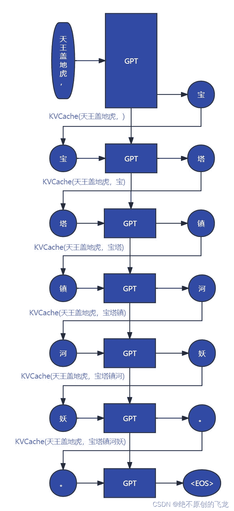

<!--yml
category: 未分类
date: 2023-10-10 23:17:35
-->

# KVCache原理简述-CSDN博客

> 来源：[https://blog.csdn.net/wizardforcel/article/details/133131845](https://blog.csdn.net/wizardforcel/article/details/133131845)

在GPT的推理过程中，它根据完整的提问和回答的已生成部分，来生测下一个词（的概率）。

例如，我们的提问是【天王盖地虎，】，回答是【宝塔镇河妖。】。

那么第一次，GPT根据【天王盖地虎，】生成【宝】，之后根据【天王盖地虎，宝】生成【塔】，以此类推，直到碰上终止符。

这里面提问【天王盖地虎，】的QKV实际上重复计算了很多遍。由于GPT是单向注意力，每层的提问的KV只根据上一层的提问的KV（或提问的嵌入向量）计算，不跟据回答中任何字符的KV计算，完全可以把它们缓存起来避免重复计算。

如下图所示：

改进之后，我们GPT根据【天王盖地虎，】生成【宝】，同时还有KV(天王盖地虎，)，然后根据KV(天王盖地虎，)和【宝】生成【塔】以及KV(天王盖地虎，宝)，以此类推。

至于为什么不缓存Q，因为推理场景下我们只取最后一个词，那么每层输出HS[-1]就可以了。HS[-1]根据全部的V和注意力矩阵的最后一行A[-1]计算，而A[-1]根据Q[-1]和全部的K计算，Q[-1]只根据输入最后一个字符X[-1]计算。

所以我们通过传入KVCache保证K和V是完整的，输入字符只传入最后一个，也就是上一次GPT生成出来的字符，就可以了。