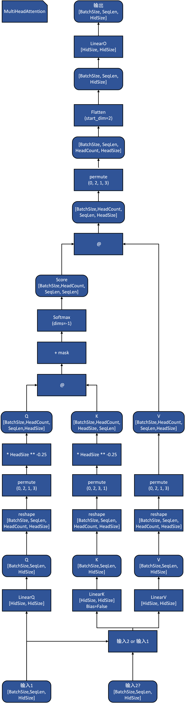
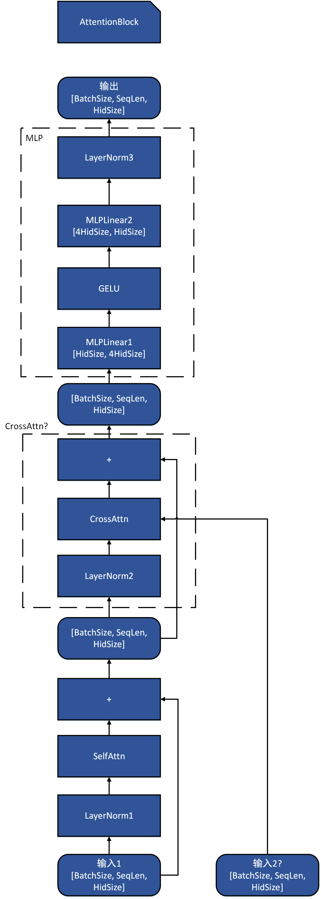
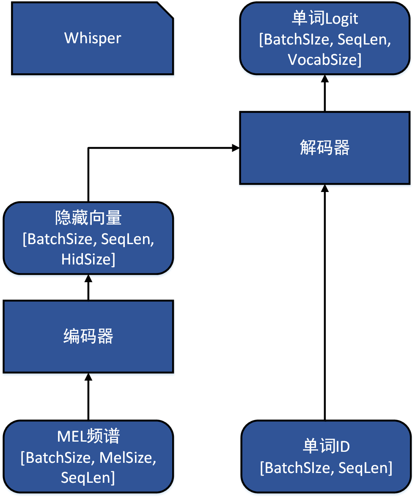

# Whisper 整体架构图

## `Attention`

注意力机制模块，兼容自注意力和交叉注意力。

# `AttentionBlock`

Transformer 模块，包含一个自注意力，一个交叉注意力（可选）和一个 MLP 模块。

# `AudioEncoder+TextDecoder`

音频编码器和文本解码器。编码器的 Transformer 模块只有自注意力，解码器的Transformer 模块有一个自注意力一个交叉注意力。

# `Whisper`

Whisper 整体模型。

